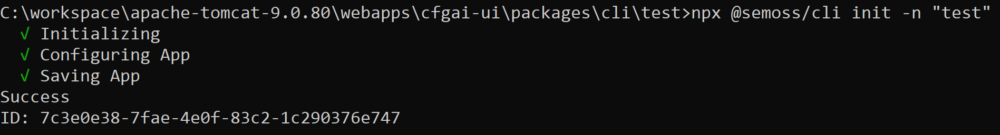
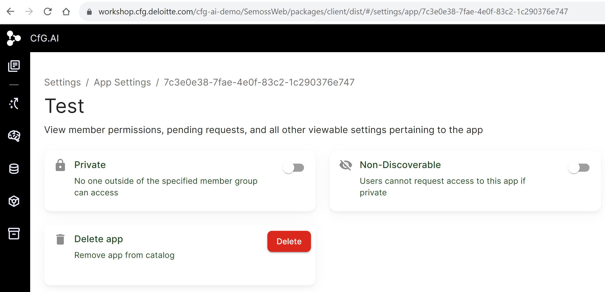
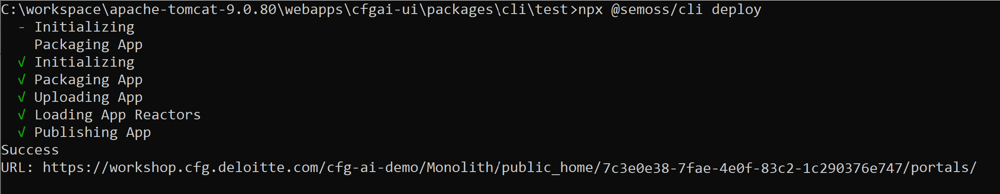
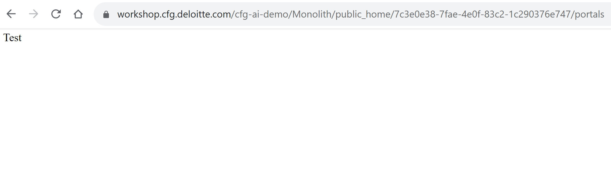

# Table of Contents
1. [Overview](#overview)
2. [Prerequisites](#prerequisites)
3. [Using the CLI](#using-the-cli)
   
# Overview
Semoss CLI (Command Line Interface) is a small CLI that accelerates the process of deploying an App. When using a CLI, you can perform nearly all of the same tasks that can be completed with portal. However, the majority of tasks can be performed more easily and more rapidly. 
As a user, you would enter a command, press enter, and then wait for a response. Since there are hundreds of different commands, it can take time to learn and remember the most important commands.

# Prerequisites
- Put the App folder inside workspace folder and also include ENV file to be used for initializing and deploying the App. App folder inside workspace is shown below.


- Open the cli in the folder and install @semoss/cli using below command
```
npm -g install @semoss/cli
```


# Using the CLI
Open the ENV file in Visual Studio and define environment variables:
```
MODULE      = ***URL HERE*** # Path to the application server
ACCESS_KEY  = ***KEY HERE*** # Access ID to the application server
SECRET_KEY  = ***KEY HERE*** # Secret Key to the application server
```


## Initialize the App
Now, enter the below command in CLI and run
```
npx @semoss/cli init -n="name"
```
here **"name"** is name of the App folder.

This command will initialize, configure and save the App. It will also generate the app ID.



You can also view the app ID by going to the the "App Settings" page of SEMOSS:



## Deploy the App
Before deploying, go to the App file in the portal and update the code if required. An illustrative code is mentioned below.
```
<html lang="en">
    <head>
        <meta charset="utf-8" />
        <meta name="viewport" content="width=device-width, initial-scale=1" />
        <meta http-equiv="Cache-Control" content="no-cache" />
        <meta http-equiv="Pragma" content="no-cache" />
        <meta http-equiv="Expires" content="0" />
        <title>App Name</title>
    </head>

    <body>
        <main class="container">
            <div>App Name</div>
        </main>
    </body>
</html>
```
Now after making changes, run the command mentioned below.
```
npx @semoss/cli deploy
```


It will initialize, package, upload, configure and publish the App which is ready to access at the URL that it provided.

