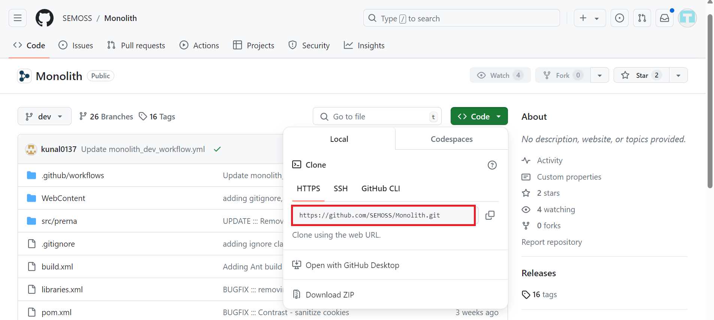
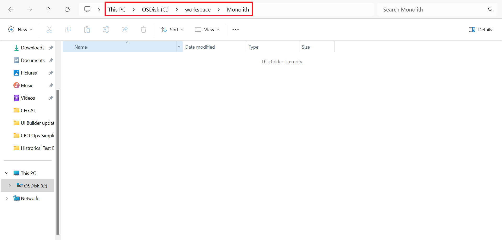
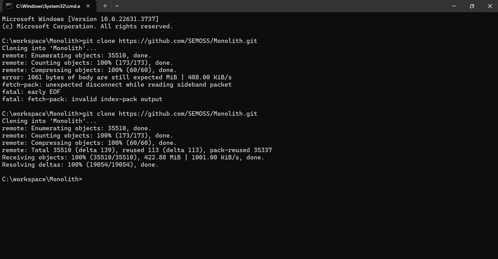
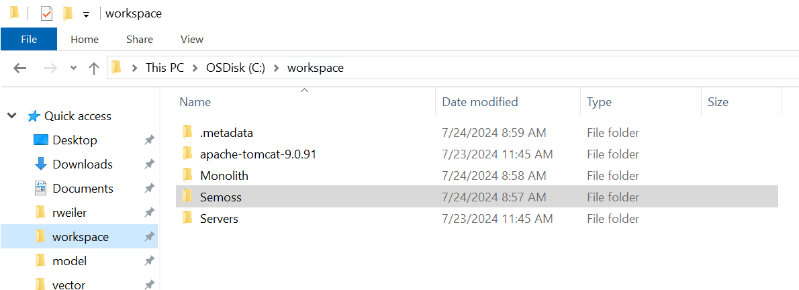
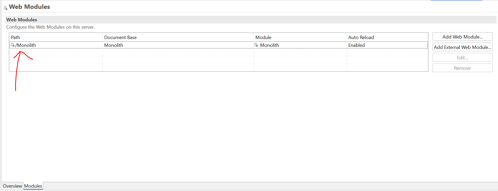

# Migrating to Github

For migrating to Github, the recommended way is to start with a fresh clone. In your workspace, rename your Semoss_Dev to Semoss_Dev_OLD, and Monolith_Dev to Monolith_Dev_OLD. This will allow you to copy db, model files over once the migration is complete.

1. Create a folder locally and name it Monolith. Go to the [Monolith repo](https://github.com/SEMOSS/Monolith) and it will take you to the Monolith GitHub repo. Click on code and copy the link as shown below.

2. Open the 'Monolith' folder that you just created in your workspace in File Explorer, and type 'cmd' in the filepath:

3. After terminal is started, type "git clone" and paste the link copied above and hit enter. It might ask you to log onto GitHub for authentication:

After signing in, it will run next set of tasks and will successfully clone the repo. 

4. Create a folder locally and name it Semoss. Go to the [Semoss repo](https://github.com/SEMOSS/Semoss) and repeat the steps as we did for Monolith folder.

5. Download [apache-tomcat-9.0](https://tomcat.apache.org/download-90.cgi). Choose Binary Distributions, Core, 64 bit Windows .zip file under the latest 9.0 section and zip the folder to your workspace, which should look like this:

6. Follow the instructions for these specific sections of the SEMOSS Dev Install deck:
- Import Semoss and Monolith into Eclipse
- Update social.properties for Semoss
    - change redirect url to new UI
- Update server.xml for Tomcat to '9090'
- Delete old tomcat server and create new one
- Manual Maven Install for Semoss and Monolith
- Update Catalina.properties for tomcat
- Update Maven
- Configure Python/Anaconda in RDF_Map.prop for Semoss

Then, you should be able to start SEMOSS Web UI. One issue that occured for many folks was that Eclipse randomly lowercased the path for/Monolith in the web modules of the apache server. Make sure that this path has a capital M in Monolith. 

7. For troubleshooting, refer to the Troubleshooting section of the deck as well as the README file of the [semoss-ui](https://github.com/SEMOSS/semoss-ui) repo. 
