# AI Core Docker Installation
AI Core supports two ways of running locally: 
1. [Fully local installation](Local%20BE%20Install%20Guide.md)
2. [Docker container](#docker-installation-guide)

This guide will show the steps for installing **Docker** and running AI Core in a Docker container. 
For instructions on how to perform a fully local installation of AI Core instead, click **[here](Local%20BE%20Install%20Guide.md)** for the **backend** installation instructions and **[here](Frontend%20Installation.md)** for the **frontend** instructions.

> **Note**
> If you don't need admin privileges and would prefer a **lightweight, low management** way to connect to AI Core, then use the [live web server](https://workshop.cfg.deloitte.com/cfg-ai-demo/SemossWeb/packages/client/dist/) instead of following this guide. Instructions to set up a connection to the web version can be found in the [Connecting to AI Core](../How%20To/Establish%20Connection%20to%20CFG%20Portal/Connecting%20to%20CFG%20AI.md) guide.
     
## Docker Installation Guide

> **Note**
> **Quick Link**: If you already created a Docker container for AI Core by following this guide, then you can jump directly to the shortcuts below to start your server:
>  * **For Windows:** [Running an Existing Docker Container on Windows](#running-an-existing-docker-container-on-windows)
>  * **For Mac OSX:** [Running an Existing Docker Container on Mac](#running-an-existing-docker-container-on-mac)

### Download Docker
If you already have Docker installed, you can skip to the next step ([Accessing the AI Core Docker Repository](#accessing-the-cfg-ai-docker-repository)).

If this is your first time installing Docker, please follow the installation guides for your operating system linked below:
* [Windows Docker Installation Guide​](https://docs.docker.com/desktop/install/windows-install/)
* [OSX/Mac Docker Installation Guide​](https://docs.docker.com/desktop/install/mac-install/)
* [Windows/Max install without Docker Desktop](https://docs.docker.com/engine/install/)

### Accessing the AI Core Docker Repository
* Please reach out to your administrator to get access to the AI Core Docker Repository. You can only continue with the rest of the guide after receiving access.
* After being granted Docker repository access, log into the repository via your organization's SSO.
  - If you are not automatically redirected to the SSO login, then click on the button that says **"Login via OIDC Provider"** to be redirected to your organization's SSO login.
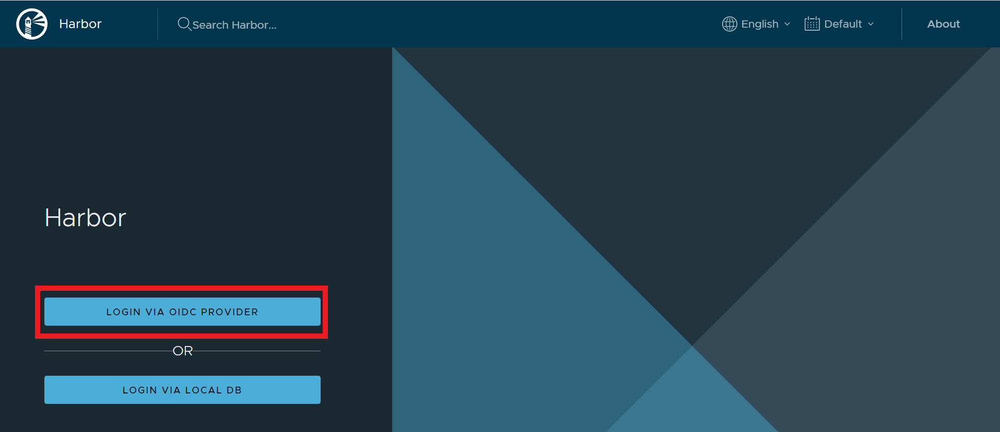
* After logging in, **click on your username in the top right hand corner**, then click **User Profile** in the dropdown menu.
* In your user profile, look for the **CLI secret** field. Click on the blue copy icon to the right to copy it to your clipboard.
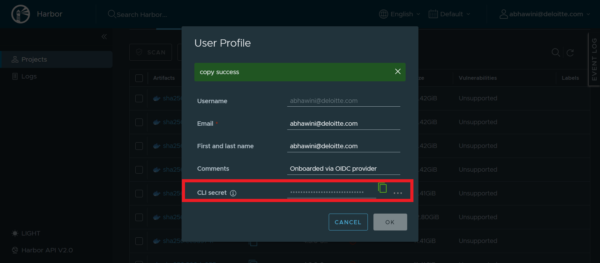
* Make sure that your Docker Desktop is currently running. If it is not, then launch the Docker Desktop app.
* Open up a new command prompt/terminal and enter the following command: `docker login DOCKER_REPOSITORY_URL`, and replace `DOCKER_REPOSITORY_URL` with the repository link that your administrator provided you.
  - It will take a few moments to connect.
  - When it prompts for your username, enter your **organization email address**
  - When it prompts for your password, hit ctrl-V *ONCE* to paste the password that you copied from your user profile details (or command-V for Mac), then hit enter.  
    - **Note: The password will not appear in the terminal when you paste it**, so be careful to only hit ctrl-v/command-V once (and do not type in anything else), followed by enter.
  - It may take a few moments for the authentication to complete. Once complete, a message will say **"Login succeeded"**

## Windows Instructions
### Download the Helper Scripts
* Click [here](../../static/assets/windows_docker_starter_scripts.zip) to download a zip file called `windows_docker_starter_scripts.zip`.
* Unzip this folder to any location and copy its path. This guide will refer to this path as `SEMOSS_DOCKER_DIR`. For example, in the image below, the `SEMOSS_DOCKER_DIR` folder path is `C:\workspace\cfgai-docs\assets\windows_docker_starter_scripts`
  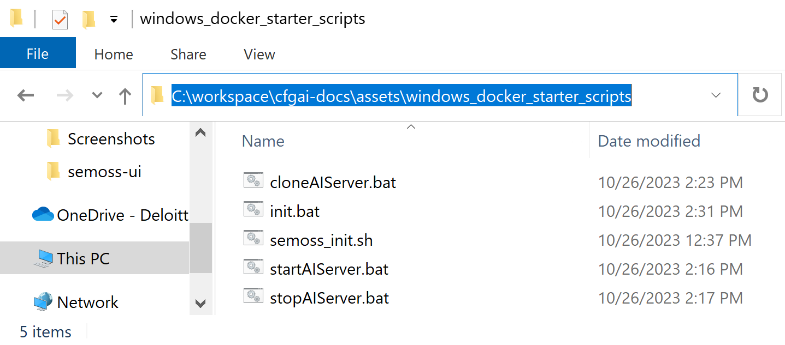

### Set Up Your Container and Volume
* Open up a command prompt and navigate to the `SEMOSS_DOCKER_DIR` by running `cd SEMOSS_DOCKER_DIR` (replace `SEMOSS_DOCKER_DIR` with the actual folder path you copied in the previous step).
> **Note**
> The helper scripts default to using port 8080 to host AI Core. If port 8080 is blocked on your computer and you wish to use a different port, then use any text editor (VSCode or Notepad++) to edit both **init.bat** and **startAIServer.bat** by replacing the `8080` in the lines that say `set ACTIVE_PORT=8080` with your desired port number

* In the command prompt, type `init.bat` and hit enter.
  - You will see some output and auto-executed commands appear (see below image for reference) while Docker pulls the image and the script runs. This process may take up to 45 minutes depending on your connection speed.
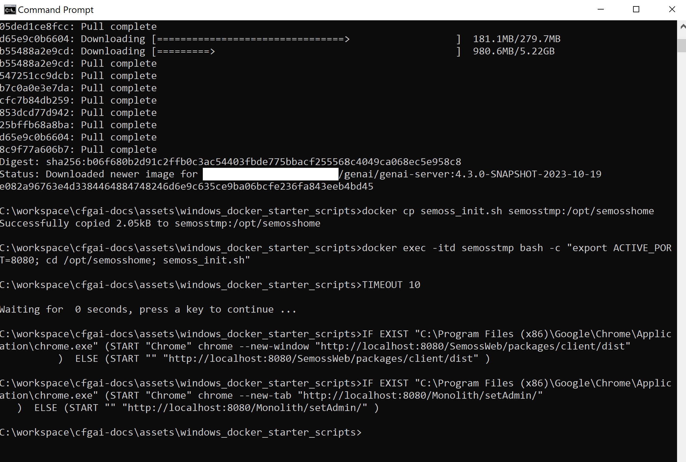
* Once it completes, your browser window will automatically open 2 tabs.
* Access the tab at http://localhost:8080/Monolith/setAdmin/ to designate an admin user.
  
    - You will see a table appear with an input field to enter your admin credentials.
    - Since we are creating a native account, you can enter in any username you want.  Please remember the username you entered.
    - Click "Submit" after typing in your username. Do not worry if the page does not respond/redirect: this is normal. As long as you clicked the submit button, your admin username has been stored.
* Close this tab and navigate to the other tab at http://localhost:8080/SemossWeb/packages/client/dist/ and click on the **Register Now** link
  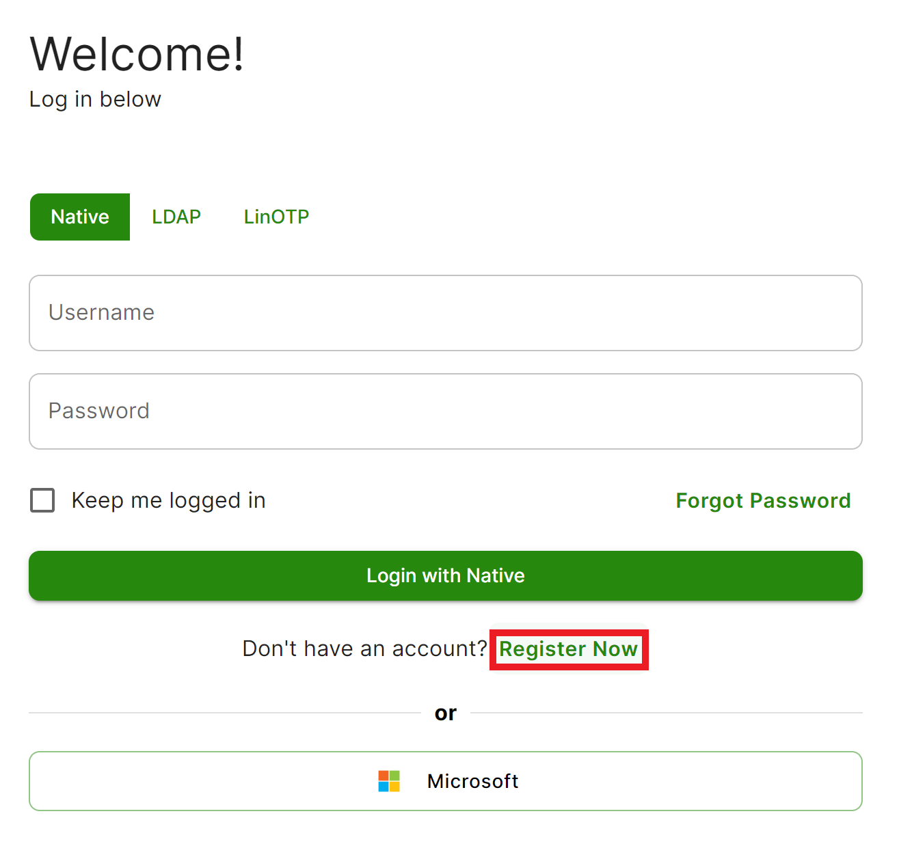
    - Fill out the fields for Name, Last Name, Username, Email Address, Password, and Confirm Password.
  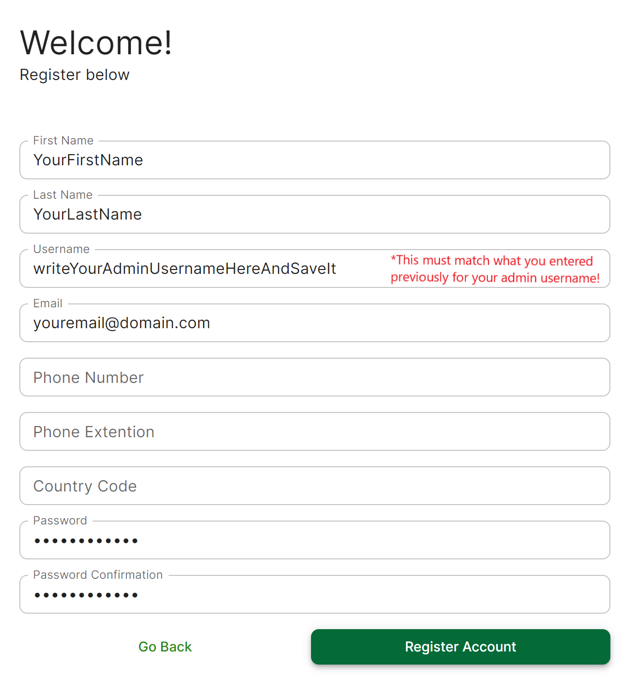
    - **Important**: Make sure your the username you enter matches the username that you created earlier when setting up your admin account.
* The page will return to the login after successfully creating your account. Enter the username and password you just created, then click **"Login with Native"**.
  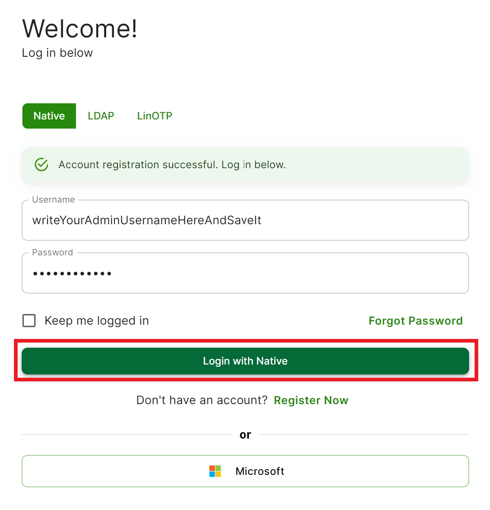
* The page will redirect to the AI Core App Library Landing page.
  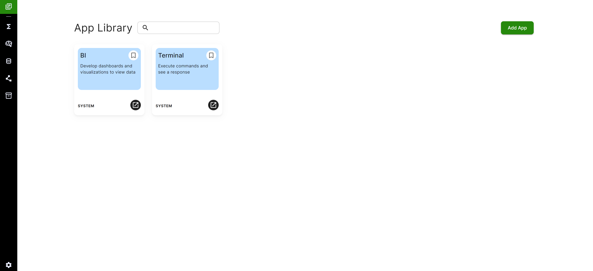
* Return to your command terminal, making sure it is still in the `SEMOSS_DOCKER_DIR`.
* Run:
  - `cloneAIServer.bat`
  - `startAIServer.bat`
  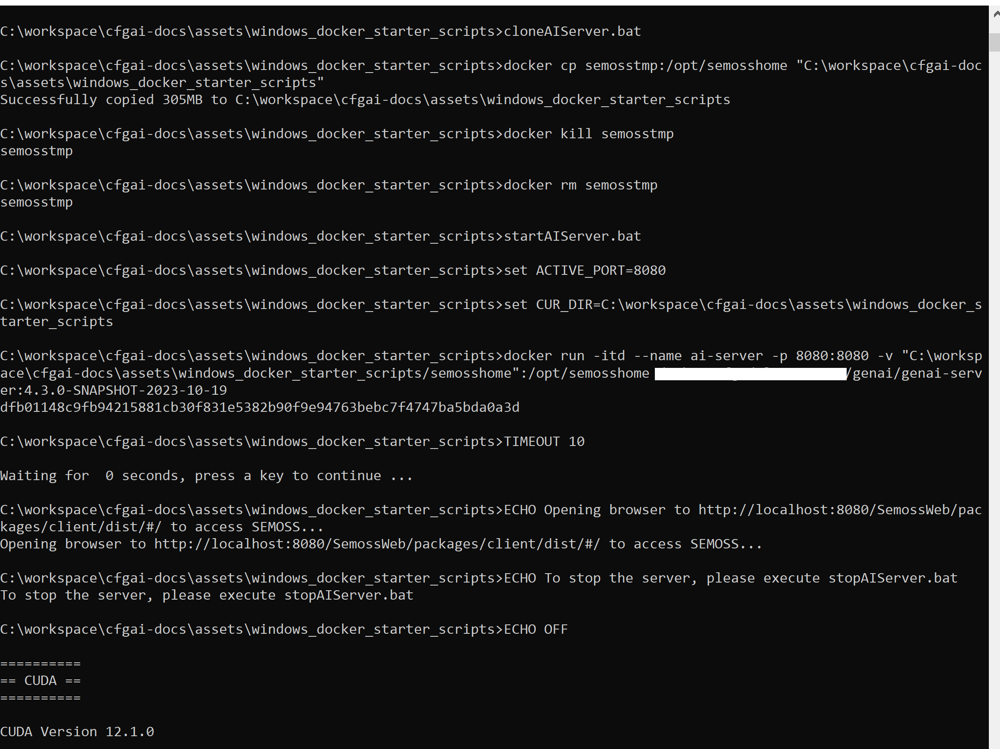

### Shutdown and Clean Up
* To stop running the Docker container, open up a new command terminal, then run:
  -  `cd SEMOSS_DOCKER_DIR`
  -  `stopAIServer.bat`

### Running an Existing Docker Container on Windows
* To start running a container, open up a command prompt at the `SEMOSS_DOCKER_DIR` and run `startAIServer.bat`

## Mac OSX Instructions
### Pulling the Docker Image
* Navigate to the Docker Repository URL that your administrator provided to you. You will see a list of projects.
* Click on the **genai** project, and then **genai/genai-server**.
  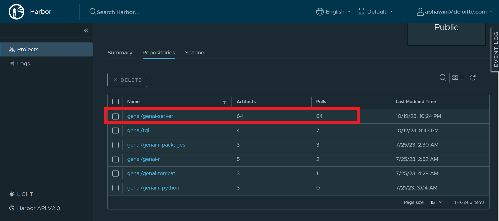
* In the table that appears, look for the header that says **"Push Time"**. Click twice on this header to sort the table from **most recent to oldest**.
* In the first row on the table (the most recent image), click on the **"Copy"** icon in the **"Pull Command"** column.
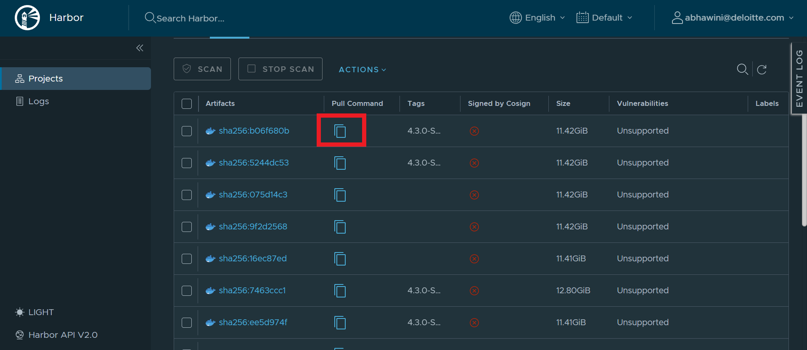
* In a command prompt/terminal, paste the command that you just copied. It should start with `docker pull DOCKER_REPOSITORY_URL ...`
  - It may take a while (between 5 - 45 minutes, depending on your internet connection speed) to finish pulling. 

### Creating a New Docker Container from the Image
* Enter the following command to list your images: `docker images`
* Find the row in the output that says `DOCKER_REPOSITORY_URL/genai/genai-server` under the **REPOSITORY** heading. This corresponds to the image that was just pulled.
  
* Copy the value under **IMAGE ID** for that row.
* Tag your image with a nickname called `genai-image` by executing the following command: `docker tag YOUR_IMAGE_ID genai-image:latest`
  - Replace `YOUR_IMAGE_ID` in the above command with the actual **IMAGE ID** that you copied from the previous step.
  - `latest` identifies that this is the **most recent** image.
      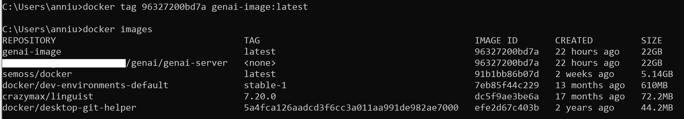
* Enter the following command to run a container from the image: `docker run -d -p 8080:8080 --name genAI genai-image`
  -  **-d tag:** The `-d` tag runs the Docker container in **detached mode**, which allows the container to keep running even after you close the command line/terminal window.
    If you want the Docker container to automatically shut down when you close the command line/terminal, you can **omit the `-d` tag**.
  - **`-p` tag:** The `-p` tag, followed by the `8080:8080` argument, specifies the mapping of the container port (8080) to your local machine's port (8080).
      - If you already have a different process running on port 8080 locally, you can replace the **first** `8080` with any other open port (ex. `9090:8080`).
  - **`--name` tag:** This allows you to specify a nickname/alias for your container. We set it to `genAI`, but you can replace it.
  - **`genai-image`**: This is the nickname for the image that we tagged in the previous step.
* After you enter the command, you will see an alphanumeric string output in the command prompt/terminal.
  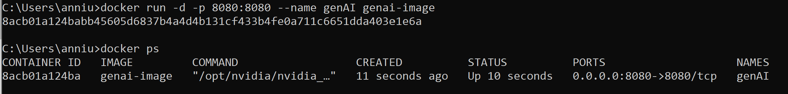
* You can verify that the container is running by entering the following command: `docker ps`
  - This will list all of the containers you have running. You should see a row with the name `genAI` (or whatever alias you set in your `docker run` command).
* In your browser, navigate to http://localhost:8080/SemossWeb/packages/client/dist/
  - **Hint**: If you used a different port than 8080 in your `docker run` command, make sure to replace it in the above link.
  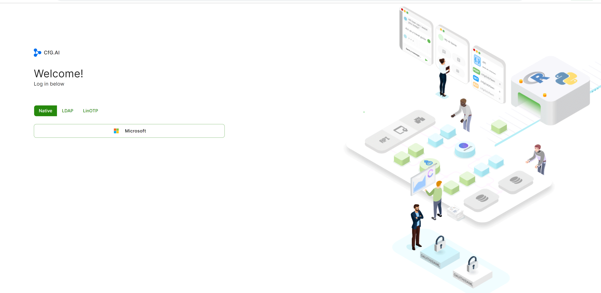
* Accept the cookies if prompted, and you will see the AI Core login landing page.
  - Note that this login page will not have an option to enter username/password yet as we still need to enable native user account registration.

### Creating an Admin and Registering for a Native Account
* Return to your command line/terminal window, and run the following command to connect to a bash shell inside of the container: `docker exec -it genAI /bin/bash`
     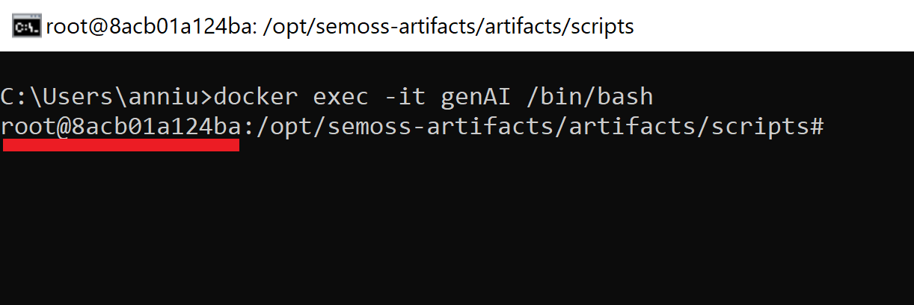
    - If you named your container something different than `genAI`, then replace `genAI` with the alias you set.
    - If you enter the shell successfully, you should see that the terminal prompter looks like: `root@XXXXXXXX/opt/semoss-artifacts/artifacts/scripts`
* In the shell, run the following commands:
  - `cd /opt/semosshome/`
  - `sed -i 's|<NATIVE_ENABLE>|true|' social.properties`
  - `sed -i 's|<NATIVE_REGISTRATION_ENABLE>|true|' social.properties`
  - `sed -i 's|<REDIRECT>|http://localhost:8080/SemossWeb/packages/client/dist|' social.properties`
  - `head social.properties`
    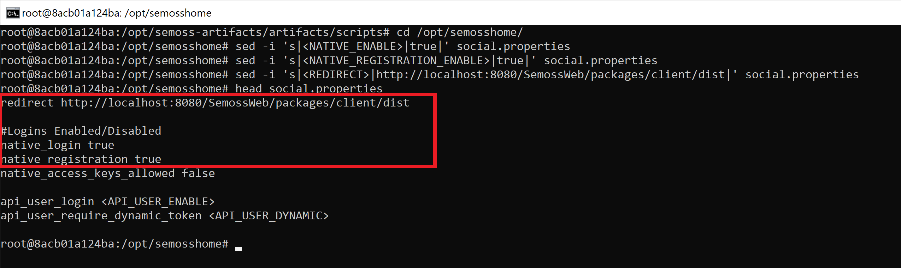
* Verify that the first 4 lines of output from the last command match what is below:
  ```
   redirect http://localhost:8080/SemossWeb/packages/client/dist

    #Logins Enabled/Disabled
    native_login true
    native_registration true
  ``` 
* Next, run the following commands:
  - `$TOMCAT_HOME/bin/stop.sh`
  - `$TOMCAT_HOME/bin/start.sh`
    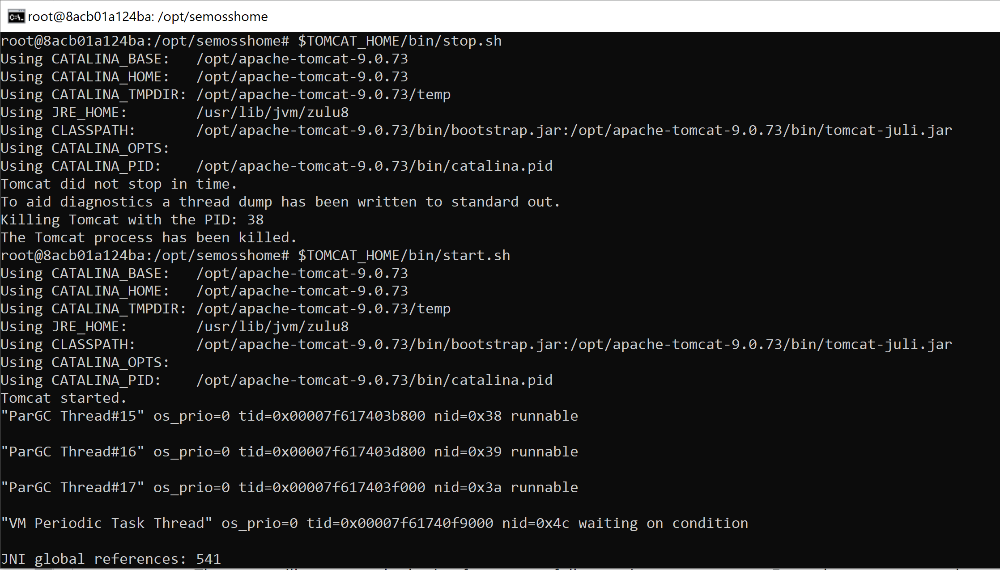
* You will see some logs and output begin to appear in the terminal. Return to a browser window and navigate to http://localhost:8080/SemossWeb/packages/client/dist/
    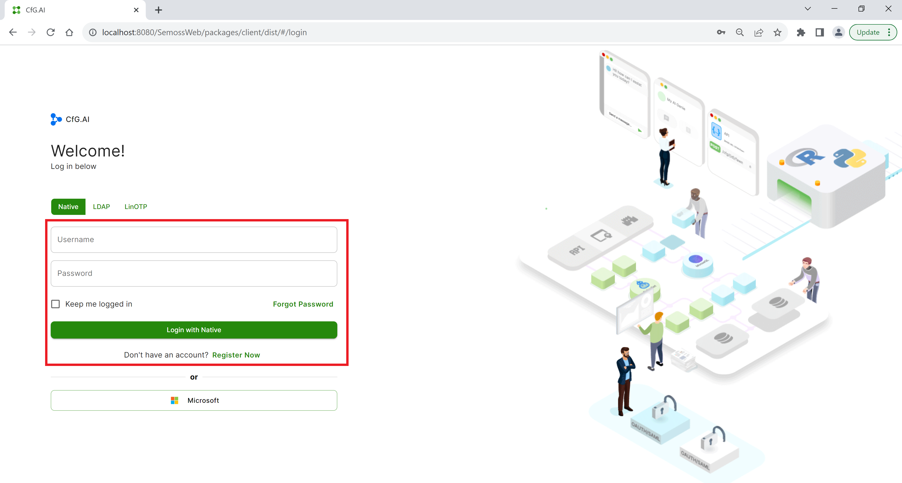
* Verify that an option to enter a username and password has now appeared on the login page. Do not login or register yet.
* Now, you will designate an admin user. Navigate to this link: http://localhost:8080/Monolith/setAdmin/
    
    - You will see a table appear with an input field to enter your admin credentials
    - Since we are creating a native account, you can enter in any username you want.  Please remember the username you entered.
    - Click "Submit" after typing in your username. Do not worry if the page does not respond/redirect: this is normal. As long as you clicked the submit button, your admin username has been stored.
* Return to http://localhost:8080/SemossWeb/packages/client/dist/ and click on the **Register Now** link
    
    - Fill out the fields for Name, Last Name, Username, Email Address, Password, and Confirm Password.
      
    - **Important**: Make sure your the username you enter matches the username that you created earlier when setting up your admin account.
* The page will return to the login after successfully creating your account. Enter the username and password you just created, then click **"Login with Native"**.
  
* The page will redirect to the AI Core App Library Landing page.
  

### Stopping the Container
To stop the container, open up a **new command prompt/terminal** and enter the following command: `docker stop genAI`
* If you named your container something different than `genAI`, then replace `genAI` with the alias you set.
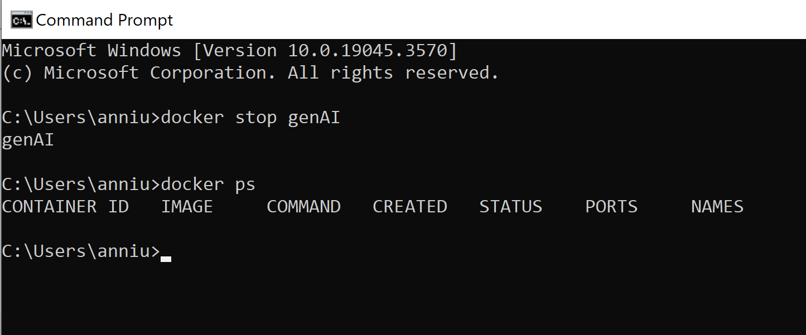

> **Warning**
>  Do not delete your `genAI` docker container. If you accidentally delete it using `docker rm`, `docker system prune`, or `docker container prune`, then you must redo the steps starting from the [Creating a New Docker Container from the Image](#creating-a-new-docker-container-from-the-image) section of this guide.

### Running an Existing Docker Container on Mac
Now that you have created a Docker container to run AI Core, you can run it directly by entering `docker start genAI` in a command line/terminal. Then, navigate to http://localhost:8080/SemossWeb/packages/client/dist/ in your browser to log in. 
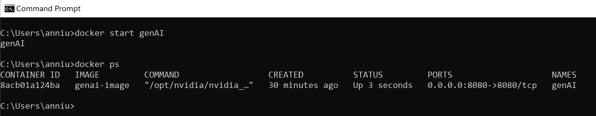

## What's Next?
Want to start developing apps with AI Core? Learn how to use the AI Core Software Development Kit (SEMOSS SDK) in the [SEMOSS SDK Guide](../How%20To/Establish%20Connection%20to%20CFG%20Portal/Using%20the%20SDK.md). 

If you've already finished that, try out one of the **App Use Case Quick Start guides** linked below to get a hands-on tutorial with your preferred frontend framework!
   - [React Quick Start Guide](../How%20To/App%20Creation%20Guides/React%20App%20Quickstart%20Guide.md)
   - [Using React Locally](../How%20To/App%20Creation%20Guides/React%20App%20In-Depth%20Guide.md)
   - [Sample VanillaJS Use Case](../How%20To/App%20Creation%20Guides/VanillaJS%20App%20Quickstart%20Guide.md)
   - [Sample Streamlit Use Case](../How%20To/App%20Creation%20Guides/Streamlit%20App%20Quickstart%20Guide.md)
