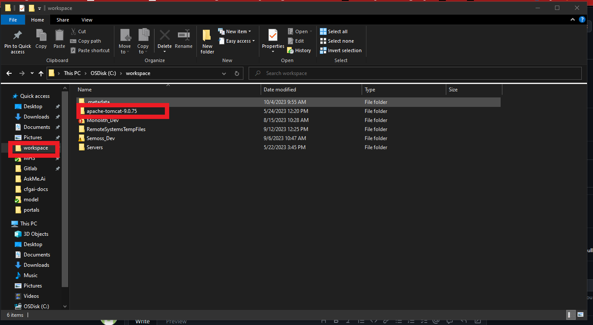
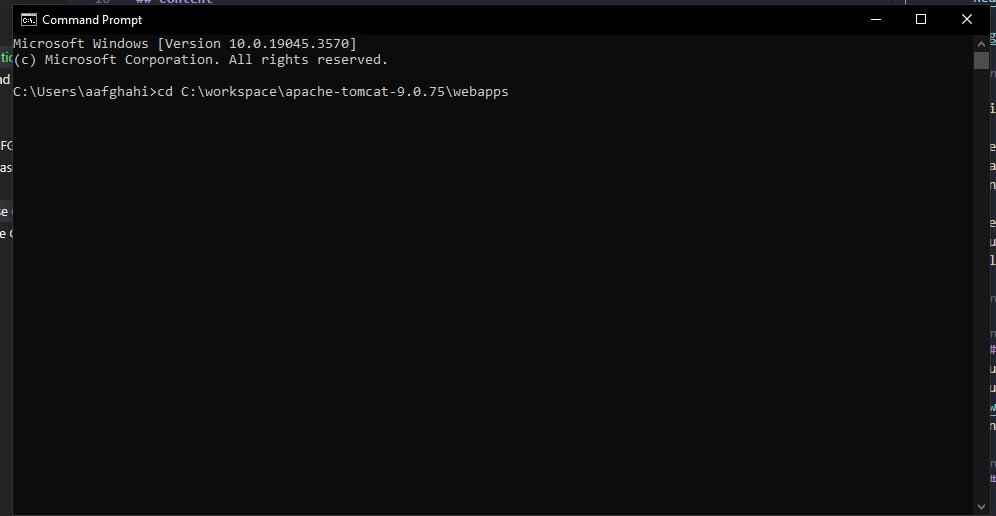
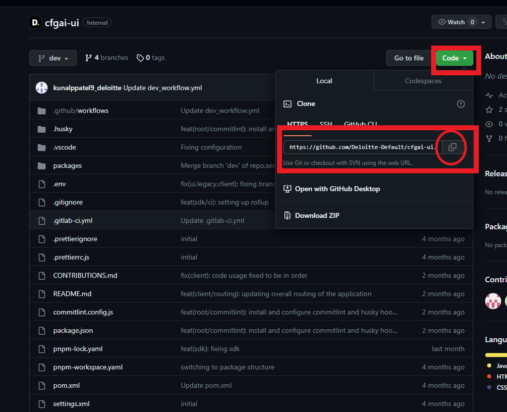
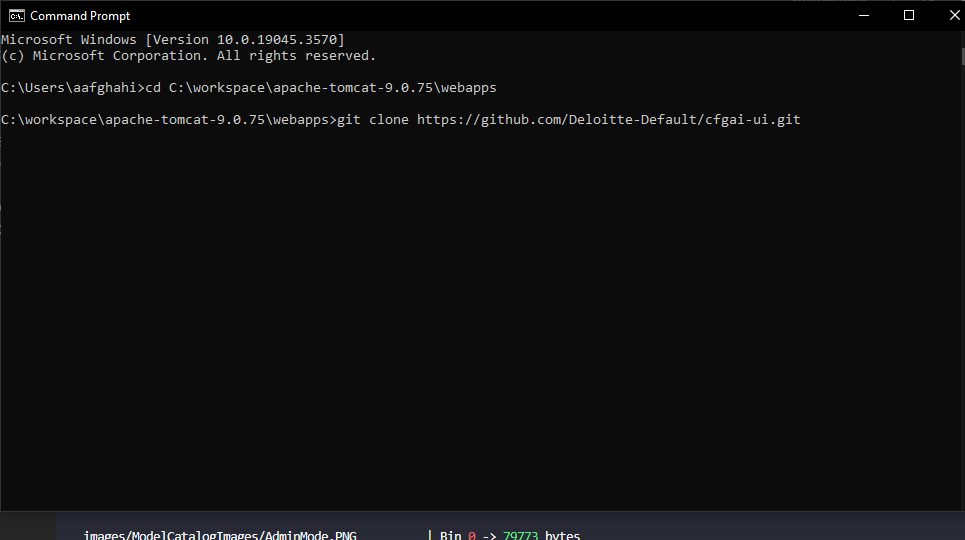
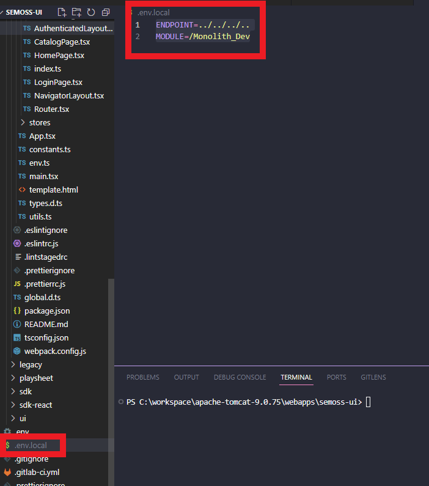
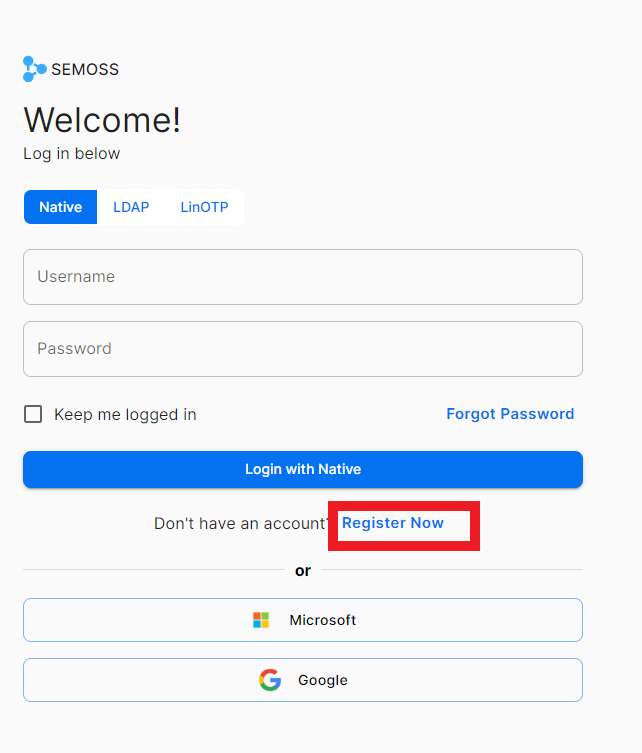
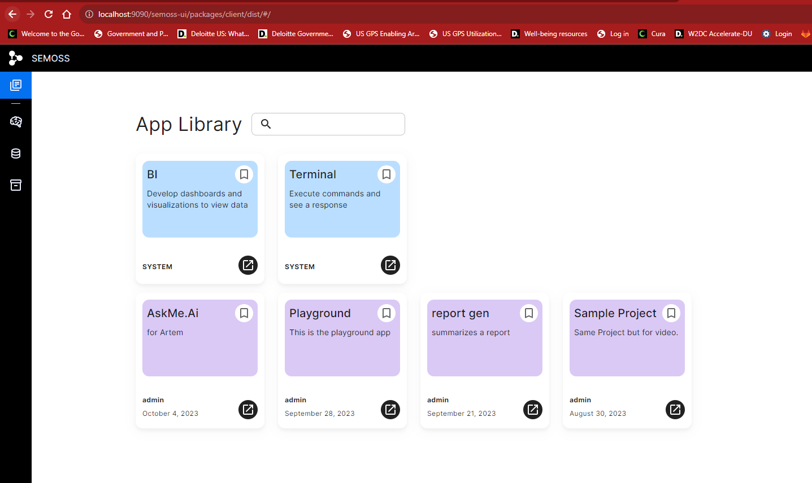

# Local AI Core Front End Installation Guide

## Overview

The main way that you'll interact with a Gen AI app is through the AI Core server. By using the SDK you will be able to access the data that you have stored inside your server. However, you can also setup AI Core to run locally. 

There are several reasons why this might be useful to you, the main one being that you will have admin privileges back in, and that you can change the AI Core interface to fit your needs more directly. 

This guide will go through what steps to take to get AI Core to run locally as a frontend server.

## Prerequisites

### Node.js
You can install Node on your machine by downloading the appropriate installer for your device directly from the Node.js website. Version [v18.16.0](https://nodejs.org/download/release/v18.16.0/) is suggested for our projects (for most Windows machines, you should download `node-v18.16.0-x64.msi`). 

### Code Editor
You'll need to have your code editor of choice downloaded on your machine. We suggest [Visual Studio Code](https://code.visualstudio.com/)


## Setting up a Project Directory

In order to have AI Core running locally, you will need to also supplement it with a running backend. You can find a guide to getting your local backend set up using this [link](Docker%20BE%20Install%20Guide.md).

Once you have your backend structure set up we will navigate to your workspace folder, and select our tomcat server:


Within the tomcat folder we will navigate to our webapps folder. This is where our UI will reside. 


Now navigate to the webapps folder in your local terminal. 




Once you have your terminal setup, you can navigate to the AI Core repository in github

[AI Core UI repository](https://github.com/Deloitte-Default/cfgai-ui)

If this link does not properly open up for you, then please email SEMOSS@deloitte.com to request access.

Inside of the repository click the green code button and copy the code for cloning the repo. You can click the circled button to copy the link that is there. 



Once you have this link you can go back to your open terminal and clone the repository into your webapps folder. 



This will download all of the necessary folder structure into your webapps component. 

# Installation and Server Setup

### Step 1: Node Package Manager (NPM) setup
You should have Node installed, that will be our package manager of choice. There are instructions for how to install this in our Prerequisites portion. 

You can check that they exist on your machine by typing the following code in a terminal. 

```
    node -v
    npm -v
```

If these output versions, that means that you have a working version of npm on your computer. If you do not go back to prerequisities and make sure to download Node (and npm alongside it). 

We will be using npm to install pnpm, which is a lighter package manager. 

To do so open a terminal and install it using:

```npm install -g pnpm```

### Step 2: Installing AI Core's packages

Now that we have access to pnpm we are ready to install all necessary SEMAI CoreOSS packages. 

Navigate to your newly created repository inside of webapps, open the `SEMOSS-ui` folder inside of your code editor of choice. 


We are going to open a new terminal inside of VS code for the next few portions. You can use an external terminal as well, the results will be the same. 

Inside the root folder of AI Core we are going to run 

```pnpm install```

This will go through all of the contents of the `package.lock` file and download them. For reference, here is the [package.lock file](https://github.com/Deloitte-Default/cfgai-ui/blob/dev/package.json)

The install command will also go through and install of the packages that each portion of AI Core uses so it might take some time. 

### Step 3: Setting Up Your .env.local file

When we run the Frontend server we are pointing it to a specific backend route to follow. This will be your locally setup backend server that is outlined in the documentation here: [Backend Install](Docker%20BE%20Install%20Guide.md)

If you followed the same naming conventions as those outlined in the above documentation then you can create a new file in your root folder and name it

`.env.local` 

You will notice that it will live right underneath the already created `.env` file. It should also appear to look greyed out, this is because it will be ignored by git, so your local preferences will not be pushed up with the rest of your work. 

Inside of the newly created local enviornment file you should add these specifications:

```
ENDPOINT=../../../..
MODULE=/Monolith_Dev
```

Your final outcome should look like this:



### Step 4: Starting your Frontend Server

Within your package.json you should see several scripts that will help run your server. 

During this process your backend server must be up and running, so please review the [Backend Installation Guide](Docker%20BE%20Install%20Guide.md) to make sure that it is correctly setup. 

```
    "scripts": {
        "preinstall": "npx only-allow pnpm",
        "prepare": "husky install",
        "dev": "pnpm run --filter=@semoss/legacy --filter=@semoss/ui --filter=@semoss/client --stream --parallel dev",
        "dev:ui-client": "pnpm run --filter=@semoss/ui --filter=@semoss/client --stream --parallel dev",
        "dev:client": "pnpm run --filter=@semoss/client --stream --parallel dev",
        "build": "pnpm run --filter=@semoss/legacy --filter=@semoss/ui --filter=@semoss/client build",
        "fix": "pnpm run --filter=@semoss/legacy --filter=@semoss/ui --filter=@semoss/client fix"
    },
```

We are only going to focus on two of them. `dev` and `dev:ui-client`. 

If it is the first time that you are running the server, you must run it using 

```pnpm run dev```

This will go through each individual package, bundle them, and create a local server. Afterwards, you may want to shift over to using 

```pnpm run dev:ui-client``` since it is slightly lighter-weight. 


***Please Note*** The server takes a long time to run. If the webpack seems to be compiled, and you get a ui module not found error, that means you need to wait longer. 

### Step 5: Accessing your local server

Once your webpack has compiled you can navigate over to 

```http://localhost:9090/semoss-ui/packages/client/dist/#/```

Here you will have to register a user using the native registration. 



Once you've registered a user, you can use the credentials to log into AI Core. This will just be a local user, we recommend using a generic name such as Admin or your first name. 



Please note that the url here is slightly different than the one shared. This is using an older version of AI Core. 

Congratulations! You have everything up and running! 

## What's Next?
Check out one of the **App Use Case Quick Start guides** linked below to get a hands-on tutorial with your preferred frontend framework!
   - [React Quick Start Guide](../How%20To/App%20Creation%20Guides/React%20App%20Quickstart%20Guide.md)
   - [Using React Locally](../How%20To/App%20Creation%20Guides/React%20App%20In-Depth%20Guide.md)
   - [Sample VanillaJS Use Case](../How%20To/App%20Creation%20Guides/VanillaJS%20App%20Quickstart%20Guide.md)
   - [Sample Streamlit Use Case](../How%20To/App%20Creation%20Guides/Streamlit%20App%20Quickstart%20Guide.md)
