## AI Core Installation for Mac Silicon

> Note: This section is undergoing updates and is not in its final form.

### Elevating Permissions

Whenever you need admin level permissions to execute something (installing a new application, copying files into certain directories), use the Privileges app (green lock icon)  - this is like running an application in admin mode!


### Set Up your AI Core Dev Directory

Open Documents, create a new folder called SEMOSS  or open your terminal and run mkdir ~/Documents/SEMOSS
- This directory will house your workspace, Java, and other installation pieces
- This can be anywhere, but placing it in Documents is the best option

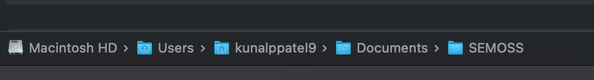

## Prerequisites

Download softwares and tools from below links to be able to install AI Core.

### Create AI Core and workspace Folders
Create a folder `SEMOSS` in Documents and then create a folder 'workspace' inside the `SEMOSS` folder

### Download Visual Studio Code
- Click on [Visual Studio](https://code.visualstudio.com/download)
- Select Mac
- Download and install Visual Studio Code

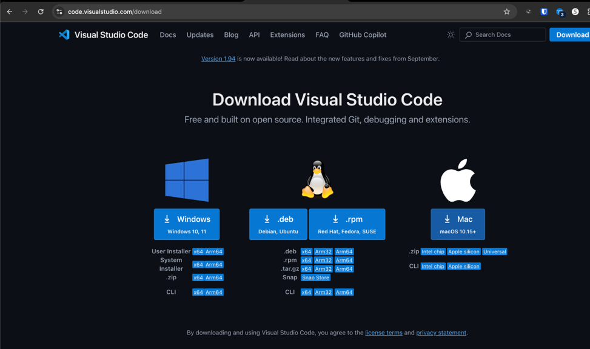

### Install Homebrew- Option 1/2
- Open the Self Service App through Launchpad or your Applications
- Go to Homebrew
- Install Homebrew and follow the instructions on the screen
- Once installation is done open terminal or iTerm
- Run brew help in the terminal to ensure it is installed

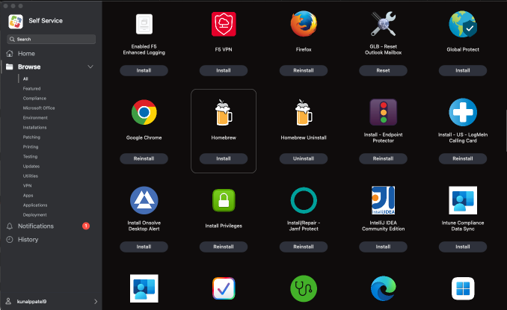

### Install Homebrew- Option 2/2
- Before procedding, make sure that you have elevated permissions with the yellow unlocked icon in the dock
- Open iTerm or the standard mac Terminal
- Navigate to [Brew](https://brew.sh/) and copy the command to install Homebrew
- Paste this into the terminal
- It will ask you for your password several times – continue to type it in until the installation is complete
  - You can optionally configure your mac to prompt you to use touch id (**given** that you've elevated privileges) by running the following commands:
  - `sudo vim /etc/pam.d/sudo` (use whichever text editor you're comfortable with) > Make a space under the very top commented line and add this line: `auth sufficient pam_tid.so`, then make sure to save overriding the readonly option.
  - This is in order to avoid typing in your password over and over again.
- Once the installation is done, make sure to read and follow the steps on the terminal to complete setting up the path listed under Next steps
- Run brew help in the terminal to ensure it is installed

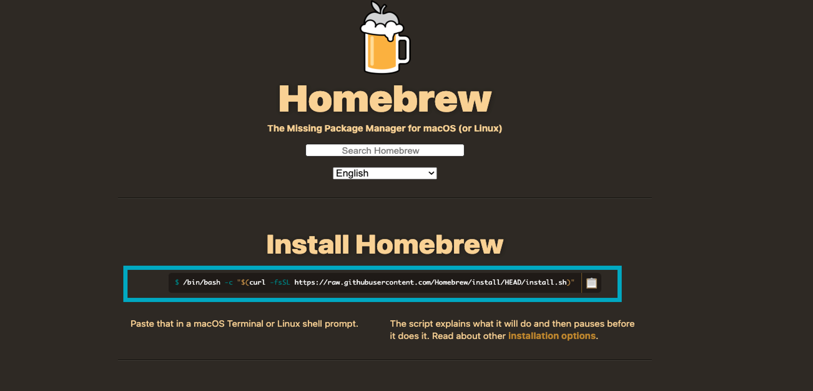

### iTerm + Git
iTerm installation is optional but is recommended as it will improve any command line experience
Click on [iTerm2](https://iterm2.com/)
- Select Download
- Install iTerm
  
- Open iTerm (or regular terminal if skipped)
- Install git via Homebrew by typing: brew install git
- Once installed, verify git is working by typing into the terminal: git -v

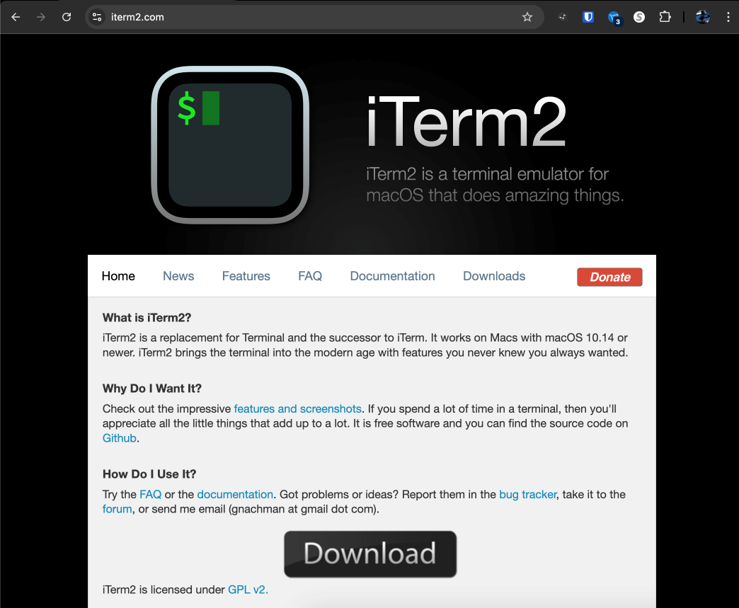

### .zshenv
- .zshenv will be the file used to maintain all environment variables
- This is located at ~/.zshenv under your user profile
- This file may not exist if nothing has used .zshenv before
- Check if it exists by opening Finder and selecting your home profile
- Enable viewing hidden files (such as .zshenv) through the shortcut of command + shift + . (dot)
- If the file does not exist, open VS code and select command + N, or go to File >> New text file
- Save the file as .zshenv under your home directory of `/Users/<username>`

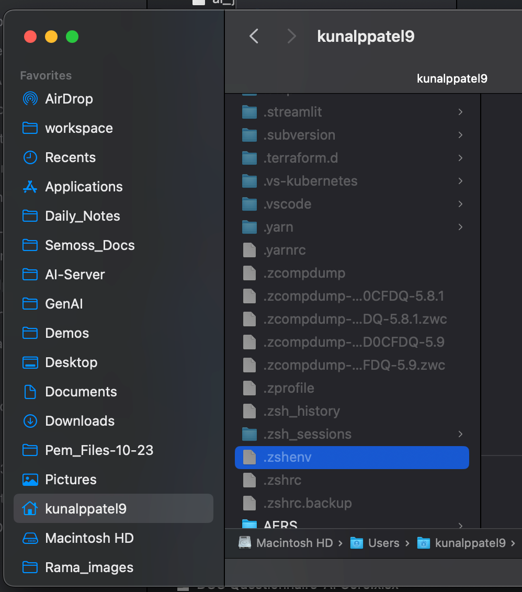

### Install pynev
- pynev is a python version management tool for macOS
- Click on https://github.com/pyenv/pyenv
- Open iTerm (or regular Terminal if skipped)
- Run: 
brew update
brew install pyenv

- Edit ~/.zshenv (this can be done through nano/vim on command line or VS code)
- At the bottom of the file, add: 
alias brew='env PATH="$\{PATH//$(pyenv root)\/shims:/\}" brew’

- Open a new iTerm window or terminal window
- Run: pyenv install 3.11
- Once installed, open a new terminal window and type python --version

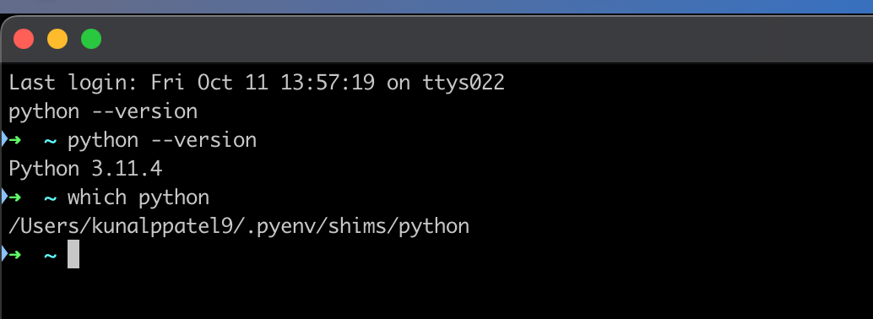

### Install nvm
- nvm is a node version management tool for macOS
- Go to https://github.com/nvm-sh/nvm
- Open iTerm (or regular Terminal if skipped)
- Run:
curl -o- https://raw.githubusercontent.com/nvm-sh/nvm/v0.40.1/install.sh | bash

- Edit ~/.zshenv (this can be done through nano/vim on command line or VS code
- At the bottom of the file, add: 
`export NVM_DIR="$\(\[ -z "${XDG_CONFIG_HOME\-}" \] && printf %s "${HOME}/.nvm" || printf %s "${XDG_CONFIG_HOME}/nvm")"`
[ -s "$NVM_DIR/nvm.sh" ] && \. "$NVM_DIR/nvm.sh" #
- This loads nvm
- Open a new iTerm window or terminal window
- Run: nvm install 18
- Once installed, open a new terminal window and type node –version
- Install pnpm via:  npm install –g pnpm

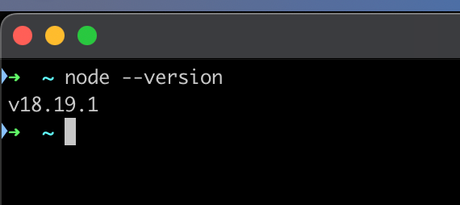

### Download Java
- Download a Java 8 JDS – We use Azul Zulu Builds of OpenJDK
- Navigate to https://www.azul.com/downloads/?version=java-8-lts&os=macos&architecture=arm-64-bit&package=jdk-fx#zulu
- Scroll down to see all options
- Choose these filters:
  - Java Version : Java 8 LTS
  - Operating System : macOS
  - Architecture : ARM 64 bit
  - Java Package : JDK FX
- Select Download and choose Zip
- Download the zip to your ~/Documents/SEMOSS folder
- Unzip the folder

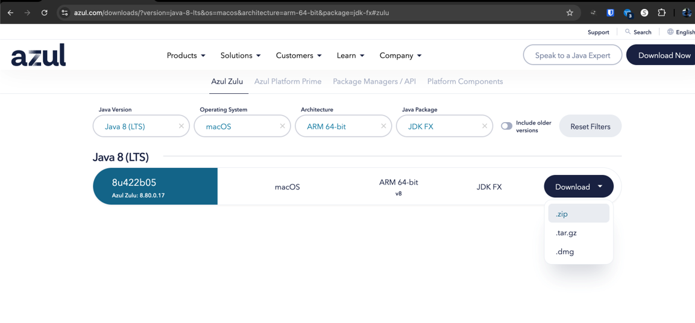

### Set Java Home
- Edit ~/.zshenv
  - This can be done through nano/vim on command line or VS code
- At the **top of the file**  add the JAVA_HOME to be the folder you just unzipped for zulu JDK (see example below and update for username and filepath/version)
  - export JAVA_HOME=/Users/kunalppatel9/Documents/SEMOSS/zulu8.64.0.19-ca-jdk8.0.345-macosx_aarch64
  - export PATH=$JAVA_HOME/bin:$PATH

### Eclipse IDE for Enterprise Java and Web Developers
Click on [Eclipse Download](https://www.eclipse.org/downloads/packages)
- Under Eclipse IDE for Enterprise Java and Web Developers, select **macOS AArch64**
- Download the dmg
- Open the downloaded dmg and either copy Eclipse into your Applications or into your SEMOSS folder
- Launch Eclipse
- Choose /o

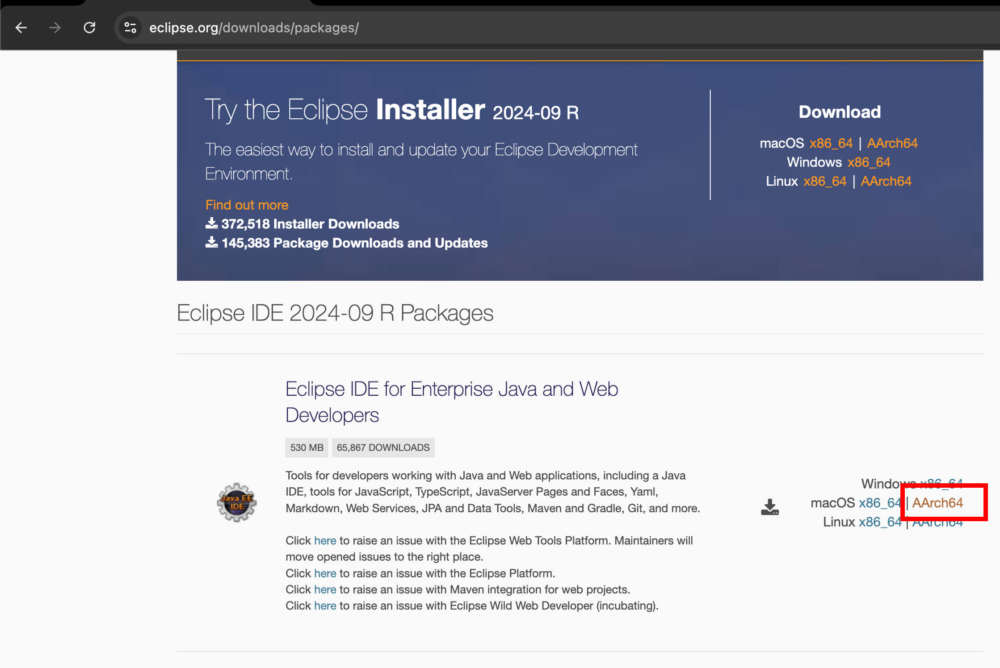

Once your Eclipse & JDK are installed, open Eclipse and specify where you want your workspace to be
   - Specify **/Users/Your Username/Documents/SEMOSS/workspace** instead of the default name that shows up
- We recommend that you pin eclipse to your taskbar and pin your workspace to your Quick access bar

### Apache Tomcat 9
Click on [Apache Tomcat](https://tomcat.apache.org/download-90.cgi)
- Choose Binary Distributions, Core,  zip file under the latest 9.0 section
- Download this to your Documents/SEMOSS/workspace folder
- Unzip the folder
 
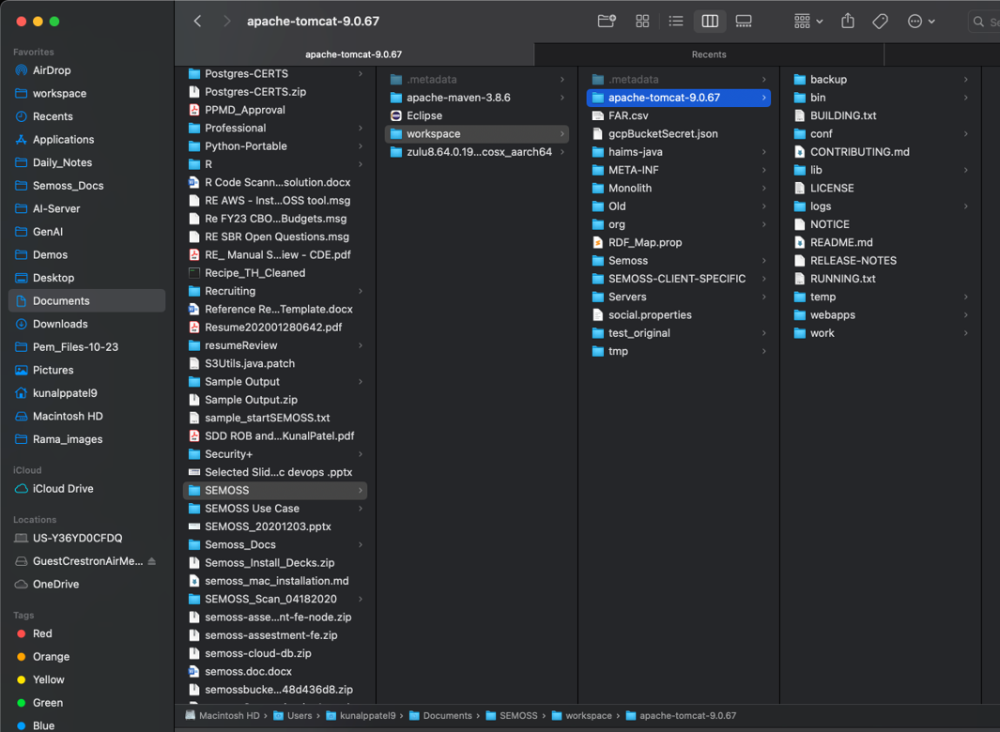


## Installation Steps

### Git Clone SEMOSS, Monolith & SemossWeb
- Open iTerm (or regular Terminal if skipped)
- Run: cd ~/Documents/SEMOSS/workspace
- Run: git clone https://github.com/SEMOSS/Semoss.git

- After SEMOSS is done git cloning, clone Monolith
- Run: git clone https://github.com/SEMOSS/Monolith.git

- Once Monolith is done cloning, clone SemossWeb
- Navigate to your tomcat webapps folder. This can be done by running: cd ~/Documents/SEMOSS/workspace/apache-tomcat-9.*/webapps/
- Run: git clone https://github.com/SEMOSS/semoss-ui.git
- Once the folder is done cloning, rename it through finder or through this command in the terminal: mv semoss-ui SemossWeb

### Import SEMOSS & Monolith into Eclipse
- Open Eclipse
- From the menu bar, select File >> Import
- Select Maven >> Existing Maven Project >> Next
- “Browse” for your workspace under “Root Directory”
- Under projects, check only “/Monolith/pom.xml” and “/Semoss/pom.xml”
- Leave everything else unchecked
- Click “Finish”

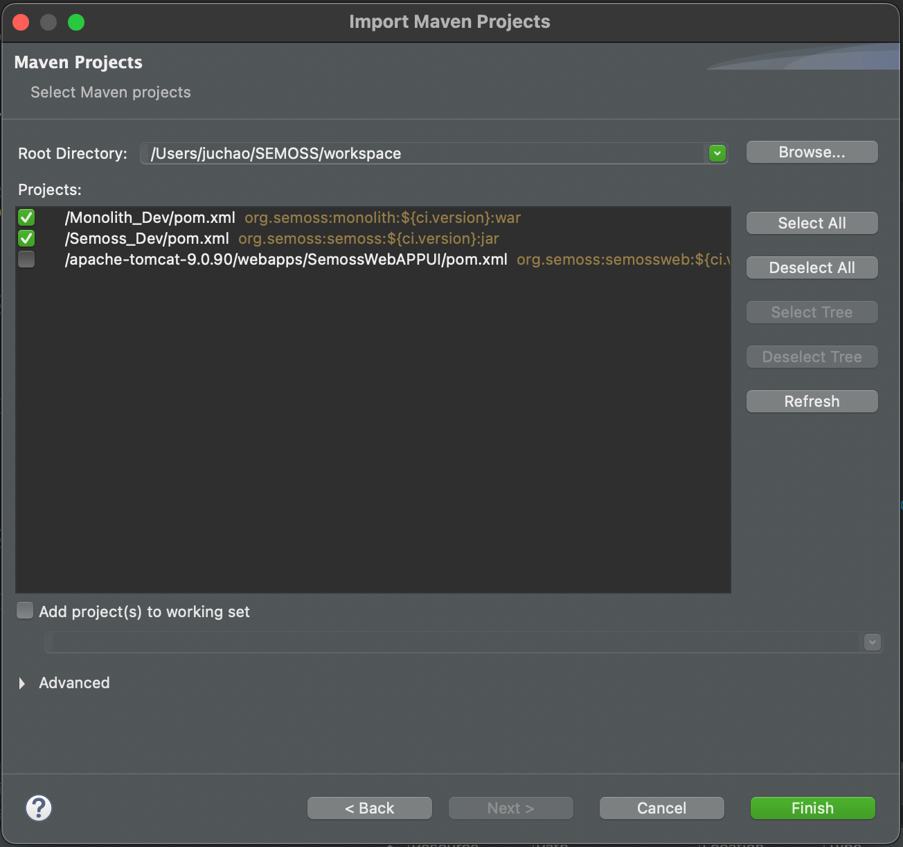

### Configure Build Path for Monolith
- Right click on “Monolith” under Project Explorer
- Select Build Path >> Configure Build Path
- Navigate to “Source” tab
- Under “Source folders on build path”, select “Monolith/Semosssrc”
- Click Edit
- Click Browse and select “src” directory inside “workspace/Semoss”
- Update “Folder name” to “Semosssrc”
- Click Finish
- Click "Apply and Close"

> Note:
> Make sure you are selecting workspace/Semoss/src and not workspace/Monolith/src


### Update RDF_Map.prop
- Open workspace/Semoss/RDF_Map.prop
- Update all paths to point to the Semoss directory
- For example:
  - Open Find and Replace and replace all instances of C:\\workspace\\Semoss with your path to your Semoss folder you clone – ex. /Users/User name/Documents/SEMOSS/workspace/Semoss

> Note: User name is your actual user name

- Additionally, ensure you adjust the following property as well: 
BaseFolder C:\\workspace\\Semoss to your Semoss folder
(eg. BaseFolder /Users/User name/Documents/SEMOSS/workspace/Semoss)

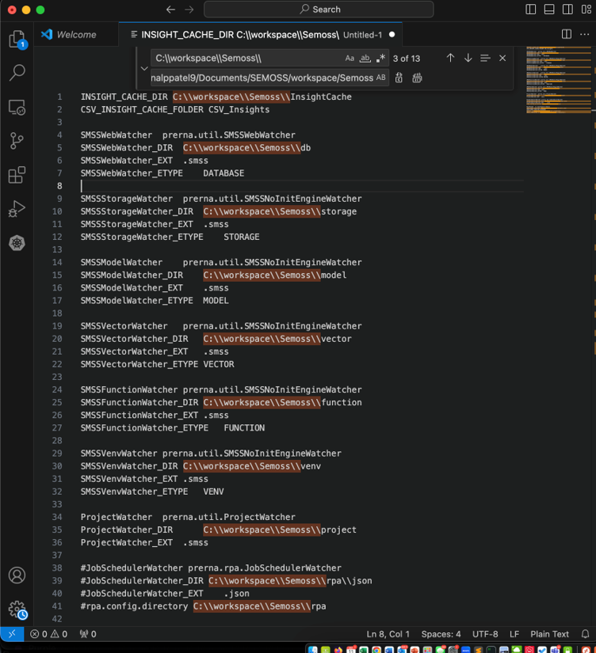

### Update server.xml for Tomcat
- Open Finder and navigate to the following path: /Users/.../workspace/apache-tomcat-9..XX\conf
- Right click on server.xml and Open With TextEdit (or your text editor of choice)
- Find the line that says "Connector and the port number" (should be around line 63)
- Change the port to 9090
- Save and close the file


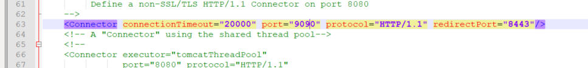

### Create a Tomcat Server
- Back in Eclipse, at the bottom, select “Servers” tab
- Click "link to create a new Server"
- Select “Tomcat Server vX.X” under “Apache” (your version maybe different)
- Click Next
- “Browse” for “apache-tomcat-X.X.XX” directory inside workspace
- Click “Next”
- Select “Monolith” and click Add to move it to the “Configured” column
- Click Finish

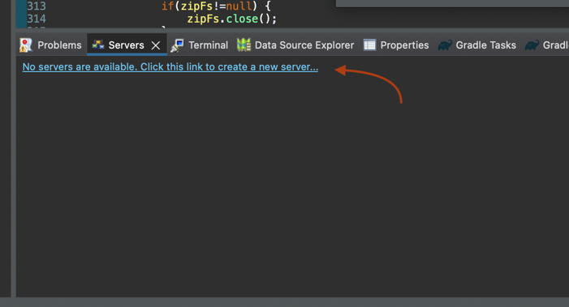


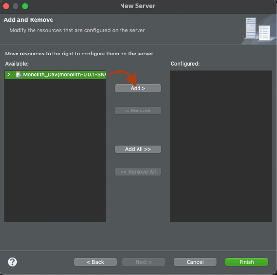

### Update Tomcat Server Configuration
- Under “Servers” tab, double-click on “Tomcat v9.X Server on localhost”
- Popup should open	
- Under “Server Locations”, select “Use Tomcat installation” and set “Deploy path” to webapps
- Under “Publishing”, select “Never publish automatically”
- Under “Timeout”, set “Start” to 300 seconds
- Navigate to “Modules” tab
- Edit module and set “Path” /Monolith
- Save configuration

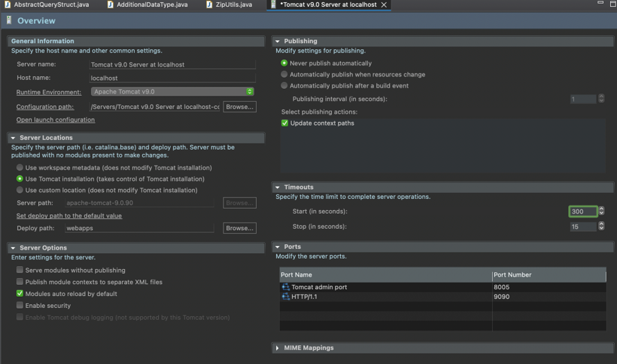

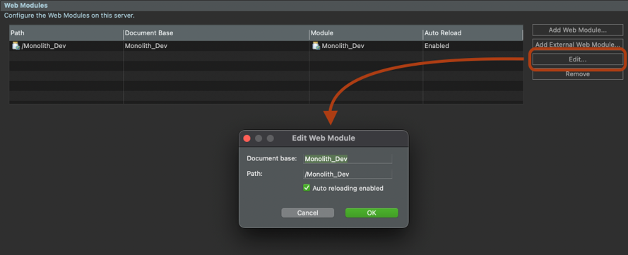

### Update web.xml
- Open Eclipse
- Type Command + Shift + R
- Search for web.xml and select the web.xml under Monolith
- Find and replace for: C:\\workspace\\Semoss\\ to your semoss folder
   - Eg. /Users/User name /Documents/SEMOSS/workspace/Semoss
- Find and replace for C:/workspace/Semoss and replace with your semoss folder
  - Eg. /Users/User name/Documents/SEMOSS/workspace/Semoss
- Find and replace for C:\\Temp and replace with /tmp

> Note: User name is your actual user name


### Create settings.xml
- Add a settings.xml into your ~/.m2 directory
  - If you do not see this folder in your finder, open finder and use command+shift+. (dot) to see hidden files/folders
- Save the below into a file named settings.xml in ~/.m2  (under you user home)
```xml 
<settings xmlns="http://maven.apache.org/SETTINGS/1.0.0"
  xmlns:xsi="http://www.w3.org/2001/XMLSchema-instance"
  xsi:schemaLocation="http://maven.apache.org/SETTINGS/1.0.0
                      https://maven.apache.org/xsd/settings-1.0.0.xsd">
  <servers>
    <server>
      <id>3rdPartyJARs</id>
      <username>semossdevuser</username>
      <password>foxhole</password>
      <configuration></configuration>
    </server>
  </servers>
</settings> 
```


### Update Maven
- Open Eclipse
- Right click on either project under “Project Explorer”
- Select “Maven” > “Update Project” (popup opens)
- Check both checkboxes under “Available Maven Codebases”
- Check “Force Update of Snapshots/Releases”
- Click “OK"


## Install R

### Initial Steps
Click here [RProject](https://cloud.r-project.org/bin/macosx/)

- Install the latest ARM64 version for Apple silicon (if you have M1 or newer)
- Execute the application when download finishes to complete the installation
- Make sure it is getting placed in your Documents (C:\Users\Your Username\Documents\R\R-4.2.3)

> Note:
> The path above may not exist yet, as the folder has not yet been created
> Your Username is your actual username

- Next, create the R folder in Documents to match the variable value
- Click Next all the way through
- Download will result in R being placed in your Documents Folder

### Install R Packages
- Add the following to the top of workspace/Semoss/R/SemossConfigR/scripts/Packages.R script (open in text editor),

r = getOption("repos")
r["CRAN"] = “https://cloud.r-project.org/”
options(repos = r)

- Edit line 190 to: httr::set_config( httr::config( ssl_verifypeer = 0L ) )

- From the terminal, run the scripts

cd /Users/brihill/Desktop/workspace/Semoss/R/SemossConfigR/scripts
Rscript Packages.R
Rscript Rserve.R


## Install Python
This  uses the pyproject.toml file to install the necessary packages for the AI CORE Python environment. This setup is intended to be used with the [Astral UV](https://docs.astral.sh/uv/) platform.

### Install uv 

Install [uv](https://docs.astral.sh/uv/getting-started/installation/) with brew 
```
brew install uv
```
#### Install Python in uv
Once you have installed UV run  
```
uv python install 3.12.9 --default --preview
```

if you get an error run this instead

```
uv python install 3.12.9 --default --preview --allow-insecure-host github.com
```  
Check that python was installed by running
```
python --version
```

#### Create a virtual environment
In your command line Go to `<SEMOSS_HOME>/py/install_config`
```
uv venv
``` 
install the necessary packages depending on your system's capabilities
```
uv pip install -r pyproject.toml
``` 
To add exptra cpu run this command

```
uv pip install -r pyproject.toml --extra cpu
``` 
To add exptra gpu run this command 
```
uv pip install -r pyproject.toml --extra gpu
```
verify the packages are installed 
```
uv pip list
```


### PYENV (NOT THE PREFFERED METHOD)
If you prefer to use PYENV follow these steps
### Install Pyenv
1. ```brew install pyenv```
2. update pyenv

```
pyenv update
```

2. install Python 3.12.9
```
pyenv install 3.12.9
```
3. set the global version of Python to 3.12.9
```
pyenv global 3.12.9
```
4. Open a new terminal and verify the Python version with 
```
python --version
```
5. [Install uv](#create-a-virtual-environment) 
6. setup [virtual environment](#create-a-virtual-environment) 


> Note:
> You may use "pyenv local 3.x.x" or Anaconda if you know what you're doing
> However, using pyenv to install globally is easy and works


### Adding new packages
create the [virtual environment](#create-a-virtual-environment)  (if not already created)

to add a package
```
uv add <package>
``` 

to remove a package
```
uv remove <package>
``` 

to verify the packages are installed
```
uv pip list
```

### Test Python Installation
- Open the Terminal and then type **py** and enter
- It will open python terminal
- Now try 2+2 and see if it gives the correct response of 4


## Set Environment Variables
- Figure out your java path by running: /usr/libexec/java_home –V
- Set JAVA_HOME in your path to the location specified under Java SE 8 in the output of the above command
- vim ~/.zshrc or append to path


  
- Set the following environment variables:

Export JAVA_HOME=/Library/Java/JavaVirtualMachines/jdk1.8.0_241.jdk/Contents/Home        
export PATH=$JAVA_HOME/bin:$PATH 
export R_HOME=$(R RHOME)                                              
export R_LIBS=/Library/Frameworks/R.framework/Resources/library
export PATH=$R_HOME/bin:$R_LIBS:$R_LIBS/rJava/jri:$PATH 
export PYTHON_HOME=/Library/Frameworks/Python.framework/Versions/3.7
export PATH=$PYTHON_HOME/lib/python3.7/site-packages/jep:$PATH

### Set Run Configurations
- Open Eclipse
- From the menu bar, select “Run” > “Run Configurations” (popup opens)
- Select “Apache Tomcat” > “Tomcat v8.5 Server at localhost”
- Under “Arguments” tab:
   - Add to the end of “VM arguments”: 

Djava.library.path=/Library/Frameworks/R.framework/Resources/library/rJava/jri/

- Under “Environment” tab:
  - Click “Add” to add the following variables one by one:

PATH=/Library/Frameworks/R.framework/Resources/bin R_DOC_DIR=/Library/Frameworks/R.framework/Resources/doc R_HOME=/Library/Frameworks/R.framework/Resources R_INCLUDE_DIR=/Library/Frameworks/R.framework/Resources/include R_SHARE_DIR=/Library/Frameworks/R.framework/Resources/share

- Click “Apply” and then “Close”


### Update RDF_Map
- Open workspace/Semoss/RDF_Map.prop
- Edit Line 23: USE_PYTHON true
- Edit Line starting with LD_LIBRARY_PATH:
  - For LD_LIBRARY_PATH, insert your Python Home directory where it says `“{{INPUT_YOUR_PYTHON_HOME}}”`
  - Remember to take out the braces (i.e. LD_LIBRARY_PATH must point to a valid path)

 
 
### Start Tomcat Server
- Right click “Tomcat v8.5 Server at localhost” under the “Servers” tab
- Select “Start”
