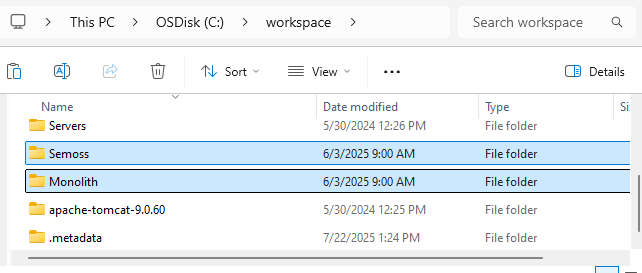
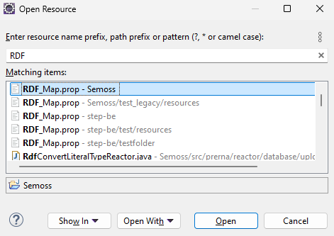
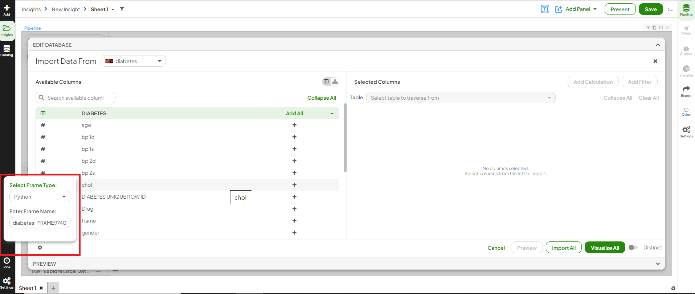
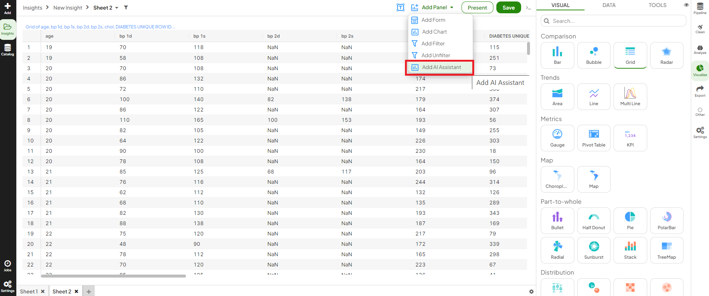
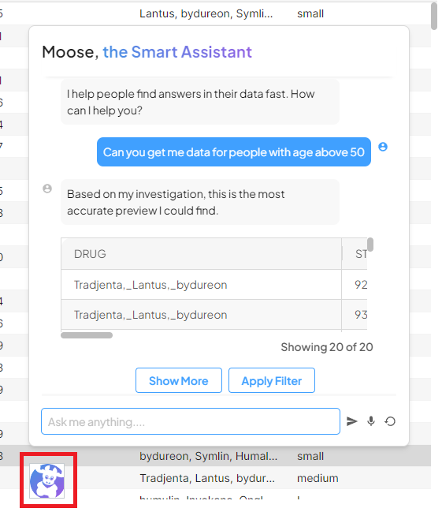

import ReactPlayer from 'react-player'  
import MooseAIAssistantDemonstration1 from '../../static/Demos/MooseAIAssistantDemonstration1.mp4'

# Overview
Moose AI is an AI smart assistant widget that can be added to a AI Core insight to assist the user with data inquiries. You can follow the steps below to set up Moose AI on your  instance. 

<ReactPlayer controls url={MooseAIAssistantDemonstration1}/>

# Setup a Moose Assistant

**Stop any running instance of AI Core on your machine**
- Open your browser and close all tabs that AI Core open.
- Go to Eclipse and stop your Tomcat server.

**Update AI Core**
- In File Explorer, go to your **Workspace** folder.
- Select both **Semoss** and **Monolith** folders, right-click, and click “**Open in Terminal**”. Then, run the command `git pull`
- Go to the **SemossWebAPPUI** folder, right-click, and then click “**SVN Update**".

- Open Eclipse > Project Explorer, go to **Semoss** and **Monolith**, right-click and click “**Refresh**”.
- Click on **Project** tab at the top, then click on “**Clean**”.  

**Update RDF Map**
- Inside **Eclipse**, click anywhere and open the **Resource Prompt** using `Control+Shift+R`.
- Search for **RDF_Map** and click to open.

- Add or replace the following lines to the end of the RDF Map file:
    `SQL_MOOSE_MODEL alpaca`
    `MOOSE_MODEL guanaco`
    `MOOSE_ENDPOINT https://play.semoss.org/moose`
    `#GUANACO_ENDPOINT https://play.semoss.org/moose/guanaco/`
    `GUANACO_ENDPOINT https://play.semoss.org/moose/llama2/`
- Save the changes.

**Install Openai for Python**
- Open the **Command Prompt**, type the following command
`py –[YOUR PYTHON VERSION NUMBER] -m pip install --upgrade openai`

**Note:** YOUR PYTHON VERSION NUMBER is the python version installed in your machine.

**Start using MooseAI**
- Go to Eclispe and restart your **Tomcat server**.
- Open **AI Core instance** in your browser. Log out once and log back in.
- Create a new insight and select the database.
- From the settings below, change the frane type to **Python** and then click on **Import**.

- Click on **Visualize the data**, then click on **Add Panel**.
- Click on **Add AI Assistant** and present.

> You should be able to see a chatbot like icon at the bottom of your screen

~
> Moose AI is ready to assist you in your queries.
