## Initial Install TroubleShooting
Check to see if this page loads http://localhost:9090/Monolith/api/config (should return JSON)

- ​If JSON doesn’t load, the back end isn't deploying… ​

  - If the console in Eclipse says "database is in use / locked“… ​

	- In the bottom panel area, on the Servers tab, double-click your server (Tomcat v9.0 Server at localhost)​

    - In the new window that appears, switch from Overview to Modules tab (at the bottom of the opened window)​
    - Select the Monolith Web Module that appears in the table and click Edit on the right​

    - Make sure the Path accurately reflects what you named your Monolith Folder and the case (E.g., “/Monolith”)​

    - Uncheck auto reload​

    - Click Save in Eclipse​

    - Right click on your server, Clean, and Republish

​

- If JSON does load, the back end is deploying… ​
  - Navigate to the following path in your command prompt/terminal: C:/workspace/apache-tomcat 9.0.##/webapps/SemossWeb​

  - In the terminal type in: “pnpm install”​

  - Inside the same terminal type in: “pnpm run build” (may take ~10 min to run)​

  - Once finished, refresh, and try accessing http://localhost:9090/SemossWeb/ 
## BE Flow
Process starts with the Start Server step. Once the server is initiated, the flow progresses to the Web.xml configuration, which is crucial for setting up web application parameters. Following this, the process moves to the RDF_MAP, which likely involves mapping data structures or resources. Finally, the flow concludes with Social Props, indicating a step related to social properties or settings. This sequence ensures a structured setup and configuration process.
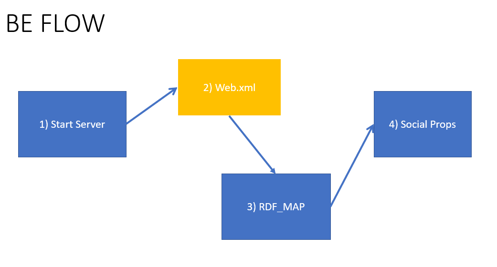

To reference the correct web.xml file in Eclipse, start by navigating to the server tab and double-clicking on your Tomcat server. Then, go to the "Modules" section, where you can see which BE files are currently deployed. For example, the vha-supply module is displayed in the list, helping you identify the specific deployment and its associated configuration files. This process ensures you are working with the correct web.xml for your application.

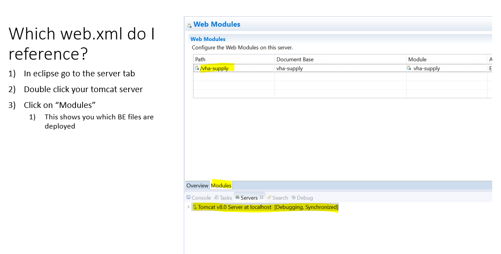


## Regarding AI Core Update

> When to Update
- If you need a stable build >> wait till you are told to update
- If you’ve had a bug >> update once your bug is fixed
- If you’re testing for the DEV team >> update hourly or by the day

### Updating Instructions
- First, update Monolith. In a command line, navigate to your Monolith folder 
  ```
  cd C:\workspace\Monolith
  ```
- Check if you have any local changes using `git status`. If you do have local changes, use the `git stash` command to save them.
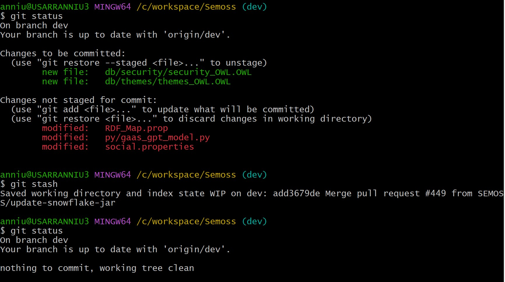
Note that if you try to git pull without stashing your local changes, you will get a warning message:
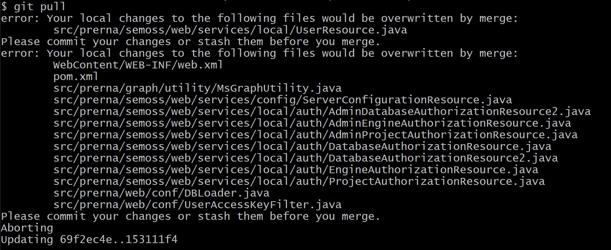
- Confirm that you are on the 'dev' branch. If not, run `git switch dev` to switch branches.
- Run `git pull` to pull in the latest changes from the dev branch.
  - You should see a list of the files which have been changed appear in the output.  Scroll through the output and check if any files are named "pom.xml".
  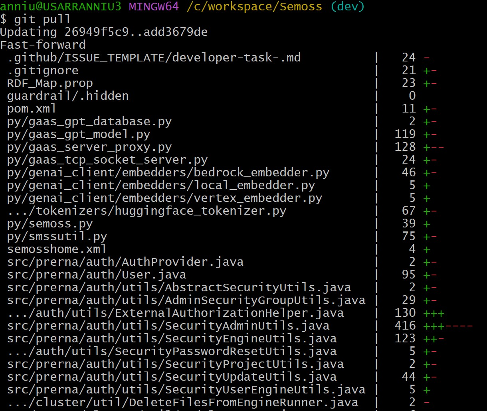
  - You may want to view these logs to know which specific files were changed in a revision, if a fix has come through for a bug you are tracking, or to see other changes in the build.
- If you wish to re-apply your local changes that you stashed earlier, run `git stash pop` 
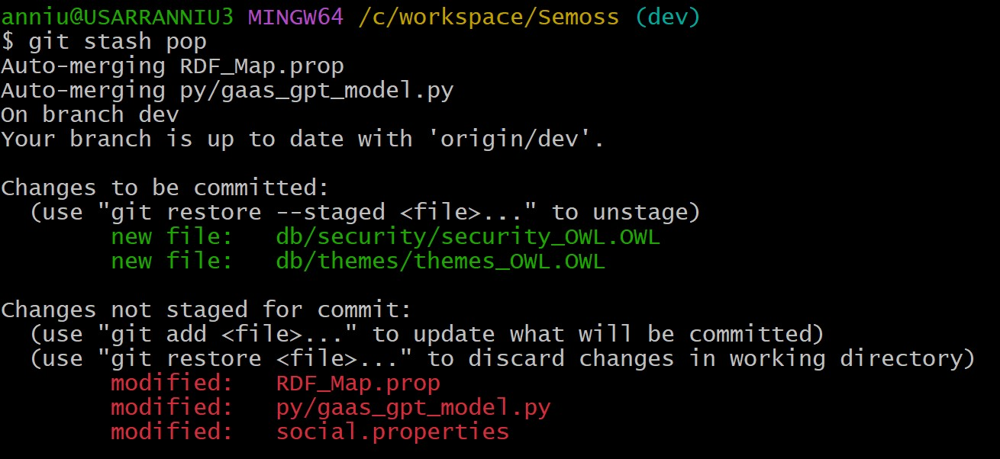
- Next, navigate to your Semoss folder (`cd C:\workspace\Semoss`) and repeat the above steps to pull the latest changes from the dev branch for the Semoss repo/folder.
- Next, navigate to your SemossWeb folder inside of Tomcat\webapps (`cd C:\workspace\apache-tomcat-X.X.XX\webapps\SemossWeb`, replacing the X's with your Tomcat version number) and repeat the above steps to pull the latest changes from the dev branch for the front-end repo/folder.
- Start Eclipse
- Refresh each project in Eclipse
- If there were pom.xml changes, Select both "Monolith" and "Semoss" and right click one of them and hold cursor over "Maven" and click "Update Project"
- Update both "Maven" Profiles by checking the box next to "Semoss" and "Monolith"
- Wait until workspace is completely built
- Start your Tomcat server

#### **Issues while Updating**
- The following section talks through some common occurrences that people may run into while updating:

**Conflicts in updating files**
- Sometimes you will have conflicts when you update. Conflicts happen when you have modified **and staged** a file on your computer that someone else also modified.
- When this happens, the output of your `git stash pop` command may look like this: 
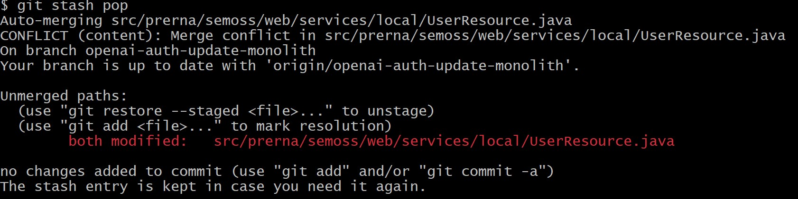
Note that the paths of the conflicted files that need to be manually resolved are displayed in the output!
- To fix this, open a file which is conflicted in VSCode. 
- View each of the sections labeled `>>>>>> Incoming changes` and `>>>>>> Current changes`, and edit the file to select which changes you want.
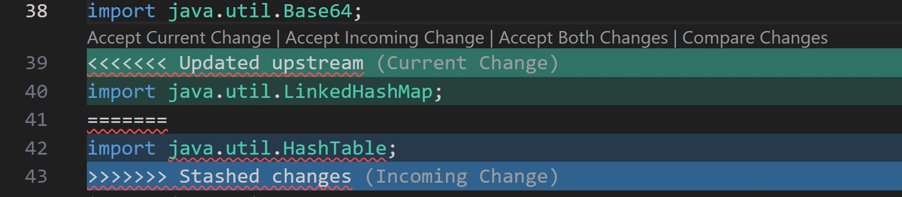
	- If it is not a database file and you have not intentionally edited the file, use **Accept incoming change** in VSCode to override your local changes with the new changes from the Git repository. 
	- If it is a database file, select **Accept current change** in VSCode to maintain your database values.
	- If you have intentionally edited the file, you can manually update the file to combine your changes with the incoming ones.
- Once you have resolved all the conflicts in the file, save the changes in your text editor (Hint: double check to make sure there are no leftover ">>>>>>" or "======" symbols in the file). 
- Then, repeat this process for each conflicted file.

**Maven Dependency Issues**
- If Tomcat publishing fails with errors related to “The system cannot find the [.m2] file specified”, double check that you do not have any pre-installed security applications causing a firewall issue with Maven
- You will need to uninstall any security applications like Symantec
- To fix this, contact your organization's IT department
	- Open a ticket with IT and request for Symantec to be suspended for an installation through maven/eclipse
	- Once the IT personnel confirms Symantec has been disabled, they may prompt you confirm by doing steps 3-4
	- Verify Symantec is disabled: click the up caret in the bottom right corner of your desktop (right side of task bar) to reveal background application. Double-click on the yellow cloud with a green shield on it (this shows you security status with Symantec)
	- Inspect if Symantec has been suspended; the IT personnel will usually give you a window of time it will be disabled, or they will ask you to message them back immediately when you no longer need it suspended. (This will depend on the IT staff)
- Then in Eclipse, follow steps in slide 87, refresh your code, and clean your projects

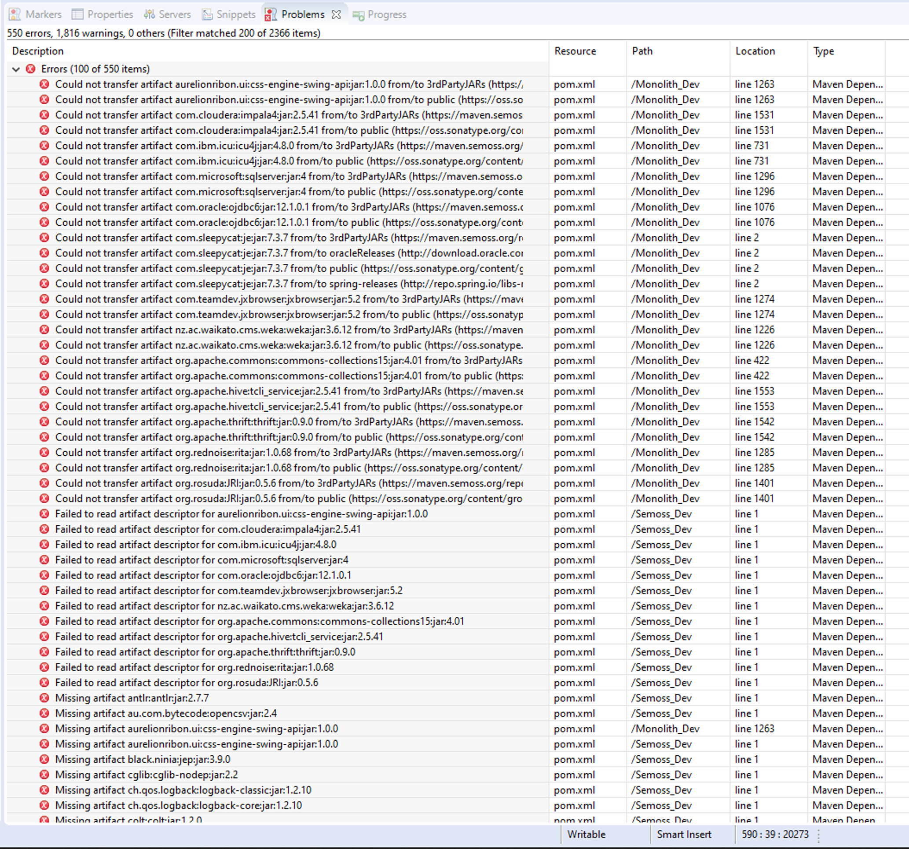


**If Maven doesn't download the dependencies correctly during your initial install**
- When you open the Problems view/tab (Window --> Show View --> Other --> Search Problems --> Select and Open), if any of the problems are categorized as ‘Maven Dependencies’ in the Type column (last column), then,
	- Download http://test.semoss.org/download/repository.zip
	- Close eclipse
	- Go to your .m2 folder in ‘C:\Users\USERNAME\.m2’
	- Delete the repository folder
	- Unzip the new repository folder in the zip you just downloaded in Step 1 and wait for it to finish
	- Make sure the repository folder is on the same level as the settings.xml file in the .m2 folder
	- Open eclipse
	- Select both Semoss and Monolith and right click --> Maven --> Update Project
	- Check Force Update
	- Press OK
	- Once this finishes, it should get rid of the ‘Maven Dependencies’ errors in the Problems tab

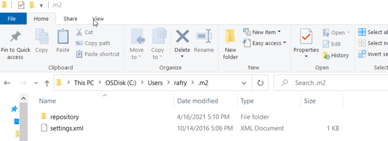

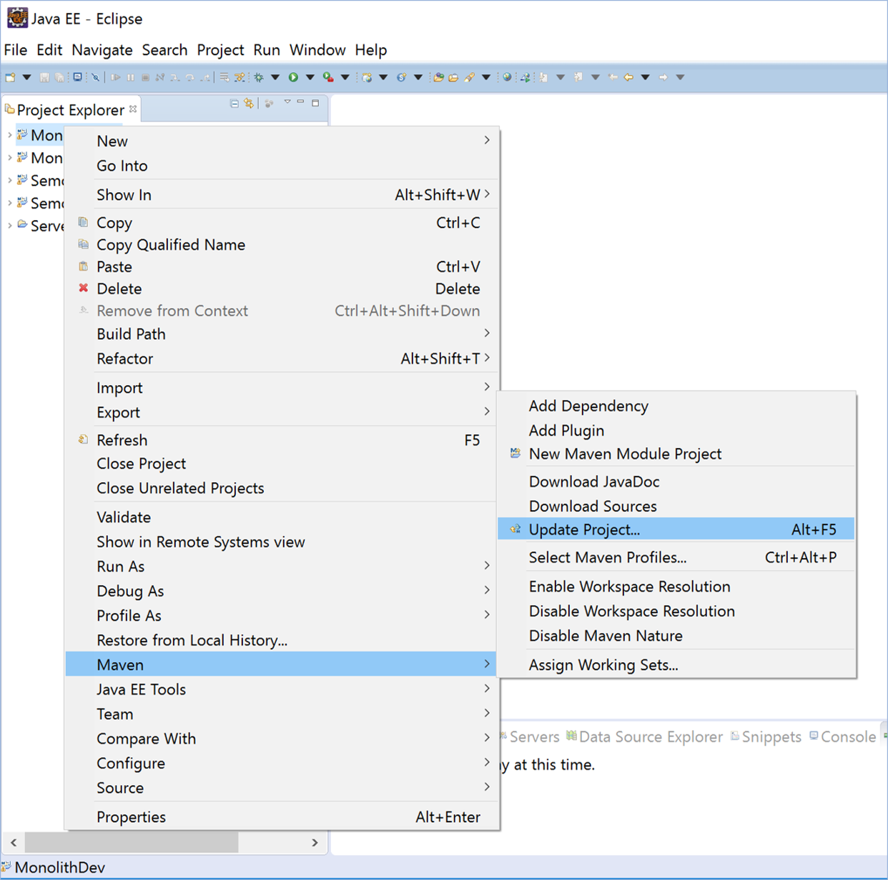
  
  **Errors in Eclipse projects**
- Sometimes you will see a red ! or X on your Semoss or Monolith projects within eclipse. This means that there is an error somewhere in your code.
- Generally, this happens because the project needs to be refreshed or cleaned in eclipse. Try Updating Maven and cleaning your projects first.

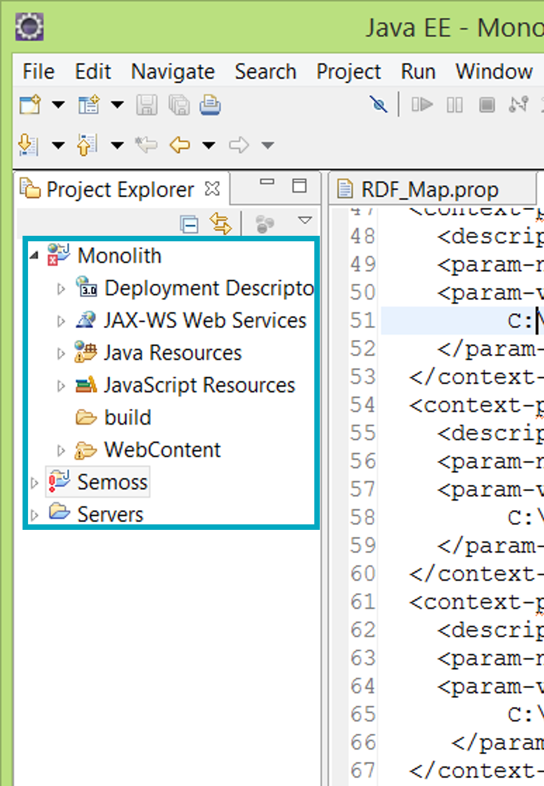


- After you update you should follow these steps within Eclipse in order to ensure your Semoss and Monolith projects are fully operational,
	- Update Maven
	- You usually only need to do this when the pom.xml is updated, which you can check during the [`git pull` update process](#regarding-semoss-update).
	- Right click on your Semoss and Monolith projects in the left hand panel of Eclipse and click Maven Update Project
	- Refresh your code
	- Right click on your Semoss and Monolith projects in the left hand panel of Eclipse and click Refresh to do this before starting AI Core
	- Clean your projects
	- From the top menu in Eclipse, select Project  Clean. Then select all your projects to clean.
	- Clean the Tomcat working directory
	- From the Java window, navigate to the Servers tab in the bottom section. Right click on Tomcat Server and select Clean.

- After you update you should follow these steps in order to ensure your front end changes take effect in Chrome
	- Empty Cache and Hard Reload: In Google Chrome, click F12. Then right click on the refresh button in the browser and select “Empty Cache and Hard Reload”

**If things go Wrong:**
- Here are a few important files to double check and make sure your paths are correct (http, port, and file paths):
	- RDF_MAP.prop (Semoss)
	- Web.xml (Monolith\WebContent\WEB-INF)
	- Config.js files in core, embed, and playsheet (SemossWeb)
	- Server.xml (Servers\Tomcat Server)

- Check your Monolith Build Path (it’s Users\Your username\workspace\Semoss\src) and the folder name is “Semosssrc”)
- If the path is incorrect, change it, click “Finish”. possible that the build path in Monolith pointing to Semoss has changed. To check this:
	- In Eclipse, right click on Monolith project and choose Build Path > Configure Build Path
	- Select Monolith/Semosssrc and choose “Edit” on the right-hand side
	- Make sure that the linked folder location is pointing to your Semoss src folder (probably C:\Us
	- If there are multiple Semosssrc links, remove all but the necessary one. Click “Finish”
	- Update, clean and refresh project
  
**Environment Variables**
- If your projects still have errors, you may need to delete your pom.xml file (Semoss) and [update again by performing `git pull`](#regarding-semoss-update).
- If you run into an issue in Eclipse that says it cannot find Local Master or Security:
	- Turn off Server
	- Delete databaseNewMaster.mv.db (C:\workspace\Semoss\db\LocalMasterDatabase) or database.mv.db (..\workspace\Semoss\db\security)
	- [Update Semoss](#regarding-semoss-update)
	- Restart Server

**Summary of If Things Go Wrong**
- Refresh your code
- Clean your projects
- Clean the Tomcat working directory
- Delete the databaseNewMaster.mv.db out of the Local Master Database folder
- Clear your cache
- Perform a hard refresh
- Restart your eclipse
- Restart your computer
- Talk to the dev team

**Eclipse won't open**
- If your Eclipse won’t open, it’s likely that your Java updated automatically by your organization's update policy.


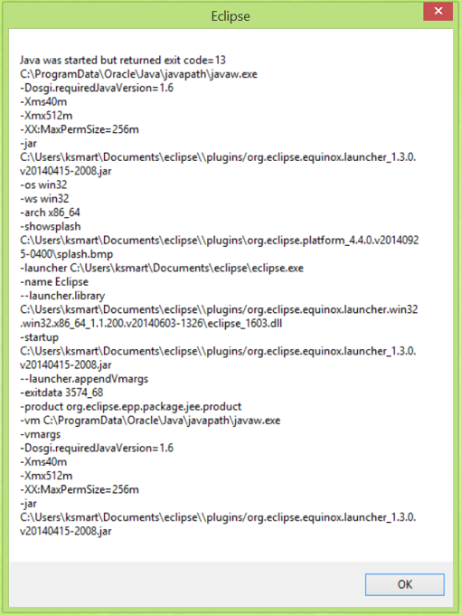

- To begin the fix, download the latest matching 64 bit JDK file from this website (http://www.oracle.com/technetwork/java/javase/downloads/index-jsp-138363.html)
	- Generally you want the Java SE 8uXXX version
- Navigate to this path:  C:\Programs Files\Java, and you should see a jdk and jre file
- Click within the JDK file and copy the file path at the top (ex. C:\Program Files\Java\jdk1.8.0_131)


- Go to the start menu and type in “Edit the system environment variables”
- Click “Environment Variables” at the bottom
- In the bottom of the “System Variables” pane, look for  JDK_HOME, JRE_HOME, and PATH—these are the variables that you will edit


**Java Errors**
- Error: Cannot find the class file for javax.crypto.SecreKey
- Do the following to the Semoss build path:
	- Right click on Semoss
	- Under Build Path Select Configure Build Path
	- Click the Libraries tab
	- Select Add External JARs...
	- Add the jce.jar and the jsse.jar files located in your C:\Program Files\Java\jre1.8.0_281\lib
	- Apply
 
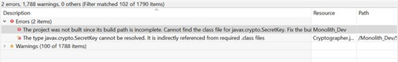

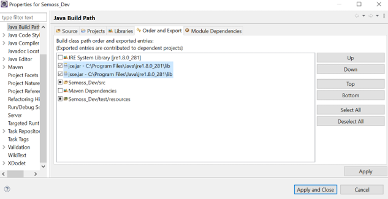
  
	 - In the Order and Export tab make sure the JRE System library is at the top and the jce.jar and jsse.jar are directly below
	- Check the jce.jar and jsse.jar boxes so that Monolith will inherit
	- You may need to go through the Refresh steps
 
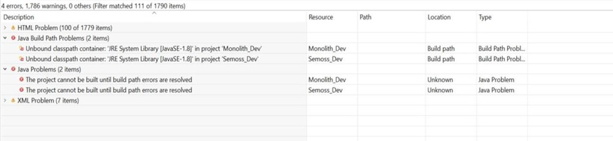

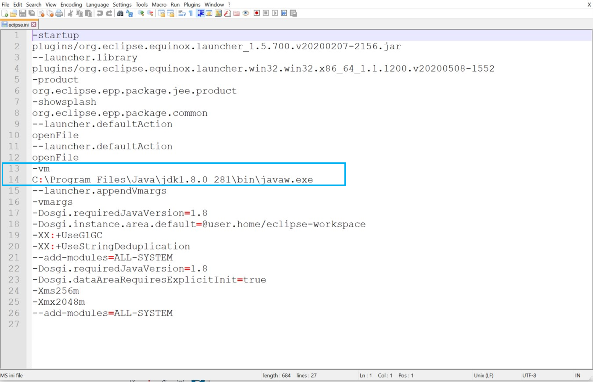

- Edit JAVA_HOME variable with the path you copied before

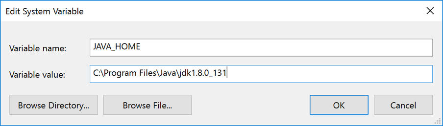

- Edit JRE_HOME with the path you copied before + \jre

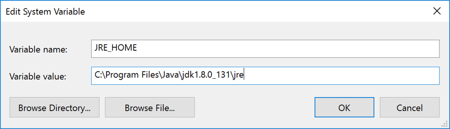

- Ensure the PATH variable uses your JAVA_HOME instead of being hardcoded
- Ensure your pom.xml does not contain a hardcoded java path

**Adding New Databases**
- The server should be off when adding new databases to Semoss
- Every database should also have a corresponding .smss file within the db folder.
- Copy and paste the folder and .smss file for the database into your Semoss/db folder
- Add the following line to the .smss file of the database you are adding if it is replacing one there before using the same name: RELOAD_INSIGHTS true
- If insights are not showing up after uploading a new database, try the following steps:
- In Insight Cache folder (Semoss) delete all files that are not called CSV_Insights
- Delete the databaseNewMaster.mv.db out of the Local Master Database folder and [update Semoss](#regarding-semoss-update)
- Go to Eclipse, clean the projects, run, and hard refresh in Chrome

**Helpful Tips**

**Server Configuration**
- If you are getting an error related to connection aborted, this is likely because your port is already in use. Your organization has started using/blocking port 8080, so you will need to perform the following steps to correct,

	server.xml
	- Open your Windows File Explorer and navigate to the following path: C:\workspace\apache-tomcat-9.0.30\conf
	- Right click on server.xml and Open With Notepad++
	- Find the line that says \<Connector and the port number (should be around line 63)
	- Change the port to 9090
	- Save and close the file

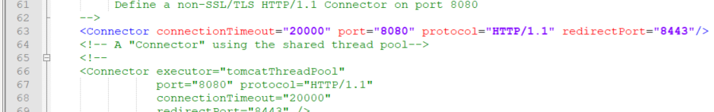

	Eclipse
	- Restart Eclipse
	- In the bottom panel area, on the Servers tab, double-click your new server (Tomcat v9.0 Server at localhost).
	- Under Ports, ensure the Port Number matches the port number you defined in your server.xml (likely 9090)
	- Save the file with changes

	Browser
	- Open Chrome and enter http://localhost:9090/SemossWeb/
	- “SemossWeb” = the name of your folder during the initial repository creation.
	- Notice the new port number

- If you are still having issues after going through these steps, check your server configuration. Double click on your server in the Servers tab to view the settings.
	Server Locations
	- “Use Tomcat Installation” should be checked
	
	Ports
	- Check that HTTP/1.1 points to the correct port number (probably 9090 or 443)
	
	Modules
	- “Path” and “Document Base” should have the same name as your Monolith project (ex. Monolith)

 **Server In Use**
- If you are getting a message that your server port is already in use, follow these steps:
- Close Eclipse
- Open Command prompt as an Administrator
- Run the command: `netstat -ano | findstr :<9090>`
- Replace `<9090>` with the port number that is in use if it is different
- The output will specify the process identifier that is running (numbers to the right of ‘LISTENING’)
- Run the command: `taskkill /PID <PID> /F`
- Replace `<PID>` with the process identifier in step 4
- Reopen Eclipse as an Administrator and start the server

**Tomcat Error**
- If you see this error:​ "The specified JRE installation does not exist"​
- when starting Tomcat, it means Tomcat is still set to use another JDK. Update it as follows: 
- In the Servers panel, double-click on Tomcat v9.0 Server at localhost to open the Server Overview.​
- Under General Information, find Runtime Environment and click its link (such as Apache Tomcat v9.0).​
- In the window that opens, select your new Java 21 JRE in the "JRE" dropdown.​
- Click Finish, then save (Ctrl+S).


**Missing R Packages**
- Open the R console
- Run install.packages("pacman")
- Run this script: https://github.com/SEMOSS/docker-r-packages/blob/R4.1.2-debian11/Packages.R

**Eclipse Network Problem**
- Disconnect from your organization's VPN
- Reinstall Eclipse from [Eclipse](https://www.eclipse.org/downloads/packages/release/2020-06/r)

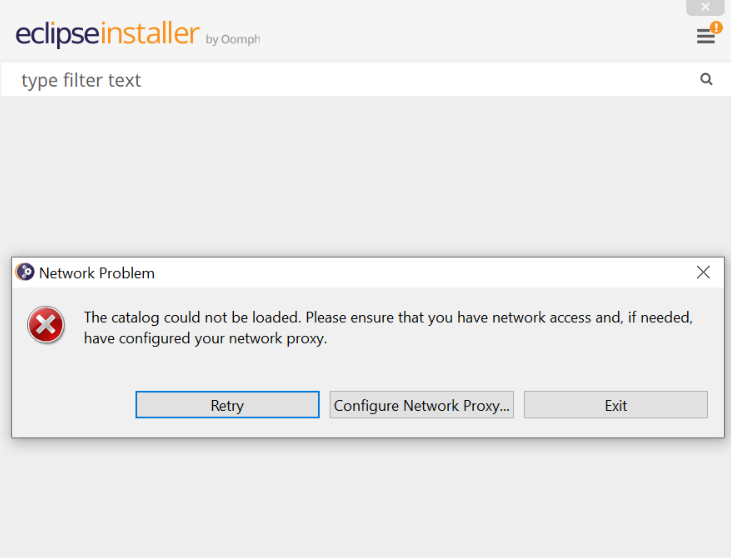

**MVN not recognized as an internal or external command**
- Run echo %PATH% in the cmd to find the maven path​
- Verify the path exists in your file explorer and matches the MVN environment variable


