Download softwares and tools from below links to be able to install Semoss.
## Create the workspace folder
The workspace folder is where all the code will sit

We recommend creating a folder in your C Drive and name it "workspace"

```C:\workspace​```

## Software Downloads
### Java JDK 21

Click on [java21](https://www.azul.com/downloads/?version=java-21-lts&architecture=x86-64-bit&package=jdk-fx#zulu)

Scroll down to Java 21 and click on Download next to Windows x86 64-bit

You can use the MSI installer or ZIP

### Eclipse IDE for Enterprise Java Developers
Click on [Eclipse IDE](https://www.eclipse.org/downloads/packages/release/2025-06/r/eclipse-ide-enterprise-java-and-web-developers)
- Select the link under ‘Download Links’ -> 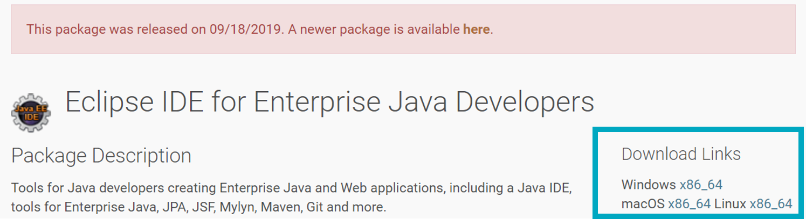
- Windows 64-bit
- Unzip this to Desktop or Default location

### Apache Tomcat (v9)
Click on [Apache Tomacat](https://tomcat.apache.org/download-90.cgi)
- Choose Binary Distributions, Core, 64 bit Windows .zip file under the latest 9.0 section
- Unzip the apache-tomcat folder into your workspace
- The folder will most likely be named apache-tomcat-9.0.## (with ## being the version number!)
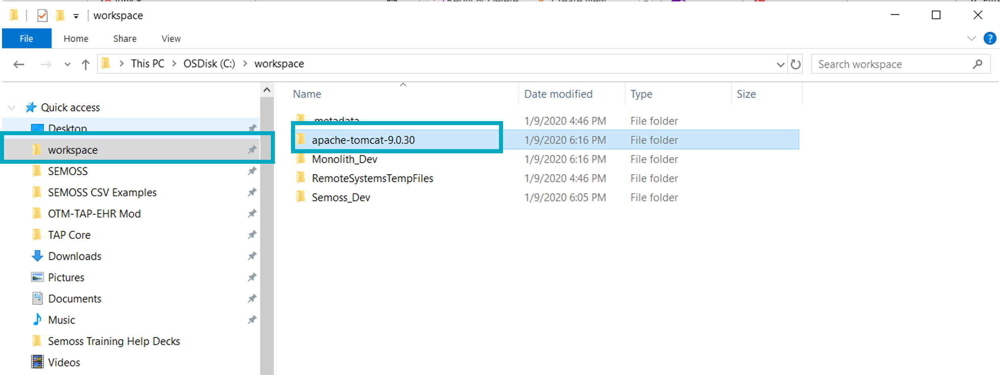

### Git
Download [Git](https://git-scm.com/downloads)

### Notepad++
Choose [Notepad++ Installer](https://notepad-plus-plus.org/downloads/v7.8.2/)

> Note: Please download the 64-bit x64 installer version (not the zip file)

### node.js
Click on [node.js](https://nodejs.org/download/release/v18.16.0/)
- Click node-v18.16.0-x64.msi and follow the installation instructions

- To check whether node.js has been successfully installed,
  - Go to terminal
  - Type 'node -v' and hit enter
  - This should return the version of the node installed

### Maven
Click on [Maven](https://maven.apache.org/download.cgi)
- Click the download link beside Binary zip archive, and unzip this to your Documents folder

- To check whether node.js has been successfully installed,
  - Go to terminal
  - Type 'mvn --version' and hit enter
  - This should return the version of the node installed

> **Note**
> Use Google Chrome for all downloads. Then you can quickly navigate to the downloads folder, right click, and Run as Administrator.


### Visual Studio Code​
Download [Git](https://code.visualstudio.com/Download ​)

Under Windows, select user installer x64, and then click next through all the default options ​

## Clone Code Repos
### Clone Semoss Code

1. Navigate to your workspace​

2. Open a terminal (cmd, powershell) at this location​

3. Run the command
```
git clone https://github.com/SEMOSS/Semoss.git
```
4. Ensure you are on the dev branch​

### Clone Monolith Code

1. Navigate to your workspace​

2. Open a terminal (cmd, powershell) at this location​

3. Run the command
```
git clone https://github.com/SEMOSS/Monolith.git
```
4. Ensure you are on the dev branch​

### Clone semoss-ui code

1. Navigate to your Tomcat webapps folder​

Since we placed the tomcat folder in the workspace, the path is: C:\workspace\apache-tomcat-9.0.##\webapps​

2. Open terminal at this location and run the command 
```
git clone https://github.com/SEMOSS/semoss-ui.git
```

3. Ensure you are on the dev branch​

4. Rename semoss-ui folder to SemossWeb​

5. In the SemossWeb folder create a new file named “.env.local”, and copy the following contents into that folder


```
ENDPOINT=../../..​
MODULE=/Monolith​

​

THEME_TITLE=AI Core
THEME_FAVICON=./src/assets/favicon.svg​


NODE_ENV=development
```
Your SemossWeb folder should look like this
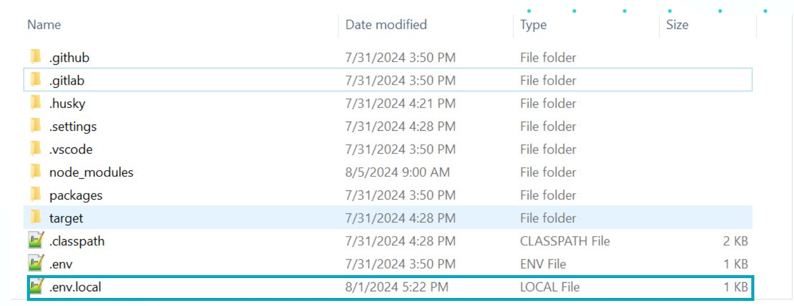

### Build the Frontend
- Navigate to the following path in your command prompt/terminal:
```
C:/workspace/apache-tomcat 9.0.##/webapps/SemossWeb (this is your root directory)
```
- In the terminal type in: 
```
npm install -g pnpm
```
- In the same terminal type in: 
```
pnpm install
```
  
> **Note**
> These next couple steps are going to require node.js version 18 or greater and pnpm

- Then navigate to the following path in your command prompt/terminal: C:/workspace/apache-tomcat 9.0.##/webapps/SemossWeb/packages/ui and type the command 
```
pnpm run build
```
- Upon completion, navigate back to root directory, open terminal and run the command 
```
pnpm run dev:client
```


#### Update app.constant.js
- Navigate to your Apache Tomcat webapps folder
  - Since we placed the tomcat folder in the workspace, the path is: C:\workspace\apache-tomcat 9.0.##\webapps
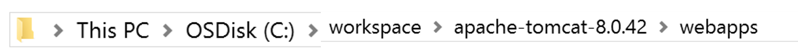

- Click on **SemossWeb**
- Go to Packages, then go to Legacy
- Right click the **app.constants.js** file and click Edit with Notepad++

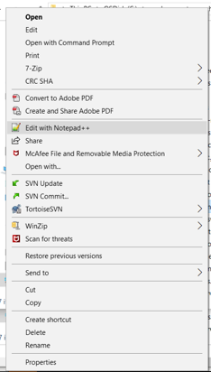

- Locate this section of code, and update the following values, if necessary:
  - Change pictured line starting with “mod” to mod = ‘Monolith’ (This will likely be near line 18-19)
  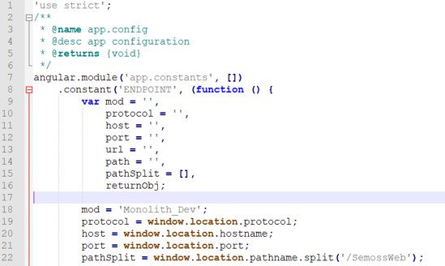

- When complete, save and close

## Eclipse Setup
### Setup Eclipse Workspace Folder
Once your Eclipse & JDK are installed, open Eclipse and specify where you want your workspace to be
   - Specify **C:\workspace** instead of the default name that shows up
- We recommend that you pin eclipse to your taskbar and pin your workspace to your Quick access bar
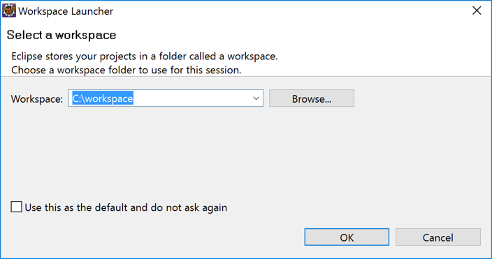


### Import Semoss and Monolith into Eclipse

**In the Import Box that appears**
- Open eclipse and go to **Import** in **File** tab, then find **Maven**, click on the dropdown and select **Existing Maven Projects**
- It will start searching existing project and might take some time
- For **Root Directory**: Browse for your workspace and click Okay. This should reflect where you saved your workspace folder i.e. "C:\workspace"
  


- For **Projects**:
   1) Check "Monolith"
   2) Check "Semoss"
   3) Uncheck all others including "SemossWeb"
 
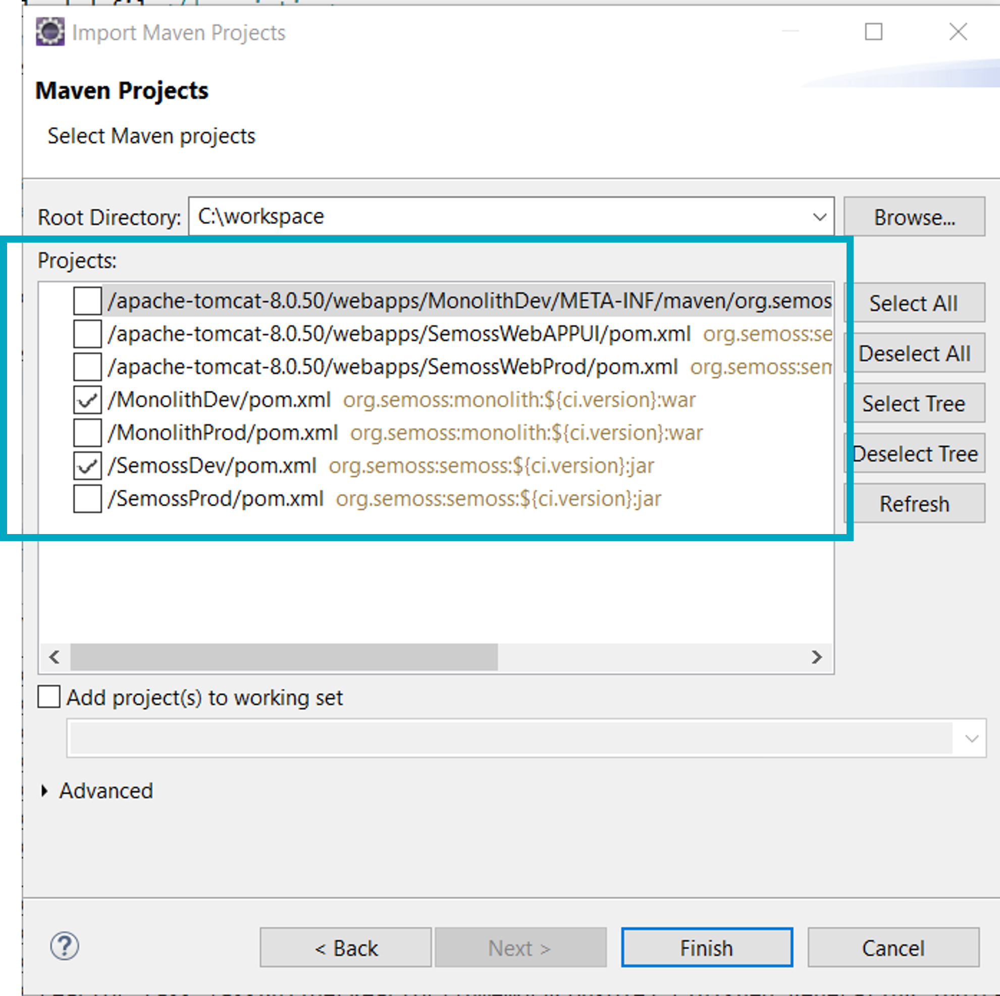

- At the bottom of the import window, click Finish to import your projects

### Build Path
- In eclipse, click on **Windows** tab and then click on **Show view** and then click on **Others**
- Now go to General and then go to **Project Explorer**
- Right click on the **Monolith** project under the **Project Explorer** Tab and select **Build Path > Configure Build Path**

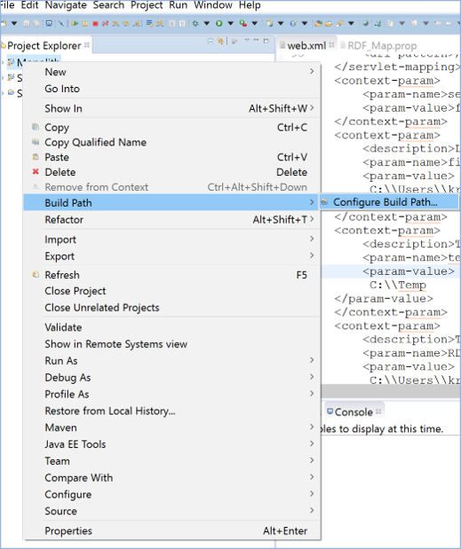

- Click on the Source tab, Select the **Monolith/src** folder and click Edit.
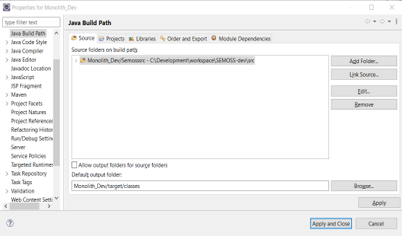

- Browse for the correct workspace location under **Linked folder location**: **C:\workspace\Semoss\src**
- Then, on the Source Folder screen update the Folder Name field to say: “Semosssrc”. Click **Finish** >> **Apply and Close**
- This may take a few minutes. Please allow the workspace to update.
  
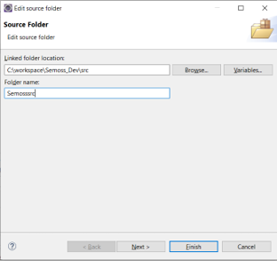

## Setup RDF_MAP

### Update RDF Map for Semoss
- In the **Project Explorer** panel on the left, expand Semoss and scroll down to find File.
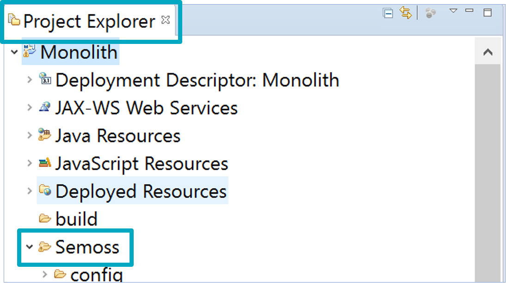

- Right click on **RDF_Map.prop** and Open With Notepad++ or double click and just open in Eclipse
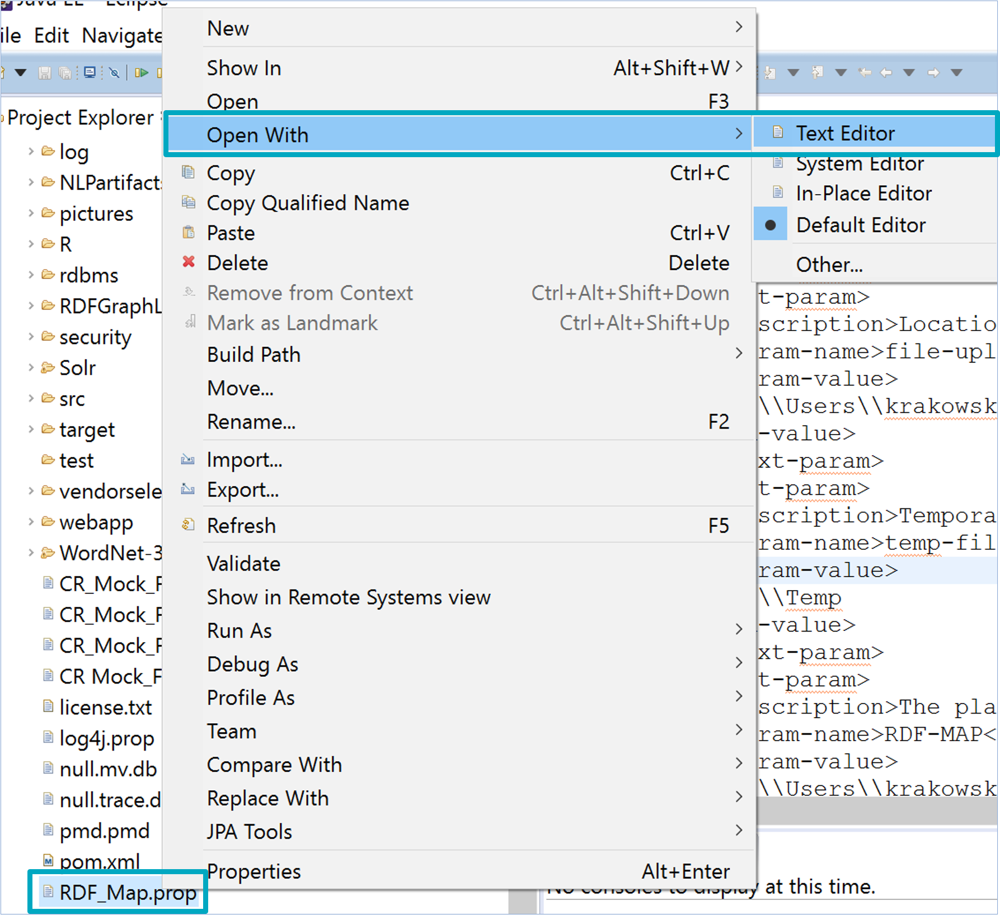

-Make sure all references to the C drive (i.e. "C:\\...") is the correct file path.
- Check that all of your paths begin with **C:\\workspace\\Semoss\\** or whatever your accurate workspace path is. The last of these should occur on line ~53, starting with EMAIL_TEMPLATES.
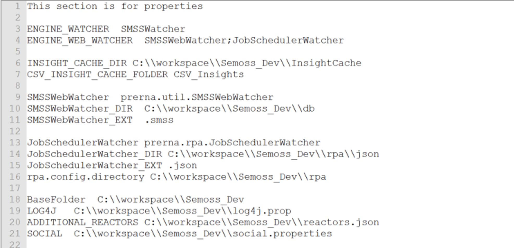

- If you make any changes, save the file and close it.

## Setup Social Properties
### Update social.properties for Semoss

- Navigate to your social.properties file. This can be found directly in the **Semoss** folder.
- Right click on **social.properties** and Open With **Notepad++** or in Eclipse
- Ensure that every port and folder name matches with how you set up your AI Core.
  - Ports 5353/5355/8080 should be changed to 9090
  - SemossWeb_AppUi should be changed to SemossWeb
  - Monolith should match what you called your Monolith folder
- Enable the logins that you plan to use (ie. Google, GitHub, etc.)
- If you wish to use certain Google APIs, you will need to create an account and project on your own to receive a client_id and secret key (https://console.cloud.google.com/home/)
> **Note**
> You can set up the logins and APIs at a later time as needed

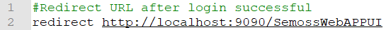
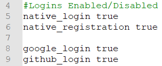

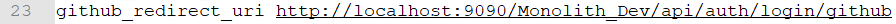

## Setup Tomcat
### Update server.xml for Tomcat

- Open your Windows File Explorer and navigate to the following path: **C:\workspace\apache-tomcat-9.0.30\conf**
- Right click on **server.xml** and Open With **Notepad++**
- Find the line that says **\<Connector and the port number** (should be around line 69)
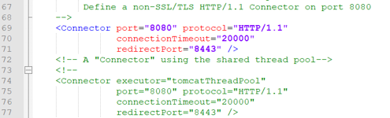

- Change the port to 9090
- Save and close the file

### Create a Tomcat Server
- In the top bar of Eclipse, click **Window -> Show View -> Other**
- Expand the Server drop-down, select **Servers**, and click **OK**
- In the bottom Servers panel, click **No servers are available. Click this link to create a new server**
> **Note**
> If you cannot find or search for Servers in the Show View window, revisit which Java you downloaded at the beginning to ensure you have the IDE for Enterprise Java Developers.

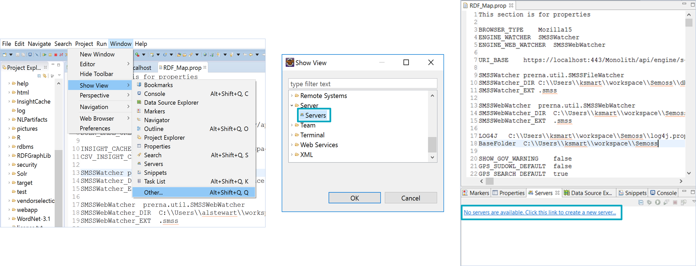

- In the New Server window that appears, expand Apache, and select the version of the **Tomcat vX.X Server** you installed and click **Next**.
> **Note**
> You may need to expand the pop-up window to view the server options.

- Expand Server, select Servers and click OK.

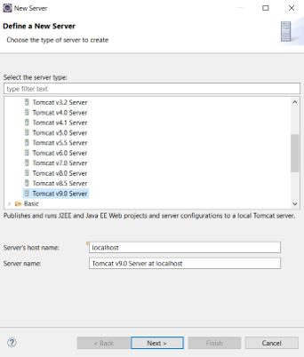

- In the **Tomcat installation directory** field, enter (the location of your tomcat file): **C:\workspace\apache-tomcat-X.X.##** and click **NEXT**.

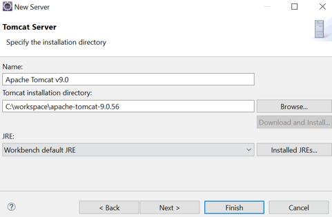

- From the Add/Remove window that appears, under Available, select Monolith, click **Add** to move it to the configured side, then click the **Finish** button at the bottom. This window will then close.
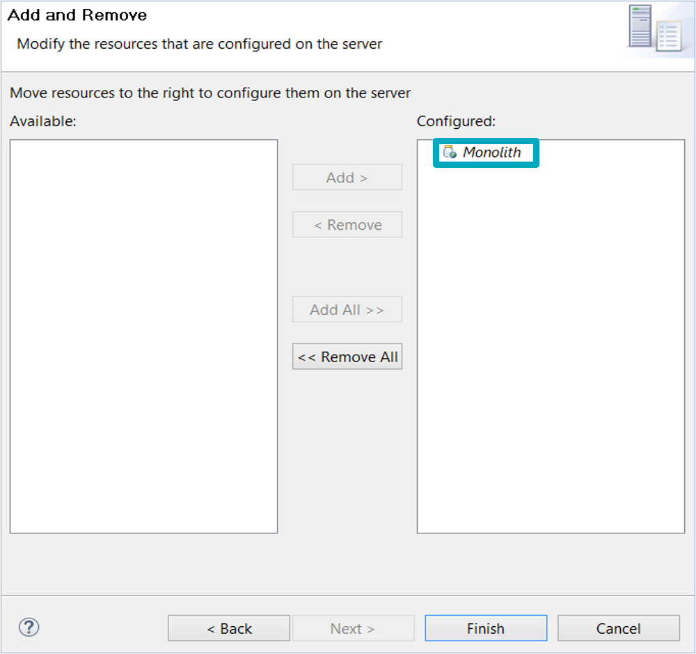

- Back in Eclipse, in the bottom panel area, on the Servers tab, double-click your new server (Tomcat v9.0 Server at localhost).
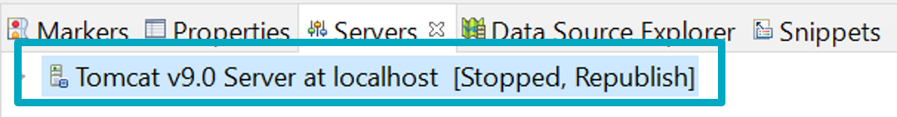

- In the new window that appears, under Server Locations:
  - Select “Use Tomcat installation”
  - Change Deploy path field to reads “webapps”. (Just delete the first “wtp” characters)
- Under Publishing, select “Never Publish automatically”
- Under Timeouts, change start time to “300 seconds”
- Under Ports, ensure the HTTP/1.1 Port Number matches the port number you defined in your server.xml (likely 9090). Leave the other ports as is. Change admin port to 8105.
- Switch from Overview to Modules tab (at the bottom of the opened window)
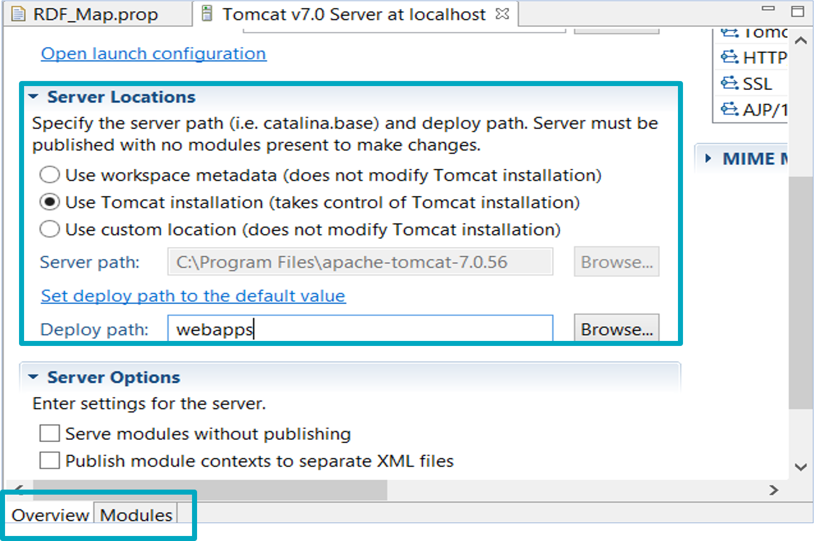

- Select the Monolith Web Module that appears in the table and click Edit on the right
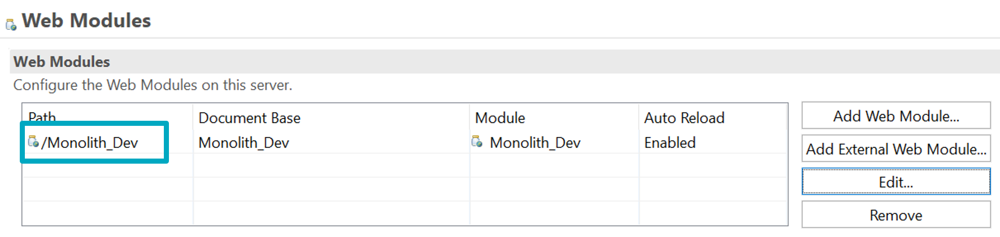

- Make sure the Path accurately reflects what you named your Monolith Folder 
  - E.g. “/Monolith”
- Click **Save** in Eclipse

## Change Environment Variables
- In Windows, from your start menu/search bar, navigate to your Control Panel > **System and Security** > System > Advanced system settings.
- On the Systems Properties window that appears, select **Environment Variables**
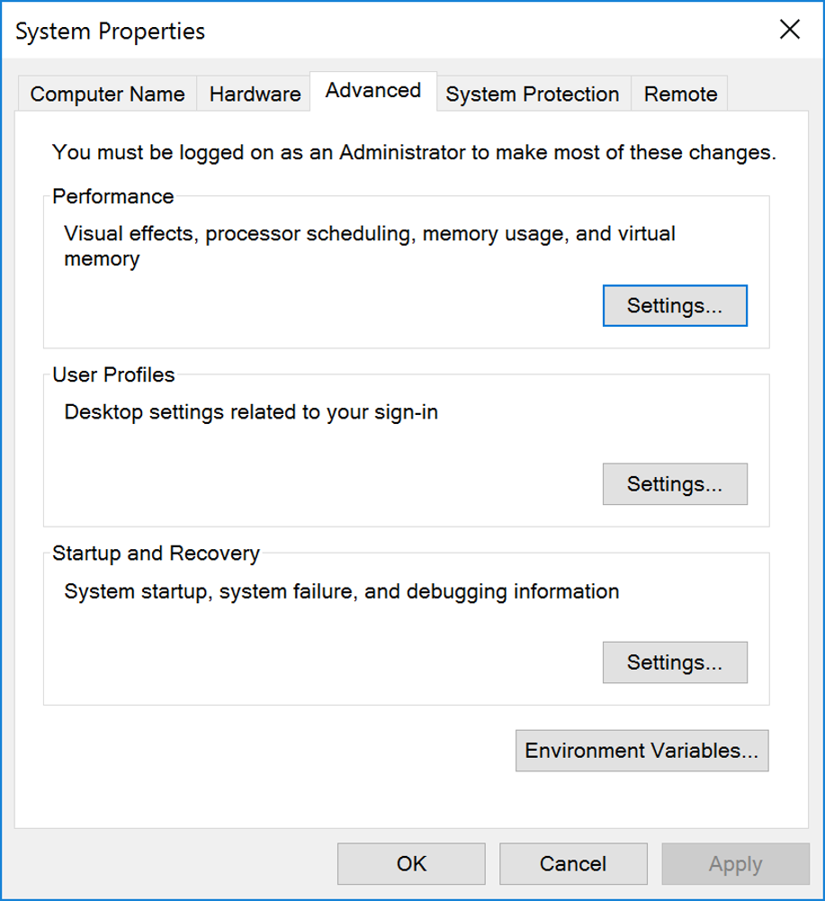
- Under system variables (bottom section), select **New...**
  - For variable name, type **JAVA_HOME**
  - For variable value, choose **Browse Directory**, go to Program Files, go to Java, and select the jdk folder.
    - For example, **C:\Program Files\Java\jdk1.8.0_###**
      
> Note: Environment variables are case-sensitive

- Click OK
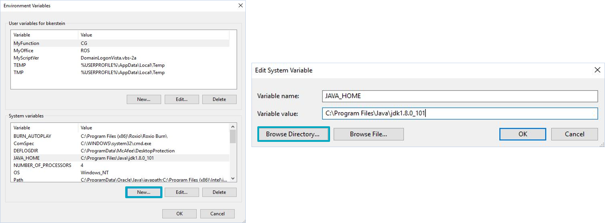

- Next, Under system variables (bottom section), locate the **Path** variable, select it, and click Edit
  - In the window that appears, click New
  - In the new row that appears, paste **%JAVA_HOME%\bin** without the quotation marks
  - Click OK

> Note: Environment variables are case-sensitive
   
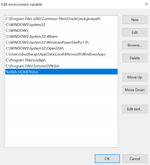

- Keep these windows open for the next steps
- Under system variables (bottom section), select **New...**
  - For variable name, type **MVN_HOME**
  - For variable value, choose **Browse Directory**, go to Documents, and select the apache-maven folder.
    - For example, **C:\Users\[your username]\Documents\apache-maven-#.#.#**
      
> Note: Environment variables are case-sensitive
   - Click OK
    
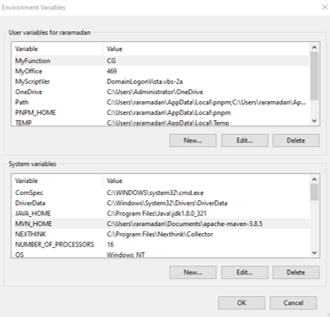

- Next, Under system variables (bottom section), locate the **Path** variable, select it, and click Edit
  - In the window that appears, click New
  - In the new row that appears, paste **%MVN_HOME%\bin** without the quotation marks
  - Click OK

  > Note: Environment variables are case-sensitive
    
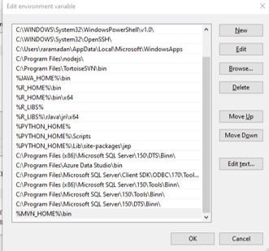

- Click Ok to close the window. Close out the remaining Systems Properties windows.

## Update web.xml for Semoss
- Navigate to **C:\workspace\Monolith\WebContent\WEB-INF**
- Right click on **web.xml** and select **Edit** in Notepad++ 
- Ensure line 660 states **<param-value>C:\\workspace\\Semoss\\</param-value>**
- Ensure line 670 states  **<param-value>C:\\workspace\\Semoss\\RDF_Map.prop</param-value>**
  - If your line numbers are off, CTRL+F for **RDF** to find the correct lines
> **Note**
> This path should match what you changed in RDF map so ensure it matches your correct Semoss path.

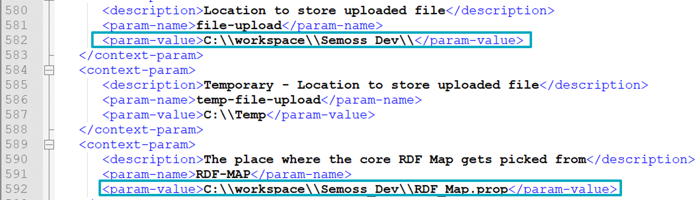

## Adding settings.xml to .m2 (maven) repository
- Navigate to **C:\Users\YOUR_USERNAME**
  - YOUR_USERNAME is your actual username
- Locate the .m2 folder (auto created after maven update in eclipse)
  - You may need to create a .m2 folder if it is not yet there
- Add the settings.xml file (from [settings.xml.zip](https://github.com/user-attachments/files/17323149/settings.xml.zip)) to .m2 folder

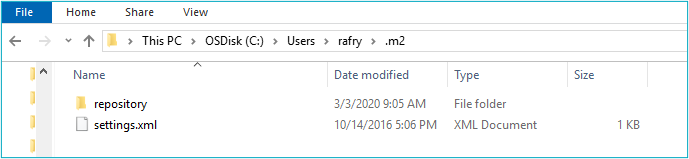

## Importing security certificates
- Navigate to your Symantec security install location in Program Files
- Go to **C:\Program Files\Symantec\WSS Agent**
  - **If you do not have this folder on your PC, you may skip this section.**
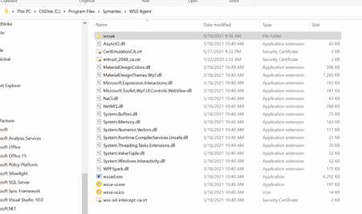

- Click the file path at the top, and copy it to your clipboard
- Click the Windows start button and type **CMD**. Select **Run as Administrator** you will need to provide your admin credentials

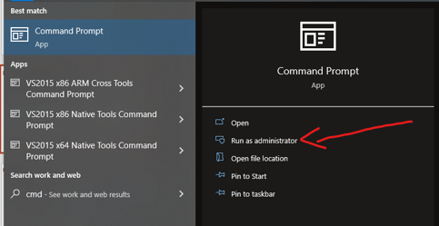

- In the command prompt, type: cd
- Then type a space, a quotation mark: **, right-click to paste the path, another quotation mark:**, and then hit Enter
**Note:** Do not hit "CRTL+V" to paste the path. Right click instead.
- Copy and paste (by right-clicking) the following line into the command prompt:
  - keytool -importcert -noprompt -trustcacerts -keystore **%JAVA_HOME%/jre/lib/security/cacerts** -file CertEmulationCA.crt -alias CertEmulationCA -storepass changeit
- Hit Enter
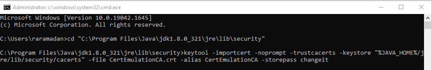

- Do the same for this line:
  - keytool -importcert -noprompt -trustcacerts -keystore **%JAVA_HOME%/jre/lib/security/cacerts** -file wss-ssl-intercept-ca.crt -alias wss-ssl-intercept-ca -storepass changeit
- Hit Enter

## Manual Maven Install
We now need to navigate to each project within the command prompt and run a maven install command
- In Eclipse, first for **Semoss project** and then **Monolith project**, do the following:
  - Right-click the project in the project explorer. Choose **Show In > System Explorer**
    
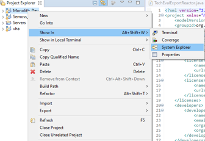

  - Double-click and open the project folder 
  - In the file explorer window, click the file path at the top, and simply type “cmd” and hit enter
    - This will open a command prompt at this location
    
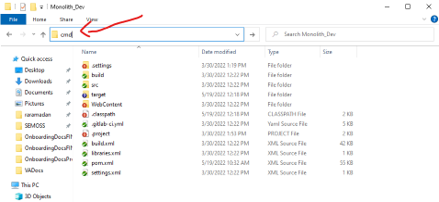

  - Copy and right-click to paste the following line into the command prompt, and hit enter:
    - mvn clean install -U -DskipTests=true
    
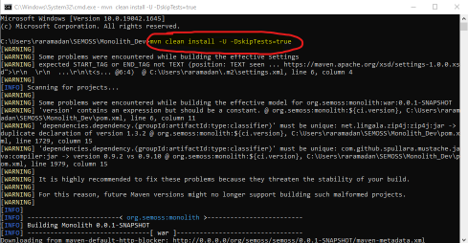

## Update Catalina.properties
- Open catalina.properties in eclipse or Notepad++. It is located in **C:\workspace\apache-tomcat-9.0.56\conf**, your Severs, Tomcat9 folder.
- Replace line 108 with the following: **tomcat.util.scan.StandardJarScanFilter.jarsToSkip=*.jar,\
- Resave the file. This will improve the startup time of your server.

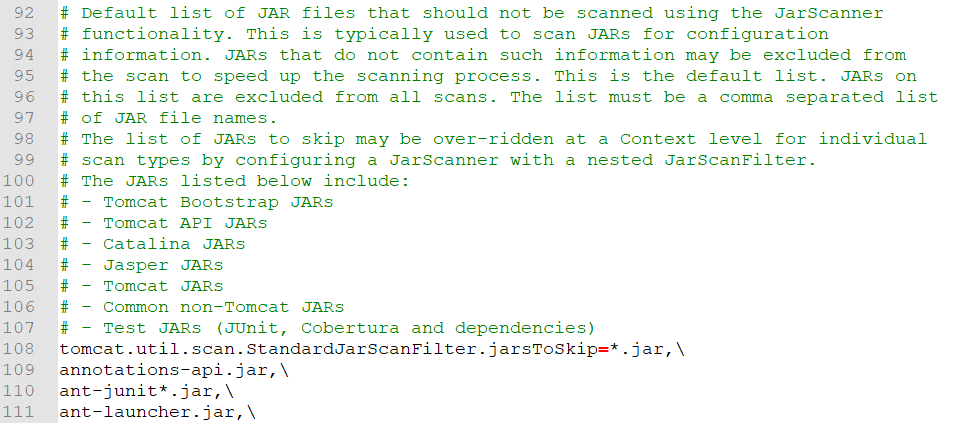

## Update Maven
- First close out of eclipse and restart the application. This is necessary any time you make changes to your Environment variables
- Back in Eclipse, ensure your Project Explorer panel is being displayed (typically on the left-hand side).
  - If you don’t see the “Project Explorer” window, select **Window -> Show View -> Project Explorer** to show them.
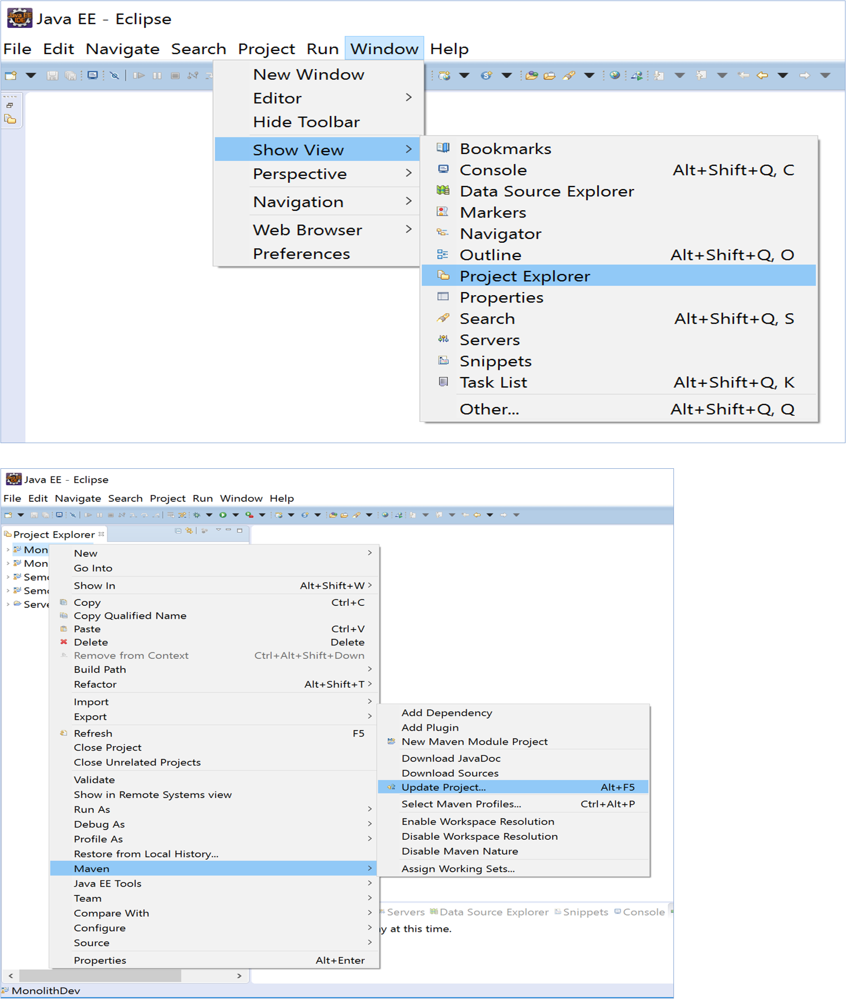

- Update each project **(first do this for Semoss, then repeat for Monolith)**
  - Right-click on the project in the project explorer panel
  - Scroll down to Maven > Update Project
  - Place a checkmark in the “Force Update of Snapshots/Releases” box. Click Ok.
  - The workspace will start updating and you can see the progress in the bottom right corner in Eclipse.  This may take some time to build.**[click on the bottom right icon to see background progress]**

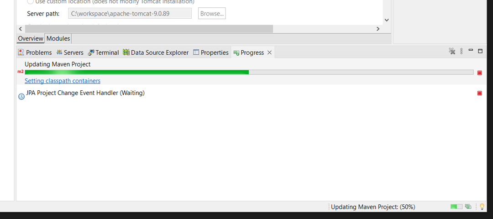

  - If you get the following error while maven updating, just click ok and let the update proceed.


> **Note**
> - If you run into issues of Maven not downloading the dependencies, please see the Tips & Tricks section for downloading a new .m2 folder
> - If Maven is throwing other unexpected errors, you may need to clean and refresh your projects.

## Install visual studio installer
- Download Microsoft Visual Studio Installer from this link: **https://visualstudio.microsoft.com/thank-you-downloading-visual-studio/?sku=BuildTools&rel=15**
  - We need to Install the 2022 (latest) community version
  - Visual Studio Installer is needed for a C++ compiler (many Python packages require this)
- To install, find the installation file (likely in your Downloads folder), right click and **Run as administrator**. You’ll need to enter login credentials at least a few times during installation.

## Install Python
This  uses the pyproject.toml file to install the necessary packages for the AI CORE Python environment. This setup is intended to be used with the [Astral UV](https://docs.astral.sh/uv/) platform.

### Install uv 
Install [uv](https://docs.astral.sh/uv/getting-started/installation/) with the powershell command:
```
powershell -ExecutionPolicy ByPass -c "irm https://astral.sh/uv/install.ps1 | iex"
```
#### Install Python in uv
Once you have installed UV run  
```
uv python install 3.12.9 --default --preview
```

if you get an error run this instead

```
uv python install 3.12.9 --default --preview --allow-insecure-host github.com
```  
Check that python was installed by running
```
python --version
```

#### Create a virtual environment
In your command line Go to `<SEMOSS_HOME>/py/install_config`
```
uv venv
``` 
install the necessary packages depending on your system's capabilities
```
uv pip install -r pyproject.toml
``` 
To add exptra cpu run this command

```
uv pip install -r pyproject.toml --extra cpu
``` 
To add exptra gpu run this command 
```
uv pip install -r pyproject.toml --extra gpu
```
verify the packages are installed 
```
uv pip list
```

### PYENV (NOT THE PREFFERED METHOD)
If you prefer to use PYENV follow these steps (This assumes you are using pyenv for Windows)

1. update pyenv

```
pyenv update
```

2. install Python 3.12.9
```
pyenv install 3.12.9
```
3. set the global version of Python to 3.12.9
```
pyenv global 3.12.9
```
4. Open a new terminal and verify the Python version with 
```
python --version
```
5. [Install uv](#create-a-virtual-environment) 
6. setup [virtual environment](#create-a-virtual-environment) 


- Navigate to this website: https://www.python.org/downloads/release/python-31010/
> **Note**
> Although it is not compulsory to install this version of Python but its recommended
- Near the **bottom of the page**, under Files, then under Version, click the link to download the **Windows installer (64-bit)** installer
- Click the link in the Version column to automatically install Python with the default settings
- Python should now be located in a directory like **C:\Users\YOUR_USERNAME\AppData\Local\Programs\Python\Python310**
  - YOUR_USERNAME would be your actual username
> **Note**
> You might have to login multiple times

### Configure Python in your RDF_Map.prop
- Using Notepad++ or any other text editor open the file **C:\workspace\Semoss\RDF_Map.prop**
- Copy paste your python path from above and add it to the RDF_Map.prop along with the below mentioned properties. Use Ctrl + F to search for the keys. If they aren’t there then add them just after #FORCE_PORT 9999:
```
PYTHONHOME C:\\Users\\YOUR_USERNAME\\AppData\\Local\\Programs\\Python\\Python310
TCP_WORKER prerna.tcp.SocketServer
TCP_CLIENT prerna.tcp.client.NativePySocketClient
NATIVE_PY_SERVER true
```
Additionally make sure the following are also enabled, they are just below above lines:
```
USE_PYTHON true
NETTY_R false
NETTY_PYTHON true
```

### Install libraries
- Open a command prompt as administrator
- Type in: **py --version** (to make sure Python is installed)
- Depending on what you are using AI Core for, install the packages in order:
  - SEMOSS:
  ```
  py -m pip install --upgrade -r https://raw.githubusercontent.com/SEMOSS/docker-r-python/R4.2.1-debian11/semoss_requirements.txt
  ```
  - SEMOSS: 
  ```
  py -m pip install --upgrade -r https://raw.githubusercontent.com/SEMOSS/docker-r-python/cuda12-R4.2.1/cfgai_requirements.txt
  ```
  - Users Who Have A  Computer With a GPU: 
  ```
  py -m pip install --upgrade -r https://raw.githubusercontent.com/SEMOSS/docker-r-python/cuda12-R4.2.1/gpu_requirements.txt
  ```
> **Note**
> To make this step easier, use the up arrow on your last keyboard to copy the last command


### Adding new packages
create the [virtual environment](#create-a-virtual-environment)  (if not already created)

to add a package
```
uv add <package>
``` 

to remove a package
```
uv remove <package>
``` 

to verify the packages are installed
```
uv pip list
```

### Test Python Installation
- Open command prompt and then type **py** and enter
- It will open python terminal
- Now try 2+2 and see if it gives the correct response of 4

### Update RDF_Map
Once everything is installed successfully, go to **C:\workspace\Semoss\RDF_Map.prop** 
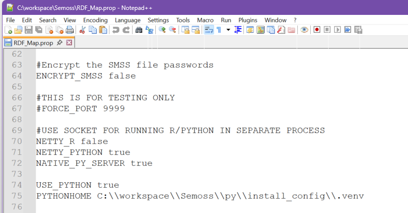
1. change the line with **USE_PYTHON false** to **USE_PYTHON true**

2. Copy the path of the virtual environment including the \Scripts folder.
3. You now have 2 options, you can either:
    - Update your RDF_Map.prop file to include the PYTHONHOME variable
    - **OR**
    - Add the PYTHONHOME variable to your system environment variables
4. If adding to the RDF_Map.prop file, you should format your path with the double blackslashes to your appropriate path like so:
properties
    PYTHONHOME C:\\Users\\rweiler\\Desktop\\REPOS\\docker-r-python\\.venv\\Scripts
5. If adding to your system environment variables, you should format your path with the single blackslashes to your appropriate path like so:
properties
    PYTHONHOME C:\Users\rweiler\Desktop\REPOS\docker-r-python\.venv\Scripts

**NOTE**: If you chose to add this to your system environment variables, you should know that this environment will be used for all Python scripts that are run on your machine unless you use a different virtual environment.
  
## R Install
- Navigate to this website: **https://cran.r-project.org/bin/windows/base/old/4.2.3/**
- Click the link to Download R-4.2.3-win.exe
- Execute the application when download finishes to complete the installation
  - Make sure it is getting placed in your Documents (C:\Users\"Your_Username"\Documents\R\R-4.2.3)**(The path above may not exist yet, as the folder has not yet been created)**
   - Next, create the R folder in Documents to match the variable value. 
   - Click next all the way through
  
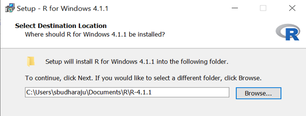

- Download will result in R being placed in your Documents Folder

### Setting up your CRAN - Optional
- Cran is where R will download the packages from. If you want to set a default CRAN you can do so just by using the RProfile.site file. Located in the ~R Installation Dir / etc/RProfile.site
- You can either uncomment the lines and put the following for CRAN or just copy paste the lines below
- #set a CRAN mirror
  local(\{r \<- getOption("repos")
  
  r["CRAN"] \<- "https://cloud.r-project.org/"
  
  options(repos=r)\})

### Edit your Environment Variables
- Search **Environment Variables** in the Windows Search
- From the window that pops up, click the **Environment Variables** button
- Under system variables, add or edit the following variables under the System variables section with your correct path:
  - Create new/edit your R_HOME variable 
  - Variable Name: R_HOME
    - Variable value: **C:\Users\YOUR_USERNAME\Documents\R\R-4.2.3**
  - Create new/edit your R_LIBS variable
    - Variable Name: R_LIBS
    - Variable Value: **C:\Users\YOUR_USERNAME\Documents\R\win-library\4.1**
      - Change out YOUR_USERNAME with your actual username **(Note that the path above may not exist yet, as the folder has not yet been created. Create this folder to match the variable value. Change the red text to your user name.)**
        
> Note: Environment variables are case-sensitive

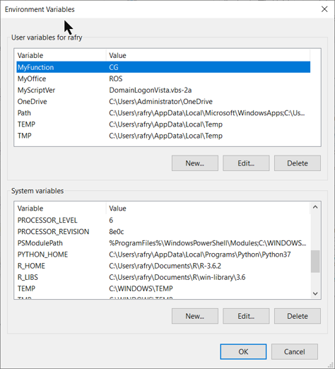

- Edit your Path variable under System variables.  Add the following:
  - %R_HOME%\bin
  - %R_HOME%\bin\x64
  - %R_LIBS%
  - %R_LIBS%\rJava\jri\x64
> **NOTE**
> To avoid bringing in hidden special characters, type these out manually instead of copying+pasting
> Environment variables are case-sensitive

### Install R Packages - 4.2.3
- Go to  and find the **C:\workspace\Semoss\R\SemossConfigR\scripts\Packages.R file**
  - If you installed Semoss in a different folder the path in red will need to be updated
- Open up a terminal and type in **R** to start the R terminal
- Copy and paste different sections of the Packages.R script (use Notepad++ to open it) into the R terminal
>**Note**
> This process will take a while to finish
> Only copy paste small sections of the script to run at a time (~30 lines chunk)

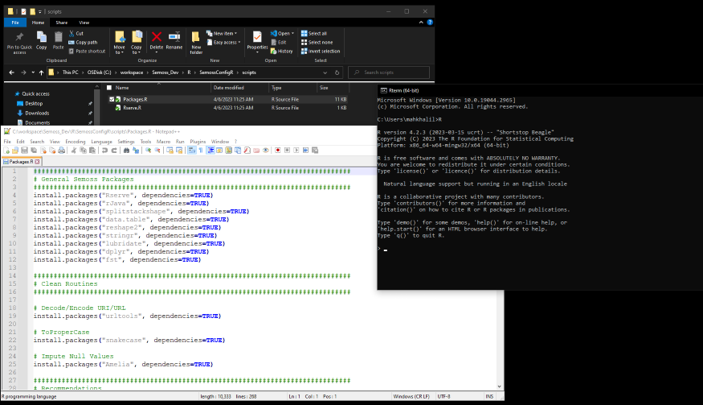

**Testing to See if rJava is installed properly**

- Open your rconsole and copy paste the following code:

```
library(rJava)
.jinit()
s <- .jnew("java/lang/String", "Hello World")
.jcall(s, "I", "length")
```

This should return 11 and this means that rJava is working

## Frontend Setup
Only follow these steps if you’re a front end dev, if not skip to the next section.

### Prequisite
- We would require the Node v.18.16.0 and npm v.9.5.1, any higher version of Node might create issues.
- So insure the node and npm version with following command –
    - node --version
    - npm --version
 
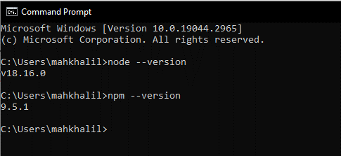

- If you have any other (higher or lower version) version, please uninstall and use below URL to download the correct version (node-v18.16.0-x64.msi) **https://nodejs.org/download/release/v18.16.0/**
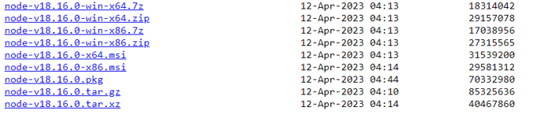

### Setup

- Make sure you checked out the dev branch of SemossWeb **(git clone https://github.com/SEMOSS/semoss-ui.git)** and renamed the semoss-ui folder to SemossWeb
- From the command line, run **npm install –g pnpm**
- From the command line, navigate to your SemossWeb directory **(e.g. C:\workspace\apache-tomcat-9.0.XX\webapps\SemossWeb)**, and run **pnpm install** (this will install all necessary dependencies)
- Run **pnpm start** to continuously build the project as you develop
- The following are recommended for Front End Development:
  - Visual Studio Code **(https://code.visualstudio.com/download)**
  - Eslint (simply run ‘npm install –g eslint’ from the command line)

## Final Steps
### Update Eclipse to Use Java 21​
- **Go to Preferences > Java > Installed JREs.​**
- **Add your new Java 21 JDK** if it’s not already listed.​
- Set Java 21 as the default JRE​
  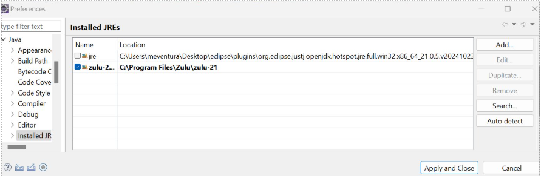
- Click Apply and Close.​
- Allow SEMOSS to rebuild with the new JDK.​
- If your eclipse does not allow you to go up to java 21, then you must download the latest version of Eclipse. ​
- On your project build paths, verify that you see **“JRE System Library [zulu-21].”**
  - If not, click **“Add Library…”** and add JRE System Library and choose Java 21. Do this for both Monolith and SEMOSS
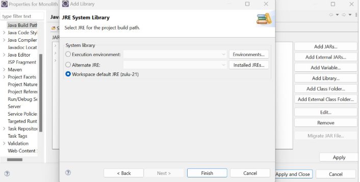
### Start Semoss Web
- Restart Eclipse (so that Eclipse loads the new Environment Variables we’ve added) 
- Select the Monolith project and make sure under **Project -> Properties -> Java Build Path**, maintain the following order under **Order and Export** tab. You will likely need to select JRE System Library and click **Top** to move it to the top.
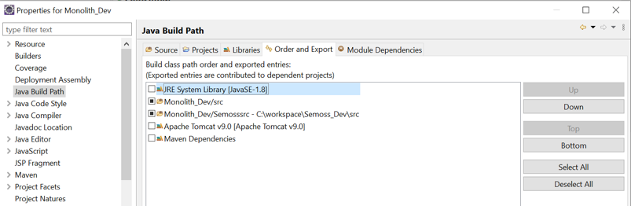

- Apache Tomcat should not be in [unbound] state.  If so, then Select Apache to add to the classpath under Libraries tab.
- Once completed, click Apply and Close
- Within Eclipse, in the bottom Servers panel tab, right-click on the **Tomcat Server** and click **Publish**
  - After republishing, double check your modules path to ensure it accurately reflects what you named your Monolith Folder and re-save
    - E.g. “/Monolith” in the screenshot below
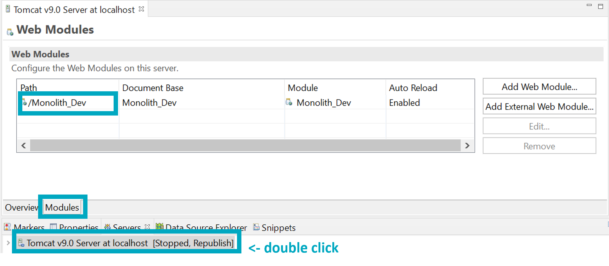
  - Double click on the server to open the Overview folder. Find the Port tab and next to the "Tomcat admin port", change the port number to 8105.

- Next, click **Start**
  - A progress bar will appear at the bottom of Eclipse.
    
> **Note**
> If you have run into any errors that might prevent your server from starting correctly, verify your server Web Module Path is /Monolith

> In a command prompt navigate to C:/workspace/apache-tomcat 9.0.##/webapps/SemossWeb
- Run “pnpm run dev:client” in the command prompt/terminal to build the front end
- If done correctly, the last line should be something about "webpack compiled successfully"
  
> Once the previous step has completed, navigate to http://localhost:9090/SemossWeb/
 - If all everything is working properly this should redirect you to a set admin page
 - Type in the username you want to register with

> Then go back to http://localhost:9090/SemossWeb/ , and at the bottom of the page, hit register new user.
 - Fill out the required fields
 - Make sure the username you register is the same as the one typed into the admin page

> Once the new user is registered, you can sign in using the same information.
 
- Congratulations! You’re all set to start using AI Core!

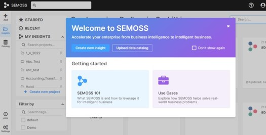

> To ensure the backend is running correctly,
 - Navigate to http://localhost:9090/Monolith/api/config
 - A json file should appear here

> If there is error when you click on start due to Port 8005, please change it to 8006 or some other port
- Now open terminal in cfgai.ui folder and enter pnpm run dev:client to run the front end if its not already running
- Open Chrome and enter **http://localhost:9090/SemossWeb/packages/client/dist/#/login**


