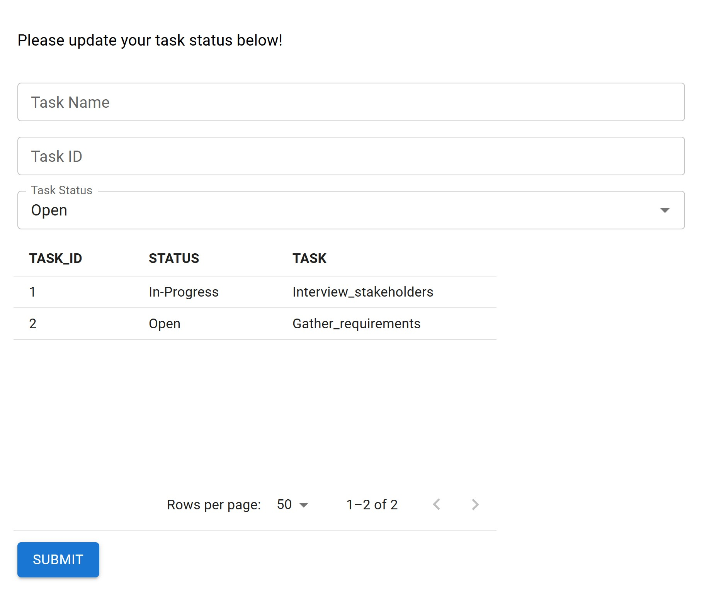
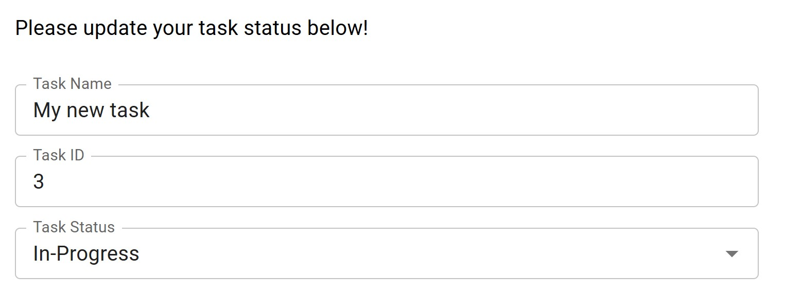
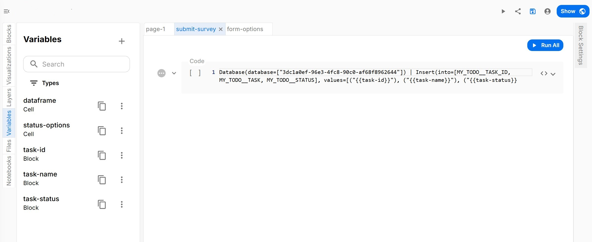
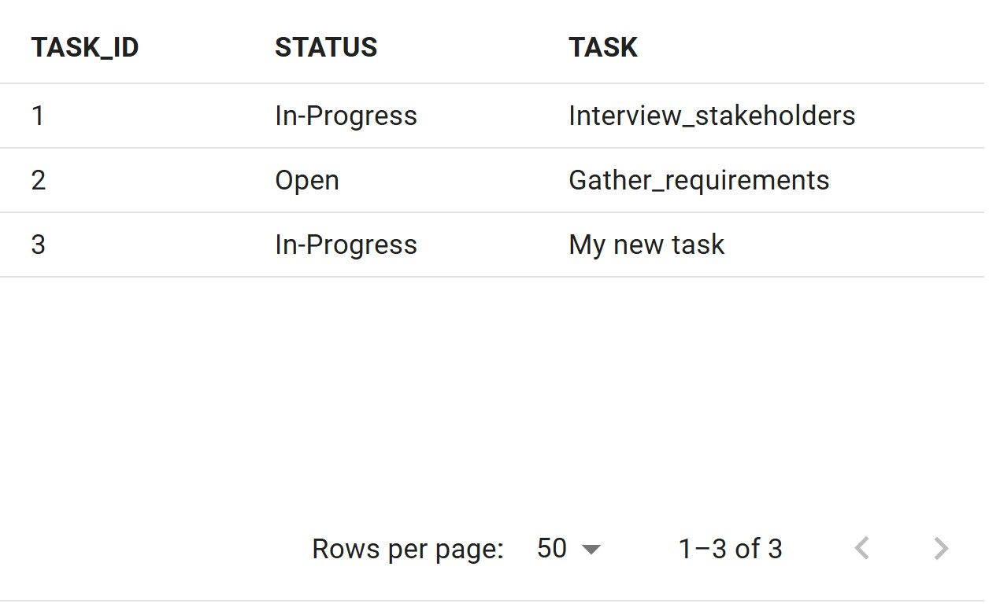

## To-Do List App with AI Core Reactor Example
Let's start with a basic "To-Do List" drag-and-drop app. 

Here are the resources to follow along with this demo. Upload the app zip and database zip files to AI Core.
* [DB Zip](../../../static/assets/CustomReactorAppZips/CustomReactor_TodoList_DB.zip)
* [App Zip](../../../static/assets/CustomReactorAppZips/CustomReactor_TodoList_App.zip)

Once you open the app, you will see a form which allows users to input a task name, ID, and status, and displays the information in a database table:


When a user fills out the form and hits the submit button, their task information is mapped to variables which are input into a pixel statement that inserts a new row into a DB table named `MY_TODO`:



Executed Pixel: 
```
Database ( database = [ "<YOUR DB ID>" ] ) | Insert ( into = [ MY_TODO__TASK , MY_TODO__TASK_ID , MY_TODO__STATUS ] , values = [ ( "My new task" ) , ( "3" ) , ( "In-Progress" ) ] ) ;
```
Notice that the pixel call responsible for inserting the new row utilizes the `InsertReactor`, a standard reactor bundled with AI Core.

The new row then appears in the table:


Hence, using standard AI Core reactors such as the `InsertReactor` is sufficient for basic operations like above.
