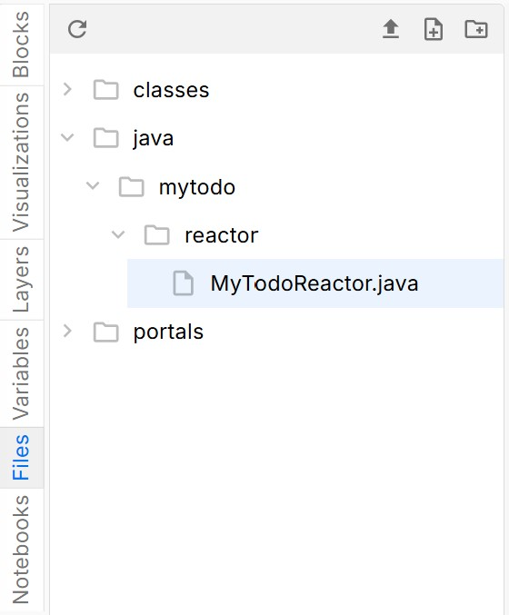
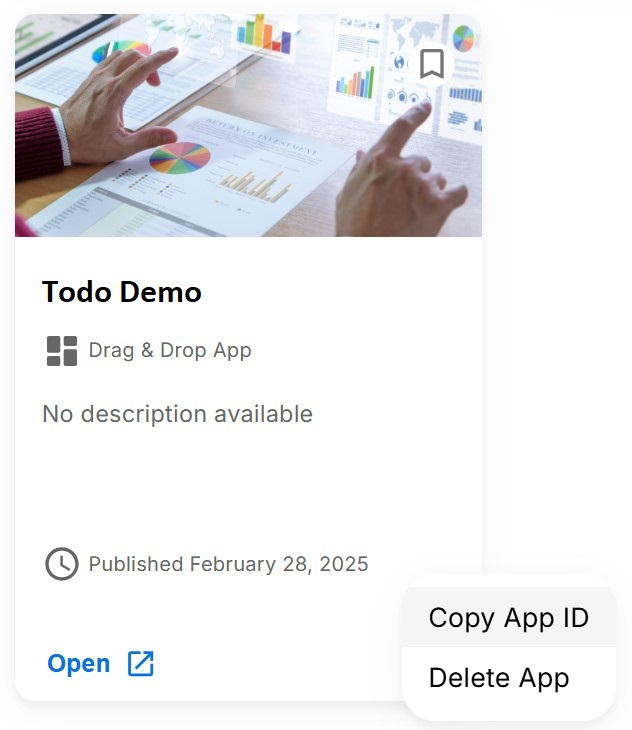
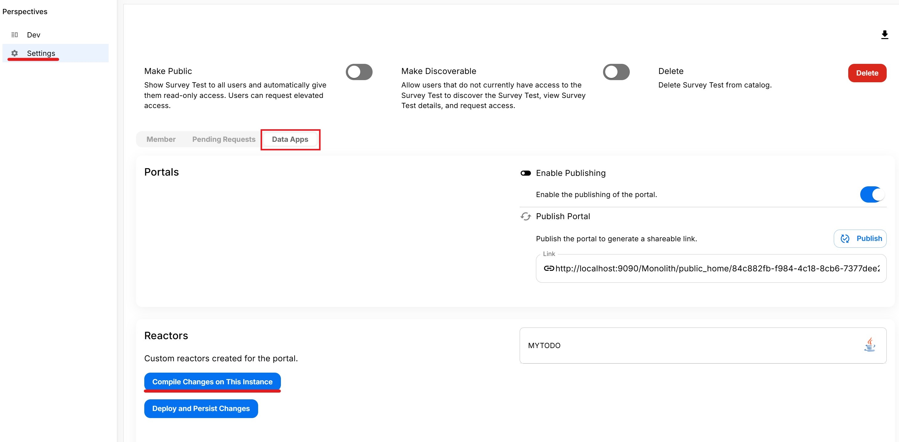
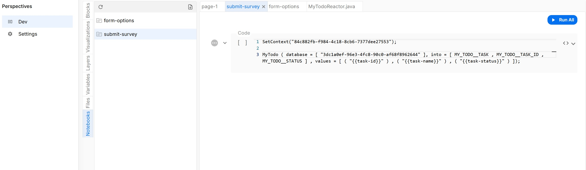
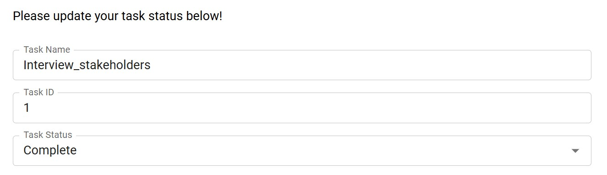
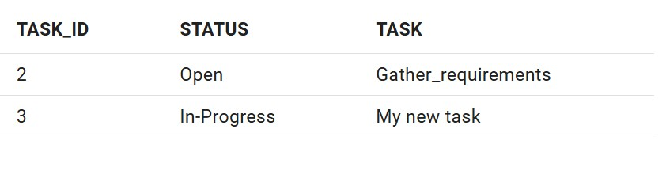
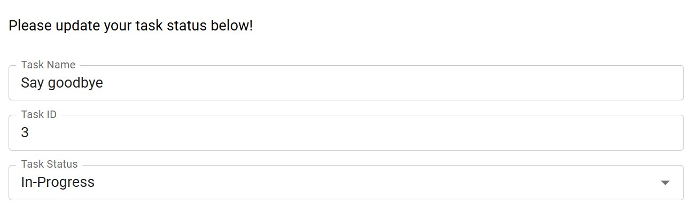
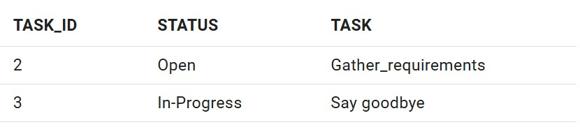

## Using a Custom Reactor with To-Do List App
However, there are many cases where we may want to add an additional layer of functionality to the submission process. For example, some business logic use cases may include:
* sanitizing inputs/input validation,
* checking for duplicates or merging duplicate rows,
* triggering additional actions such as sending emails,
* executing custom Python scripts or shell code, etc.

To leverage the power of a custom reactor, let's create a new reactor for our app called `MyTodoReactor`. Similar to the `InsertReactor`, it will use same 3 inputs from the form (Task, Task ID, and Status) to insert new tasks into the `MY_TODO` table. 

In addition to inserting rows, we also want `MyTodoReactor` to:
* update existing task rows based on the Task ID, and
* delete a task from the table when the status is changed to "Complete"

This will elevate our basic app from only being able to create new tasks into a more functional **Create/Read/Update/Delete (CRUD)** app.

The Java source file for `MyTodoReactor` can be found [here](../../../static/assets/CustomReactorAppZips/MyTodoReactor.java).

To add the `MyTodoReactor` to the app context:
1. Navigate to the Files tab. If it does not exist yet, create a `java` folder inside of the `version/assets` folder. Within the `java` folder, create the subfolders for your reactor based on its package, then upload the reactor file: 
Note that in this case,  the `MyTodoReactor` declares that it has a package of `mytodo.reactor` on its first line, which corresponds to the subfolders inside the `java` folder. 

2. Save the app, then return to the AI Core homepage. Find your app ID by clicking on the three dots icon on the lower right hand corner of the app, then click "Copy App ID" and save the copied ID to a safe place. 

3. Open up the app again, then navigate to the Settings page, then go to the "Data Apps" tab and click "Compile Changes on this Instance". 

Note that you will need to perform this step to **re-compile changes** each time you alter the source code of the custom reactor in order for the changes to take effect.

Now, we can try using `MyTodoReactor`. We can replace the `InsertReactor` call that gets triggered upon form submission with the following pixel call syntax, making sure to replace your app and database IDs where needed:
```
SetContext("YOUR APP ID");

MyTodo ( database = [ "YOUR DB ID" ], values = [ ( "{{task-name}}" ) , ( "{{task-id}}" ) , ( "{{task-status}}" ) ]);
```


Notice that:
1. We call the `SetContext` reactor before `MyTodo` so that the app recognizes where to load the custom `MyTodoReactor` class files from.
2. The syntax for calling `MyTodoReactor` is similar to the parameters for the `InsertReactor`.

Finally, let's test the `MyTodoReactor` functionality by submitting a few cases:
1. Submit a form where the task ID = 1 and the status is "Completed" to test that the reactor correctly deletes the row from the table:

Output: 

2. Submit a form where the task ID = 3 and the task name is changed to "Say goodbye":

Output: 

## Conclusion and Additional Links
Custom reactors are powerful because they allow you to integrate a wide array of Java libraries into the app and extend the functionality of your app beyond the native AI Core reactors. 

For more details on how to code custom reactors, please read through the [Custom Reactor Guide](../../Understanding%20Development/Java%20Development/Custom%20Reactors.md).