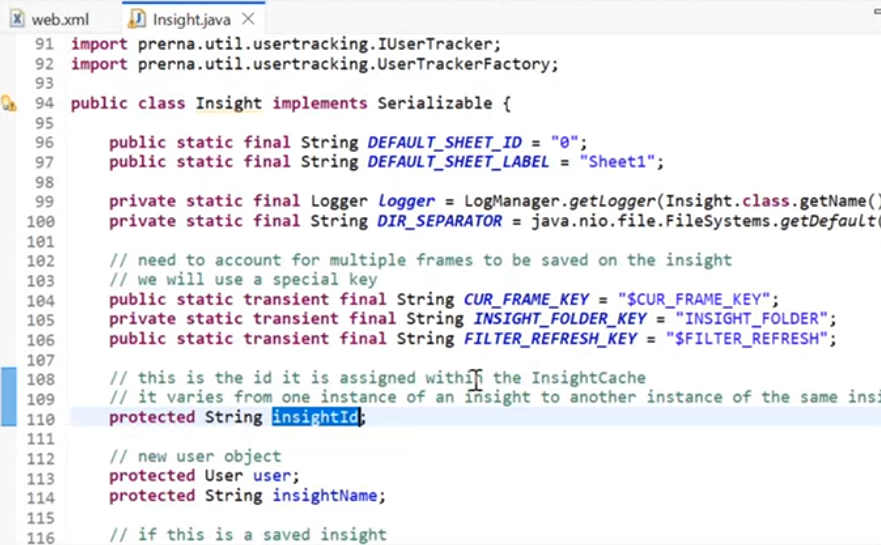
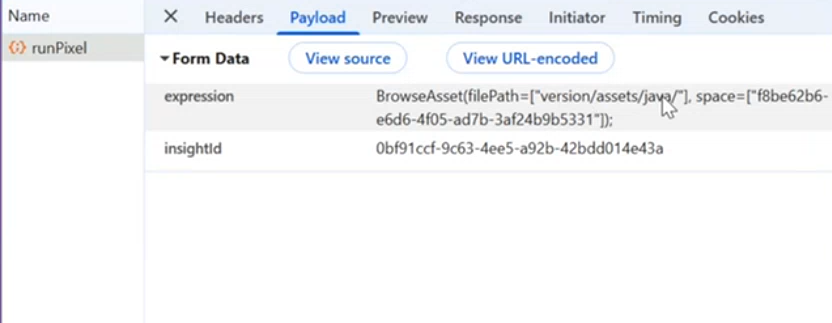

# Using Custom Reactors

A key feature of AI Core is the ability to extend the platform's functionality with the use of custom reactors.  Not only do custom reactors allow you to define specific business logic, they also  amplify the power of AI Core by allowing you to leverage a vast array of Java libraries to fulfill your use case.

### How a Custom Reactor works

In AI Core, Projects are saved in Insights, The Insight object allows you to do everything for an app. Like running the pixel calls and for every project there exists asset files they would be available throught using an Insight as well. 

For testing a Custom Reactor which does not have a UI, use the terminal to load the Java files and test the functionality of the reactor.
This is available by going to apps then system apps in that click on Terminal app. 

BrowseAssetReactor is a Java object which loads the Assets in the UI. 

As shown here, BrowseAsset Reactor takes two parameters **filePath** which is relative filePath location and **space** which is nothing but the project Id.

For any reactor we can go to terminal and use **--help** to get the information about what inputs are required by the reactor. 
This is True for the custom Reactors also, as long as we write the description while creating the Custom Reactor. 

The next pages of this documentation shows a Basic Java Reactor Example and how a Custom Reactor helps in CRUD Operations in detail. 