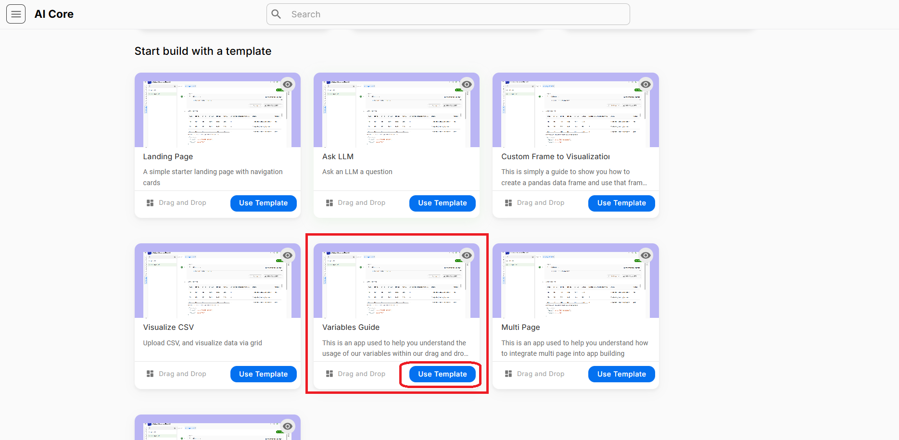
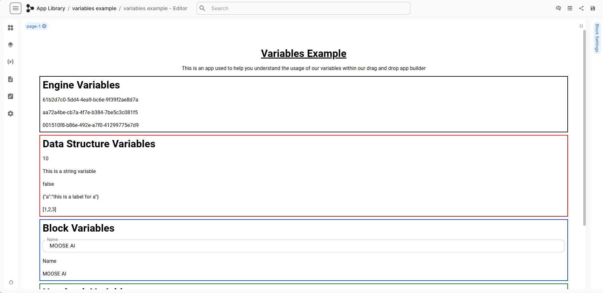
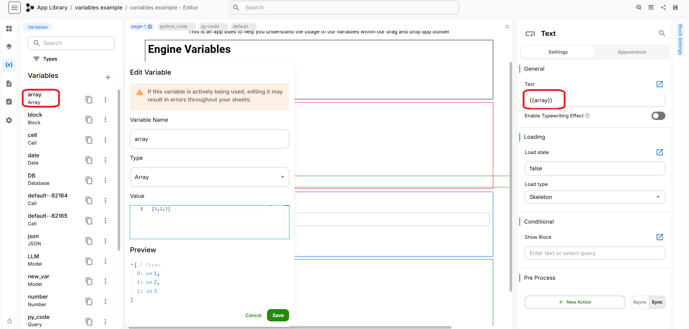
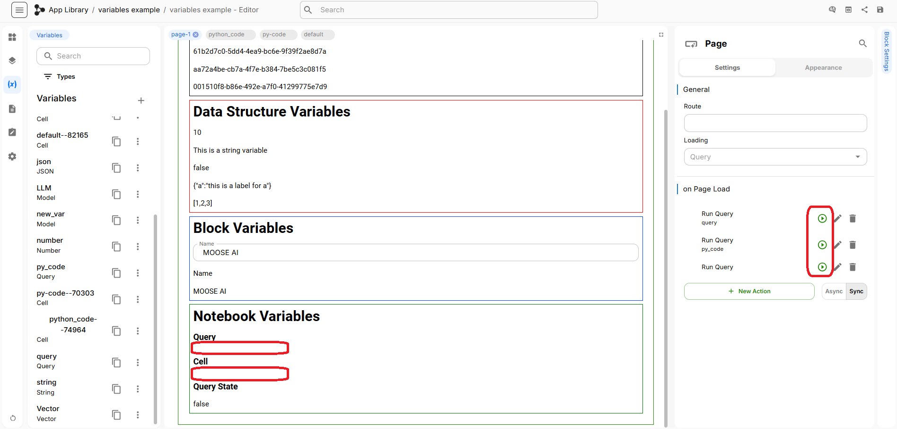
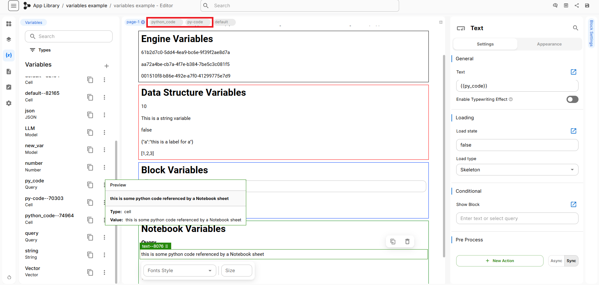

The **Variables Guide** is a template that allows users to experiment with and configure variables in the UI builder. Any of the variables can be added or removed depending on the app’s needs. We can also connect variables to our own data and create custom queries to run in our app. For example, we can use a variable to display a customer’s order history from a database or highlight data from a survey response. 

To get started, click on **Create New App** and then navigate to the Browse Templates section to locate the **Variables Guide**. Click on **Use Template** within the Variables Guide as shown below.

After naming our drag & drop app, click **Create**. We will then see an example app with different types of variables already in place. 

The Variables Guide includes multiple examples under each of the following variable types:
- **Engine Variables**: Unique system-generated values used to help the app function in the background.
- **Data Structure Variables**: These show common data formats like numbers, text, true/false values, labeled objects, and lists that can be reused across the App.
- **Block Variables**: These control what appears inside blocks, such as a product name or company title.
- **Notebook Variables**: Used when connecting the app to Notebooks. These power more advanced tasks like running calculations or displaying results from a data query.

### Engine Variables

Start by entering edit mode if you are not already in it. Next, click **Block Settings** in the right-side menu to open the panel. In the Engine Variables section, clicking on the first line will show that it is linked to the **`{{DB}}`** variable, as indicated in the block settings.

To find out more about this variable, click the **Variables** icon in the left-side menu to open the variables panel. You will see a list of available variables, including one called **DB** which is the variable referenced earlier. This demonstrates how variables are referenced within blocks and allows you to update them as needed.

To edit this variable, click the **three dots** next to its name and select **Edit.** Once you enter variable edit mode, details such as the variable’s **Name, Type, and Value** will be displayed. You can modify these settings as needed. When you are ready, use the **Preview** button to review your changes and click **Save** to apply them.

The following two lines in the Engine Variables block demonstrate a similar process for the **Vector** and **Model** variables.

### Data Structure Variables

There are five different examples under Data Structure Variables:
- The first variable is a number variable, which is set to 10. 
- The second variable is a simple string. 
- The third variable is of type `cell.isLoading`, which can be used to denote the state of the action; for example, if there is a long-running query cell that calls an LLM is being executed, this variable would be true to indicate it is actively loading.
- The fourth variable is of type json. 
- The fifth variable is of type array, which can store an array of numbers. 

Use the same steps described in the Engine Variables section to view and modify these variables.

### Block Variables

- The first variable is an input block named block, where we can edit its name and value. The value of block named block is currently set to MOOSE AI and the label is set to name.
- The second variable is a text variable, and the vaule for this is **`block.label`**.
- The third variable is calling the value of block, which is MOOSE AI.

Use the same steps described in the Engine Variables section to view and modify these variables.

### Notebook Variables

There are several blocks in Notebook Variables. Under **Query** there is an empty cell called **py-code**, however we cannot see its output yet because it has not been run. If we run the **py-code** notebook, it will produce a string that will then be displayed in the Notebook Variables. Similarly, follow the same process to execute and show the output for **python_code** and **Query State**. 

