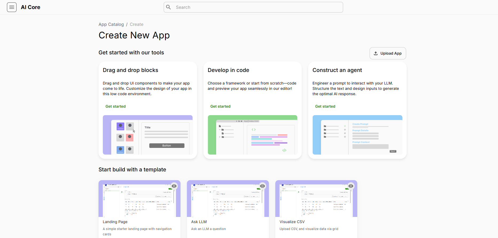

# Introduction to Apps 

### What is an App?

In AI Core, an app is a customizable GenAI solution built on a low-code platform with configurable components. Advanced users can upload web-based applications. These apps are accessible and modifiable through the App Library.

### Why Create an App?

Developing an app on the AI Core platform offers several benefits:

- **Customization and Flexibility**: Tailor apps to meet specific business needs, addressing unique challenges and requirements effectively.
- **Efficiency and Automation**: Automate repetitive tasks and streamline workflows, increasing productivity and reducing manual effort.
- **Data Integration**: Integrate AI Core apps with various data sources for comprehensive data analysis and visualization, supporting better decision-making.
- **Scalability**: Scale apps with the organization's growth, accommodating increasing data volumes and user demands.
- **Innovation**: Foster innovation by creating new solutions that leverage advanced analytics, AI, and machine learning capabilities.
- **Competitive Advantage**: Gain a competitive edge with unique functionalities that differentiate the organization from competitors.
- **User Experience**: Enhance user satisfaction and engagement with intuitive interfaces and interactive features.

### Who can develop an App?

App development on the AI Core platform can involve various stakeholders, including:

- **Data Scientists and Analysts**: Develop apps for advanced data analysis, machine learning, and predictive modeling.
- **Software Developers**: Create and customize apps using programming skills to build complex functionalities and integrations.
- **Business Analysts**: Design apps to address specific business requirements and improve operational efficiency.
- **IT Professionals**: Develop and maintain apps to ensure they meet technical standards and integrate seamlessly with existing systems.

### AI Core App Options

In AI Core, there are three different ways to create apps: Agent Builder, Drag and Drop, and Code. Here’s a brief overview of each method and the type of user who might prefer it:

- **Construct an agent**: A guided tool that helps users create apps through prompting. Users can create apps by specifying their requirements and edit the app using Drag and Drop System Components. Ideal for business users who may not have technical skills but need to create apps quickly and easily. It allows them to focus on business logic and requirements without worrying about the underlying code.
- **Drag and Drop**: This method allows users to create apps by dragging and dropping various components (like charts, tables, and forms) onto a canvas. It provides a visual way to build and configure apps. Suitable for admins who need to customize and manage apps without deep coding knowledge. It offers a balance between ease of use and flexibility, enabling them to design functional and visually appealing apps.
- **Code**: This method involves writing code to create and customize apps. It offers the highest level of flexibility and control, allowing for complex and highly customized solutions. Best for developers who have the technical expertise to write code. It allows them to leverage their programming skills to create sophisticated and tailored applications that meet specific business needs.

| Method        | Description                                                | Benefits                                               
|---------------|------------------------------------------------------------|--------------------------------------------------------|
| Construct an agent | Guided tool that helps users create apps by prompting      | Ideal for business users who need to create apps quickly and easily |
| Drag and Drop | Create apps by dragging and dropping components onto a canvas | Suitable for admins who need to customize and manage apps |
| Code          | Writing code to create and customize apps                  | Best for developers who have the technical expertise to write code |

Each method caters to different user skill levels and needs, ensuring that AI Core can be effectively used by a wide range of professionals within an organization. We will go over each Create New App method in detail.
