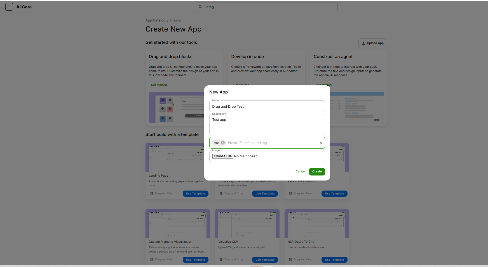
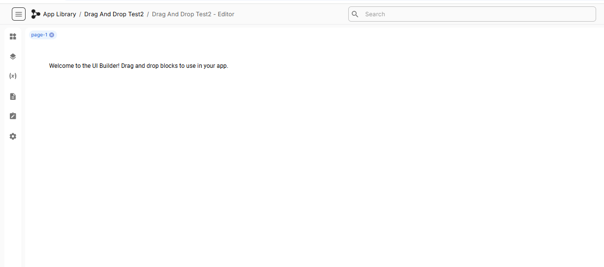
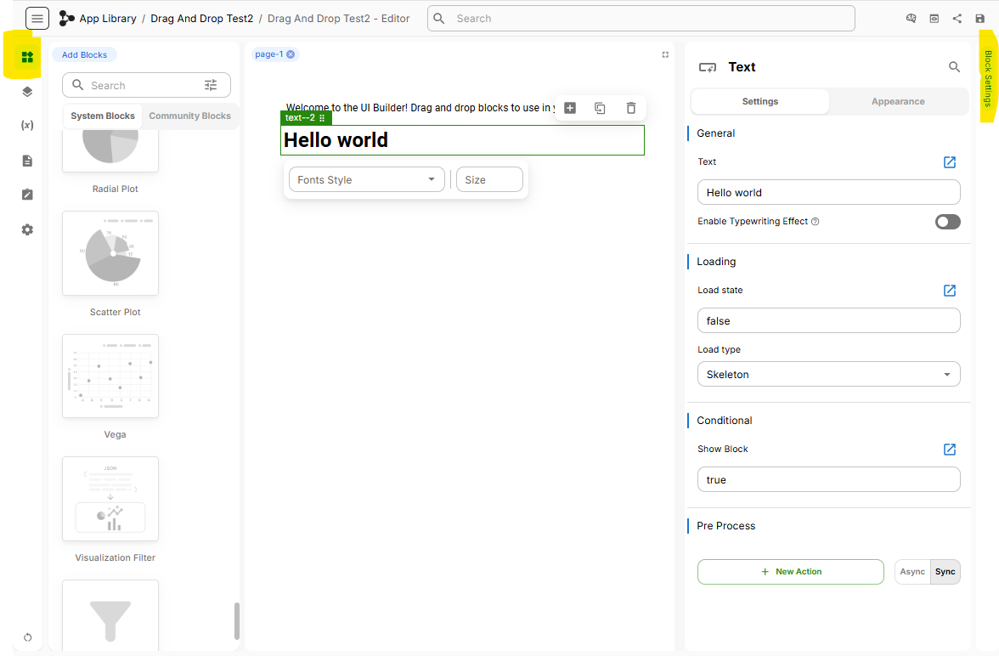
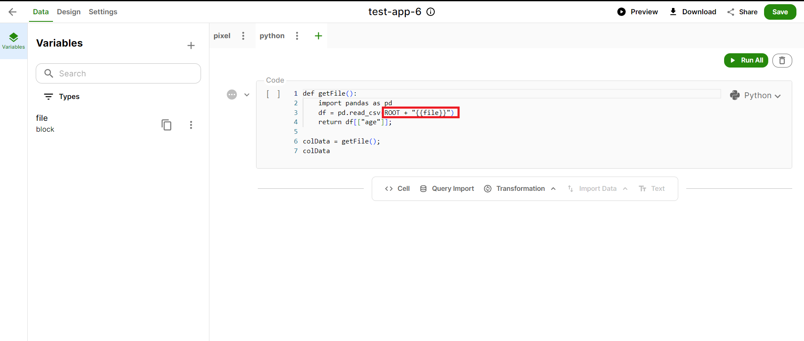
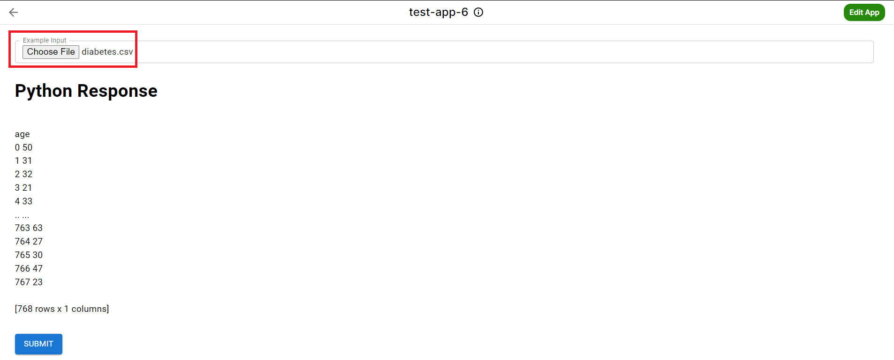
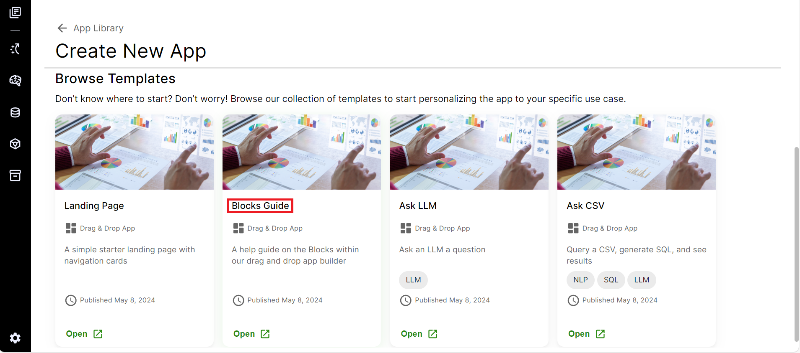
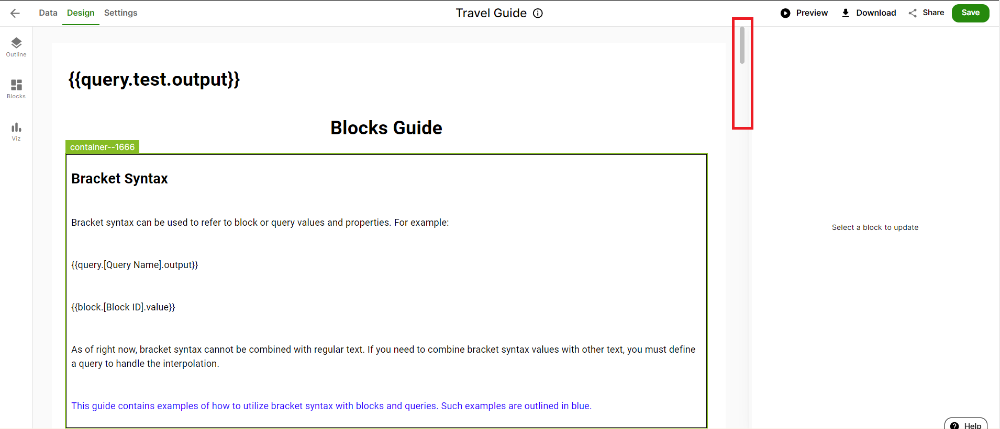

import ReactPlayer from "react-player";
import DragandDrop from "../../static/Demos/DragandDropDemo.mp4"
import BlockGuideDemo from "../../static/Demos/BlockGuideDemo.mp4"
import AskCSVTemplateDemo from "../../static/Demos/AskCSVDemo.mp4"
import IntroToDragAndDrop from "../../static/Demos/IntroToDragAndDrop.mp4";
import AccessingLLMsInDragAndDrop from "../../static/Demos/AccessingLLMsInDragAndDrop.mp4";

# Drag and Drop Blocks to Build UI for your new App
<ReactPlayer controls url={IntroToDragAndDrop} />
 

## Overview
Drag and Drop is designed to simplify app creation through an intuitive, visual interface. With our drag-and-drop tools, users can build applications quickly and efficiently—no coding required.

- **Simple Drag and Drop Components**  
  Effortlessly place UI elements such as buttons, text boxes, and images onto your app’s design canvas using our drag-and-drop feature.

- **Customizable Design**  
  Easily adjust the position, size, and appearance of each component to achieve your desired look and feel.

- **UI Building Blocks**  
  Construct your app’s layout by leveraging a library of pre-made UI elements—our building blocks—tailored for rapid development.

- **Add Data**  
  Connect your UI components to data sources or input fields, enabling dynamic data integration within your app.

Get started by exploring the design area and experimenting with our drag-and-drop components to bring your app ideas to life!

## Create New App
1. Click on **Create New App**.
2. On the **Drag and Drop** tile, click on **Get Started**.

3. Add a name for your new app and can optionally provide a description of what your app’s purpose is, tags, and app icon. 

4. Click save! 

## Edit App

On the left side of this page, you will see icons labeled:

1. **Blocks**: These blocks allow users to create and customize visualizations and data transformations by dragging and dropping different components. They are used to build workflows and analytical processes without the need for extensive coding.

2. **Layers**: The Layers panel is used to manage different layers of data and visualizations. Layers can be thought of as different views or aspects of the data that can be overlaid to create complex visualizations. This is particularly useful in geospatial analysis or when combining multiple data sources.

3. **Variables**: This panel is used to manage variables within AI Core. Variables can store data, intermediate results, or parameters that can be reused across different parts of a project. They help in making the analysis dynamic and flexible.

4. **Files**: The Files panel is where users can upload, manage, and organize their data files. These files can include datasets, scripts, or any other relevant documents. Users can import data from various sources and formats.

5. **Notebooks**: In this section, you can use Notebooks to write and run code, which helps in developing and testing scripts interactively.

6. **Settings**: In this section, you can share your app with other users and modify additional app settings

### Blocks

Here, you will find a variety of blocks available for constructing your app's user interface. Once an element is placed on the page, you can edit the system component by adjusting settings by clicking Block Settings tab; which opens a panel of configuration options.

#### Block Settings
The **Block Settings** tab is located in the panel to the far right. The Block Settings tab is used to configure and customize the behavior and appearance of the System Components. Here's a simple breakdown of what you can typically do in the Block Settings tab:

1. **Adjust Parameters**:
   - You can change various settings related to how the block functions. For example, you can use variables to dynamically change parameters.

2. **Input and Output Configuration**:
   - This allows you to specify what data goes into the block and what data comes out. You can edit text values or set variables for a dynamic approach.

3. **Styling and Appearance**:
   - You can customize the look of your visualizations. This might include changing colors, alignments, labels, and other visual elements to make your charts and graphs more readable and visually appealing.

Detailed information on how to use each System Component can be found
[here](../../documentation/category/system-components).

## Block Options
The different types of blocks we can add here are mentioned below,

### Element
Here we can add basic elements in the app like HTML, IFrame or an image block. **HTML** block is added to the App for inclusion of a web page. We can either generate HTML page using AI or can write a customized HTML code. **IFrame** block can be used when we want to add a web page into the App interface.

We can add images using the **Image block**. After adding an Image block (by drag and drop), we can click on **Block Settings tab** (on the left side of the page) and put url of the image we want to insert along with also mentioning its position in the block and setting the dimension details.

#### Chip
{/* TODO */}

#### Divider
By adding a Divider you can separate your content with a line. Click on the Block Settings (top right) to enter the divider's details.

Variant - Here you can specify whether you want a full width line (choose option 'Full Width' for this), a shorter line centered at the centre (option 'Middle'), or a shorter line aligned to the right (Inset).
Orientation - Choose whether you want a horizontal divider line or a vertical divider line. If you choose vertical line, it will automatically be right aligned.
Divider Text - You can even add a text to your divider line. For this, enter your text in the Divider text and click on the 'Show Text' toggle to switch it to 'on'.
Text Alignment - You can select the alignment of the text to Centre, Left, or Right.
Light Variant - Select this toggle for a lighter colour tone of the divider line
Flex Item - By selecting this toggle, your divider line will be visible only if it is a horizontal line.

Dimensions-
Mention the specifications of your divider line. If its a horizontal line mention its width and if its vertical line mention its height. Max. width and height can be mentioned to put a cap to the dimensions.

#### HTML
HTML is added to the App for inclusion of a web page. We can either generate HTML page using AI or can write a customized HTML code.

You can write your own code in the area highlighted in the image below.

To use AI to generate your code, write a prompt under the AI Generator, select an LLM, and click on Generate.

#### Icon
You can even add an Icon to your App page. Drag and Drop the Icon block and in the Block Settings choose any icon you may like to add. Add details like colour and dimensions (width and height) for your icon.

#### Iframe
**Iframe** block can be used when we want to add a web page into the App interface. Mention the link of the webpage and give it a title. Add various specifications of the frame like its height and width, margin (space around the element) and padding (space inside the element), and its border size, colour, and style.

#### Image
We can add images using the **Image block**. After adding an Image block (by drag and drop), we can click on **Block Settings tab** (on the left side of the page) and put url of the image we want to insert along with also mentioning its position in the block and setting the dimension details.

The **IFrame** block can be used when we want to add a web page into the App interface. This is especially useful for embedding external content such as a live data dashboard, video, or an external form or survey. Embedding these elements provides additional functionality without requiring users to navigate away from the app.

We can also add images using the **Image** block to enhance visual communication in our app. For instance, we might use the Image block to insert a company logo or instructional graphics to make the content easier to understand. After adding an Image block (by drag and drop), we can click on the **Block Settings** tab and enter the url of the image we want to insert along with also mentioning its position in the block and setting the dimension details.

#### PDF Viewer
{/* TODO */}

#### Progress
{/* TODO */}

#### Ratings
{/* TODO */}

### Input

This category allows us to add interactive elements to our app, enabling users to enter or select information as part of their experience. By using input blocks, we can capture feedback, personalize content, and guide user decisions. 

We can choose from several input options, including **Audio Player**, **Button**, **Checkbox**, **Select**, **Input**, **Toggle Button**, or **Upload**. 

- **Audio Player**: We use the Audio Player when we want to share voice-based content directly in the app. This can be useful for playing back instructions or narrated summaries. This option lets us embed audio clips directly into the App.

- **Button**: We add a button when we want users to trigger an action or generate an output. For example, we might add a “Submit” button to complete a form. 

- **Checkbox**: Checkboxes allow us to easily select or unselect options, which is helpful for toggling features or preferences. This is useful when we want others to agree to terms or subscribe to updates.

- **Select**: The Select block provides a dropdown menu, letting users choose one or more items from a list of predefined options. This is ideal for forms or filters. We can use the Block Settings tab to customize these options and link them to data if needed.

- **Input**: The Input block is used when we want users to type in their own values instead of selecting from a list. This gives us flexibility in scenarios where responses are open-ended. This is useful for when we want users to type in their own response, such as names, comments, or any custom information that cannot be standardized ahead of time.

- **Toggle Button**: The Toggle Button is an on/off switch for a specific feature, setting, or rule in the App. For instance, we can use it to show or hide a component like a chart or image. It’s an easy way to control conditional behavior in the App.

- **Upload:** We use the Upload block when we want users to submit files directly into the app, such as a document, image, or spreadsheet.

#### Using Upload Block

When using **Upload Block** in the App and using **Python** as scripting language in code/query, we should use **"ROOT + "file"** in code as shown below, for calling the **file** instead of just using **"file"** as in case of **Pixel.**

After making this tweak in the query code, we can run the App seemlessly. As shown below, after uploading a csv file, we can run the App without any hiccups.

### Layout and Progress

This category enables us to build the UI layout using Containers and Query blocks, which help organize the structure and flow of the app interface. For example, when creating a user profile section, we might want to group a profile picture, username, and an “Edit” button together so they appear as a single, cohesive unit. This is where layout tools like the Container Block become essential. 

For example, a **Container Block** is used to group and arrange other blocks like Element, Input or Text in a clear and organized way. Using the Block Settings tab, we can customize the specifications of the container from Layout to Border.

The **Progress** block is used to visually display the status or completion level of any feature/element in the App, such as tracking progress through a multi-step form or a data submission process.

### Text

The Text category allows us to add various types of content to the page via Link, Logs, Markdown or Text blocks. You can include a **Link** block that directs users to another page or file. To add link details, click on Block Settings and select the Link block. **Logs** are embedded blocks used to track App performance and user activity over time. **Markdown** blocks support formatted text such as headers, bullet lists, bold or italicized words, and hyperlinks. These are useful for displaying structured content, like documentation or updates. If you just need to display plain text (e.g., instructions or descriptions), you can use a **Text** block. To customize the formatting or behavior, go to Block Settings, select the Text block and use the customization section.

### Theme

Theme blocks can be used as parent blocks to assign a specific theme to the entire page. Thus, theme could be the first block we add to the UI and then all other blocks can be added inside the theme block.

As seen in the image above, we have added the button block inside the theme block. To make changes to the theme go to layers, select theme block and go to block settings (at the right side of the screen). Now you can give a colour theme to the button block, also decide what colour of text should it display.

Users with admin permissions are able to update the theme. For more detailed information on updating the theme database, reference this link 
 [here](/admin-query#themes-database).

## Layers

The **Layers** tab on the left-hand side as shown below will list all the blocks that were selected to be layered in an App. 

## Notebook

In the **Notebook** tab, we can click the Create a Notebook icon. From here, we can assign the Notebook an identifier. In the Notebook cell, we can enter our code in Pixel, Python, or R. A user can query data, connect Notebook cells to large language models, and import data from databases that they have role-based permission to access. 

It is important to understand the difference between a query and a query cell. A query, or notebook, consists of multiple query cells. A query can have multiple cells, and multiple queries (or notebooks) can be created in the Notebook tab. A query is generally a complete set of actions contributing to the operation of the app. For example, in a payment feature, entering payment details, hitting enter, and communicating with the bank server can together form a "Payment" query. Each action, such as entering payment details or hitting enter, represents a different cell within the query. 

Sometimes, the functions within these cells are required in other queries as well. For instance, communicating with a bank server may also be necessary for user authentication. Thus, another query, like "User Authentication," may use the "communicating with the bank server" query cell defined in the “Payment” query. This shows that cells from different queries or notebooks can be interconnected.

Under cells, we can choose either a **Code** cell, represented by a **\<\> cell**, or a **Import Data** cell, and then write code or a query to access AI Core resources as per app requirements.

If we choose a Code cell, we can navigate to the AI Core resource (Model, Database, Storage, Vector Database, etc.) we want to connect with the app and click on the usage tab within the resource. We can copy the code based on the scripting language chosen for the cell and paste it into the Notebook query cell. This code can be modified or customized altogether.

In a Import Data cell, we can write a database query and select the Database from the list of accessible databases. 

The Import Data cell differs from the Code cell in how it represents data. Using a Import Data cell, we can get data in a tabular form (or Data Frame). For example, selecting the database and our desired rows and columns from any database (in this case **executive_orders_dev**) and running the cell will give tabular form below the cell. 

We can also transform data presented in the columns of the table using the **Transformation** option. Some possible transformations include converting lowercase to uppercase. To transform any column's data, click on Transformation and choose the type of transformation from the list.

A new cell for the selected transformation will appear below, and in that cell, choose the Frame in which to transform data. Then, select the required details as per the chosen transformation type and run the query. The modified or updated data will then be displayed in the Frame, as shown in the screenshot below. 

### Creating and using variables

To connect the user interface with a created query, follow these steps:
- Click on the Variables tab.
- Click on the add (+) button on the left side of the panel.
- Define the variable by adding the necessary details as shown below.

- Once the variables are defined, update your code by replacing any constants with the variables you just created, as shown in the screenshot.

- Now your code is ready. Click on Run All to test it. If you encounter any errors, double-check that you have selected the correct programming language and that your variables are defined correctly.

- In the example below, we are adding an ONCLICK action to a Button block. To do this, click on New Action on the right side under ONCLICK and enter the query type and query ID as shown in the example. This enables our Button block to execute queries.

- In this example, to connect a query that automatically runs when an App page is opened, select the page block that embeds all other blocks. Click on **New Action** on the right-hand side under **ON PAGE LOAD** and enter the query type and query ID as shown in the screenshot. You can add multiple queries to the page, and they will automatically run whenever someone opens the App page.

- Now, go into the **App Library** and click on the App you have created. You will see the UI of the App you have created as shown below.

## Settings 
- Click on **Settings** to set the accessibility of the App and to delete the App as shown below.

- After making all the changes, you can **Preview** the App before saving and then **Save** it. You can also share the link of the App with other members or users as needed.

## Blocks Guide
<ReactPlayer controls url={BlockGuideDemo} />

To use different blocks that we have discussed above, there is a **Block Guide**. It is a template that allow users to experiment with each of the blocks in the UI builder. We can leverage all blocks in the template or remove some blocks as required in the app. We can also connect our own data to this app and customize queries that will run the app.

To create new app using **Block Guide**, click on **Create New App** and then click on **open** in Block Guide within browse template section as shown below.

Enter the name we want to give to the App and then click on **Create**. After entering the template, we can browse from top to bottom to see through all the blocks present in the App.

Each block consist of a description which will provide information to user related to the function of that block.

Now if we wish to remove some blocks from the App, select those blocks and **Delete** to remove them from the App as seen below.

We can modify configuration of blocks as required by the App by changing details on the right side of a block.

To create and modify queries for connecting data to blocks in **Design** tab, go to **Data** tab and work around queries/code as per App requirement as we have discussed in the Data(Notebook) section above. Data tab of block guide is shown below.

Once we connect queries in data tab to blocks and update configurations of these blocks, we can save the App and now its ready to use.

## Examples

### Travel Itinerary
Using an LLM build a quick drag and drop app to make a travel itinierary for any destination

<ReactPlayer controls url={AccessingLLMsInDragAndDrop} />

### Button
Demo how to integrate a button into a drag and drop app and run a query
<ReactPlayer controls url={DragandDrop} />
