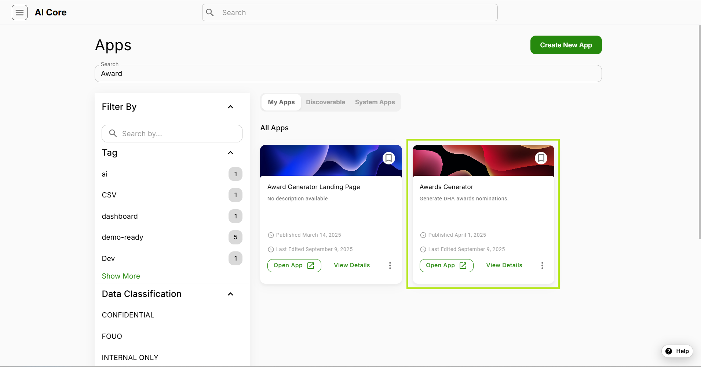
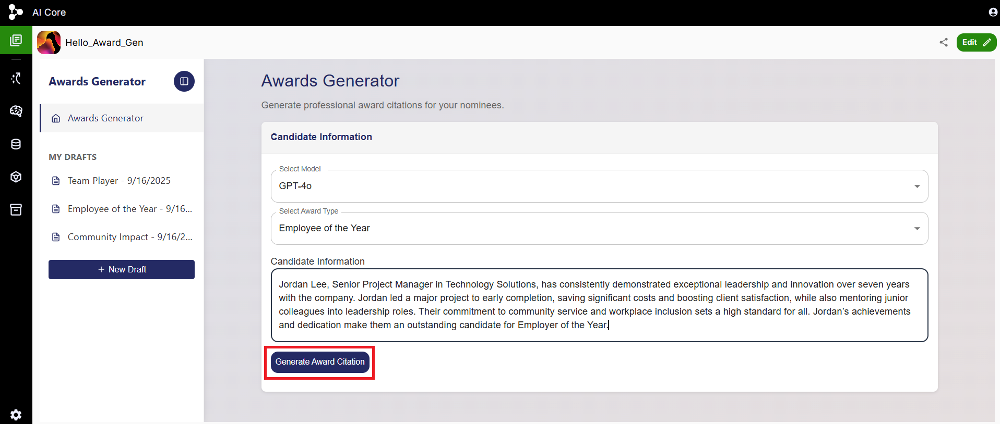
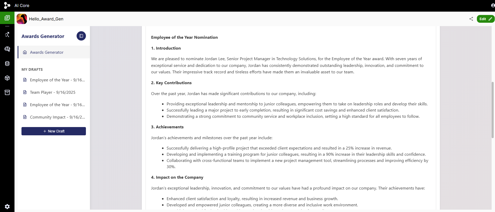
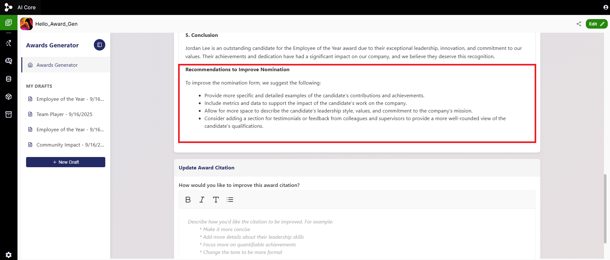
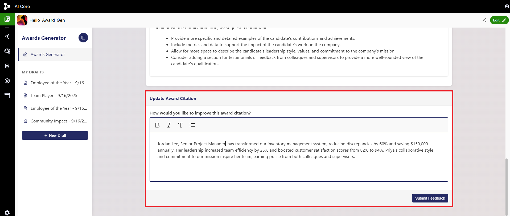
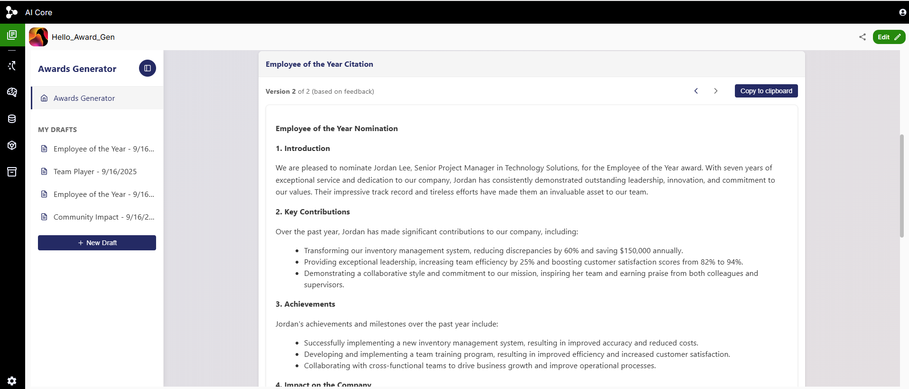
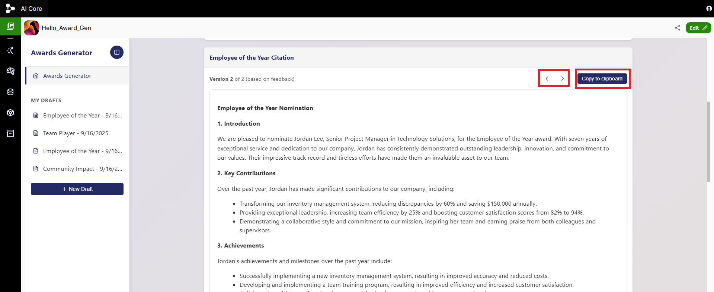
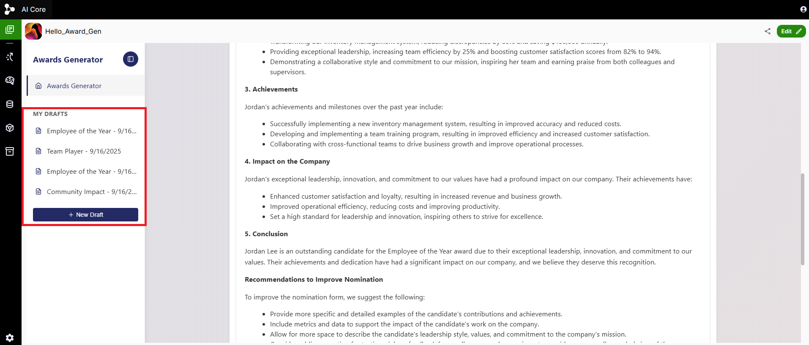

# Award Generator 

## Purpose 

The Award Generator app streamlines the process of crafting personalized award citations by leveraging advanced language models. Users can easily select their preferred LLM, choose from various award types, and input candidate details—all within a user-friendly interface. By automating citation generation, the app ensures consistency, saves time, and enhances the quality of recognition across organizations.

## How to Use

1. Navigate to  the app library section and search for Award Generator 

2. To Generate an Award Citation, please complete the following steps according to your needs:
    - Select the model available.
    - Select the desired award type.
    - Fill in the candidate’s information and accomplishments.
    - Click the **Generate Award Citation**  button to receive a detailed citation along with recommendations for enhancement.

3. You can see that the generated award citation is organized into distinct sections, each highlighting key competitive areas that should be emphasized. These blocks focus on the most important aspects of the nominee’s achievements and strengths.

4. The app offers targeted recommendations to help improve the nomination process.

5. You can Update the award citation by including additional information or applying recommendations from the previous citation to improve the citation of the candidate. 

6. By adding further details based on the recommendations, you can now view the improved award citation, which incorporates the recommended enhancements to the nomination.

7. You can view both the previous and updated versions of the citation here after incorporating feedback and the citation can be copied using the **Copy to Clipboard** button..

8. All previous drafts can be viewed at any time by navigating to the **Drafts section** , allowing you to easily reference, review, or restore earlier versions of your work whenever needed.

