## Purpose

This recipe demonstrates how to set up an Agent Builder app with a RAG input, connect it to a vector database, and use it in both the UI and pro-code environments.

### What is RAG?

Retrieval Augmented Generation (RAG) is an AI technique that combines a language model with a retrieval system, such as a vector database. Instead of relying solely on the model’s built-in knowledge, RAG retrieves relevant information from your own documents and uses it to generate more accurate, context-aware responses. This approach is especially useful for “chatting” with your documents—asking questions and getting answers grounded in your specific data, rather than just general knowledge.

**Advantages of using RAG include:**
- Providing answers grounded in your organization’s documents, not just general internet knowledge.
- Enabling dynamic, context-aware responses that reflect the latest information.
- Reducing hallucinations and increasing trust in AI-generated answers.


---

## Example scenario
Suppose your company has a large collection of HR policies in PDF format. With RAG, you can build a chatbot that allows employees to ask questions like “What is the sick leave policy?” or “How many vacation days do I get?” The system will retrieve the relevant sections from your HR documents and use them to generate precise, reliable answers—making it easy for users to “chat” with your documentation.

- Download the [HR Documents](https://www.hhs.texas.gov/sites/default/files/documents/laws-regulations/policies-rules/hhs-employee-leave-policies.pdf) for this sample application
---

## How to Use

### Create Vector Database

 1. Navigate to the top left corner of the homepage and click to open the side navigation menu. 
 2. Next, click **Vector** to open the vector catalog.
 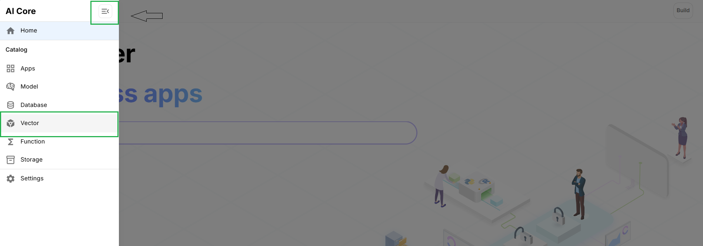
 3. Click **Add Vector** in the top right corner of the vector catalog page. 
 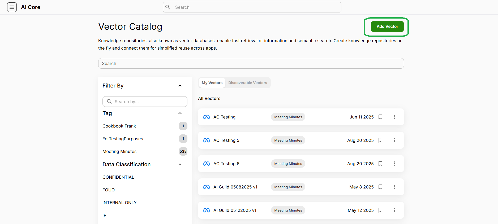
 4. Next, click **FAISS** as the vector database connection.
 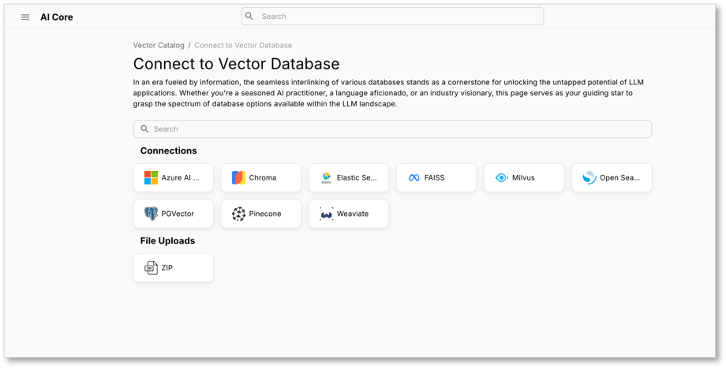
 5. Filling the Details of Vector DB.
    - Enter a unique title in **Catalog Name**.
    - Select an Embedder
    - Upload the **hhs-employee-leave-policies.pdf** file.
    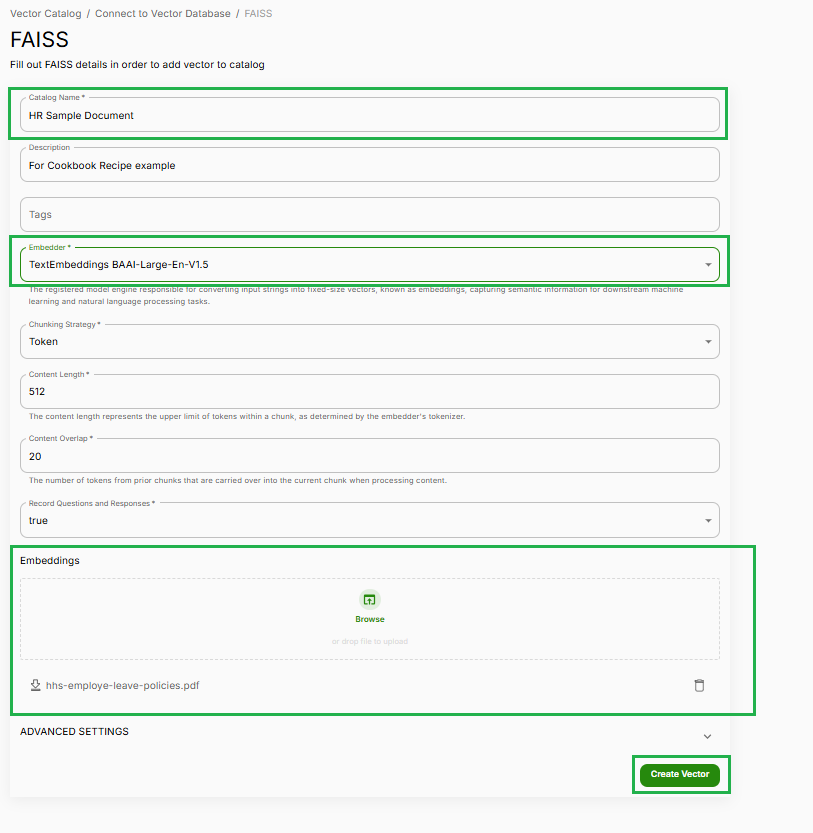
 6. Click Create Vector.
 7. The screen will be redirected to **HR Sample Document** vector, as shown in the image below.
  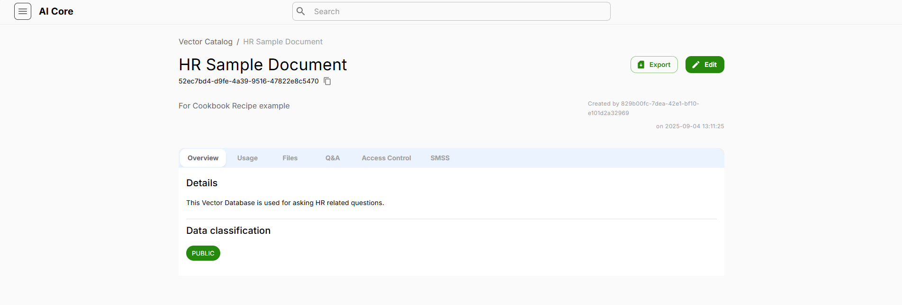

> **Note**: _The vector DB used in this example **HR Sample Document** is Exposed and Discoverable. To use this search HR Sample Document in **Vector** catalog and switch to discoverable tab._

### Create an Agent
 
 1. Navigate to the top left corner of the page to open the side menu, Next, click **Apps**.
 2. Next, click **Create New App** in the top right corner of the Apps page. 
 3. Now, click **Get Started** Under **Construct an Agent**
  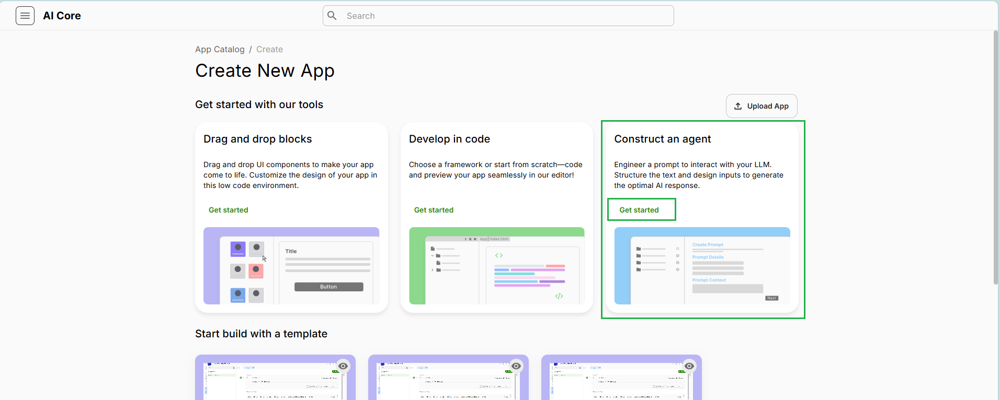
 4. Give the details of the Agent App
    - Enter a Unique Name
    - Select **Llama3-70B-Instruct** as LLM
    - Type **prompt** in Prompt Context section. This is how you will chat with the document in a later step.
 5. Click Next
  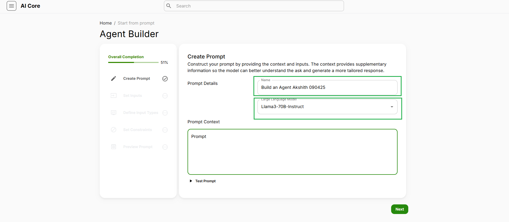
 6. Set Inputs, Use your mouse to hover over the word "Prompt". Then select **Set Input** and Click **Next**.
  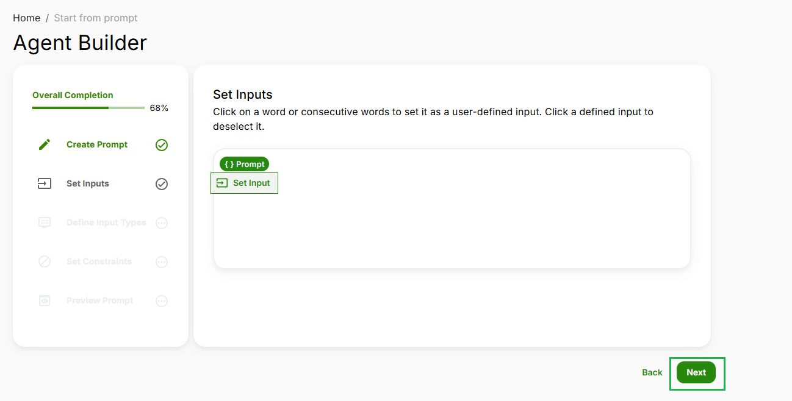

 7. **Defining Input Type** 
    - Select **Perform RAG Search** under Input type. 
    - Select your Knowledge repository. This is the **HR Sample Document** we will be referencing. Click Next to set the Constraints.
  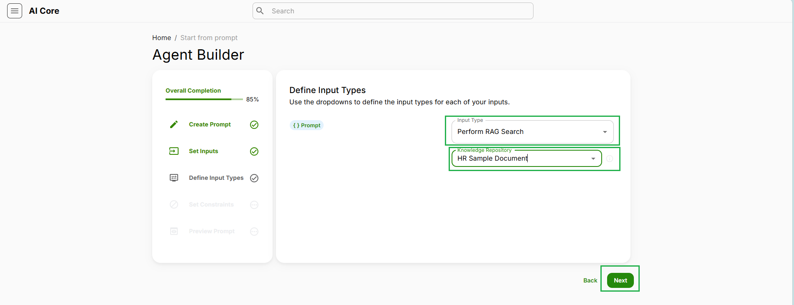

 8. Hate speech is automatically filtered out, but you are welcome to select any other constraints. Next, click **Preview**.
  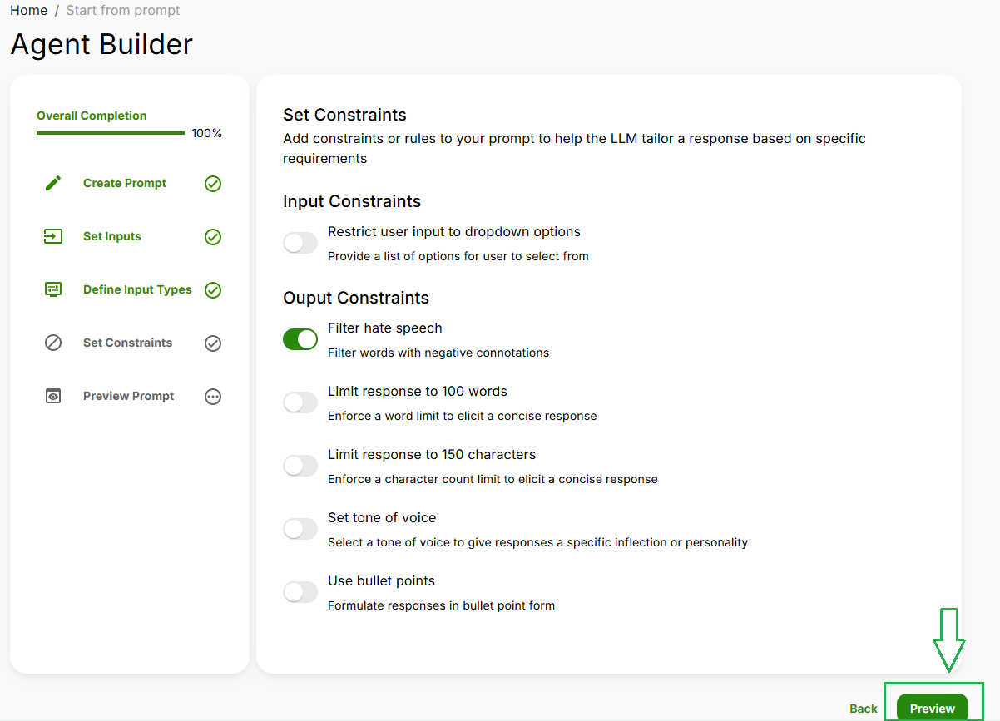 
 9. Here you can preview your app and make any remaining changes. Then, click **Create App**.
  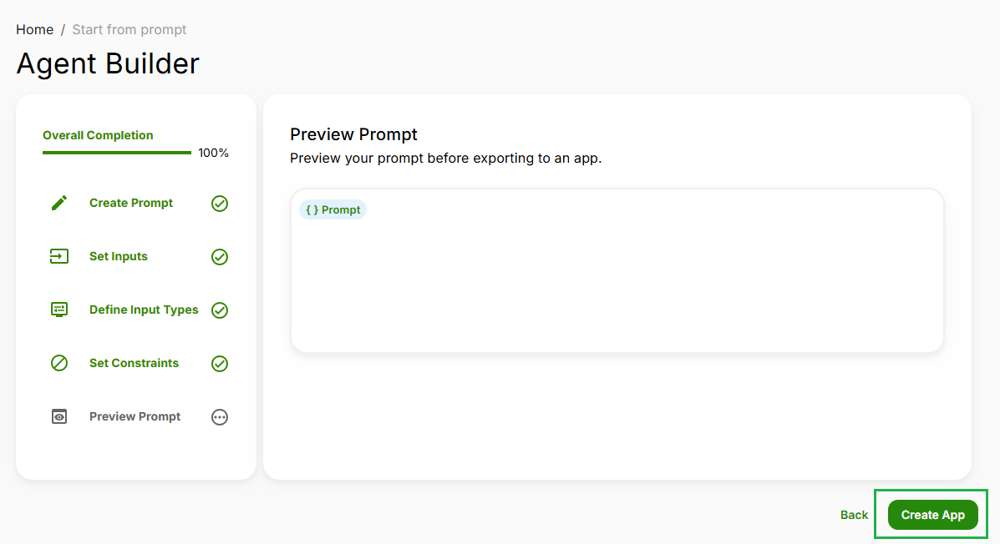

#### Testing the Agent
After Clicking on **Create App**, The App creation is successful if the Screen looks like Screenshot below.
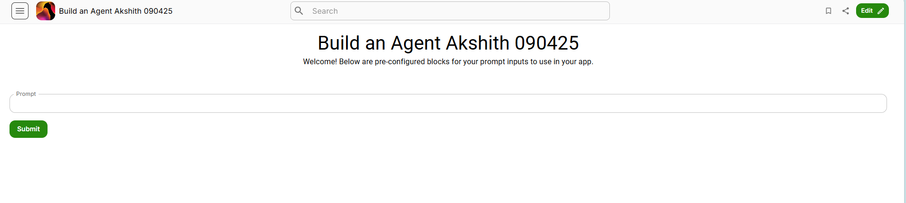


To test if the RAG input type set to the input working Precisely. Enter example questions like:
 - What is the sick leave policy?
 - What are the different types of leave?
 - What are the rules for jury duty leave? 

> **Note**: If additional documents are uploaded, questions can be asked accordingly for the specific use case. 

After typing the question in the prompt input box, click on **Submit**. The response will be generated and shown below the **Submit** button. 

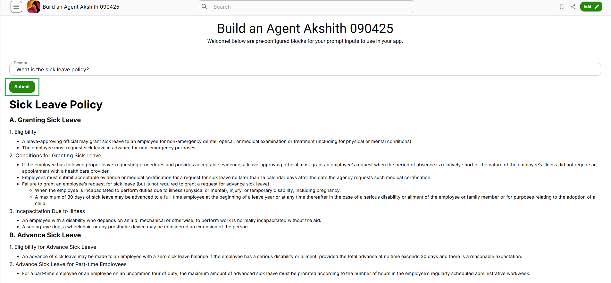

---

### How the Agent App works?

When you submit a question, the system first searches the vector database for relevant information from your uploaded documents. The most relevant content is then sent, along with your question, to the LLM (Large Language Model). The LLM uses both your question and the retrieved context to generate a precise, context-aware answer. This ensures responses are grounded in your actual data, not just general knowledge.

---

## Pro-Code Examples

You can interact with the vector database and perform RAG operations directly in code. Below are examples in JavaScript, Python, and Langchain for common tasks such as listing documents, adding documents, performing a nearest neighbor search (RAG query), and removing documents.

### Pixels 
You can use these in JavaScript/typescript

```typescript
// List all documents in the vector database
ListDocumentsInVectorDatabase(engine = "52ec7bd4-d9fe-4a39-9516-47822e8c5470");

// Add PDF documents to the vector database
CreateEmbeddingsFromDocuments(engine = "52ec7bd4-d9fe-4a39-9516-47822e8c5470", filePaths = ["hhs-employee-leave-policies.pdf"]);

// Perform a RAG (nearest neighbor) search
VectorDatabaseQuery(
  engine = "52ec7bd4-d9fe-4a39-9516-47822e8c5470",
  command = "What is the sick leave policy?",
  limit = 5,
  filters = [],
  metaFilters = []
);

// Remove a document from the vector database
RemoveDocumentFromVectorDatabase(engine = "52ec7bd4-d9fe-4a39-9516-47822e8c5470", filePaths = ["hhs-employee-leave-policies.pdf"]);
```

### Python Notebook

A Python SDK can be used to interact with the vector database and perform RAG queries in a notebook environment.

```python
from ai_server import VectorEngine

# Initialize the vector engine with the HR Sample Document engine ID
vectorEngine = VectorEngine(engine_id="52ec7bd4-d9fe-4a39-9516-47822e8c5470")

# List all documents in the vector database
vectorEngine.listDocuments()

# Add a PDF document to the vector database
vectorEngine.addDocument(file_paths=['hhs-employee-leave-policies.pdf'])

# Perform a RAG (nearest neighbor) search
result = vectorEngine.nearestNeighbor(
    search_statement='What is the sick leave policy?',
    limit=5
)
print(result)

# Remove a document from the vector database
vectorEngine.removeDocument(file_names=['hhs-employee-leave-policies.pdf'])
```

### Langchain Application

If you are using Langchain, you can convert the vector engine to a Langchain-compatible vector store: 

```python
from ai_server import VectorEngine

vector = VectorEngine(engine_id="52ec7bd4-d9fe-4a39-9516-47822e8c5470")
langchain_vector = vector.to_langchain_vector_store()

# List documents
langchain_vector.listDocs()

# Add documents
langchain_vector.addDocs(file_paths=['hhs-employee-leave-policies.pdf'])

# Perform similarity search (RAG)
results = langchain_vector.similaritySearch(query='What is the sick leave policy?', k=5)
print(results)
```

## References

 - **Vector DB Engine ID**: `52ec7bd4-d9fe-4a39-9516-47822e8c5470`
 - **Vector DB Name**: `HR Sample Document`
 - **Vector Type**: `FAISS`
 - **Embedder**: `TextEmbeddings BAAI-Large-En-V1.5`

> Note: These code snippets can be copied and be adapted to other applications or notebooks to perform RAG operations using the **HR Sample Document** vector database.
