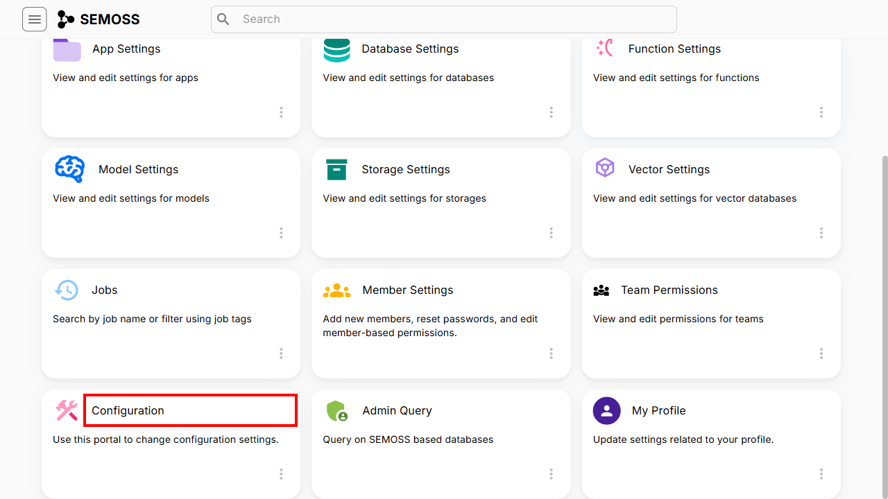
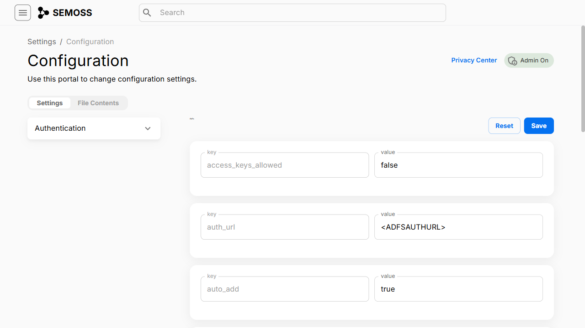

### Navigating to Configuration

1. Open up the side menu. Click on Settings.

2. Enable Admin Mode

3. Click on Configuration.

### Configuration Information

There are two tabs in configuration which are **Settings** and **File Contents**.
Use this portal to change Configuration settings.

For a configuration we can reset and save the existing key-value pairs. 

The keys present in a configuration are: 

- **access_keys_allowed** : The value should be a boolean value either true or false.
- **auth_url** : The value should be a url which should be written inside.
- **auto_add** : The value should be a boolean value either true or false, this makes sure that the configuration has the feature of auto add or not.
- **beanProps** : In the value field add attributes of the bean.
- **client_id** : Add the client ID in the value.
- **display_name** : In the value write the name which the configuration name should be displayed as. 

clicking on **Reset** button resets the values of the configuration, where you can fill the values of all the keys.
After entering the values click on **Save** to save the changes to the configuration.

