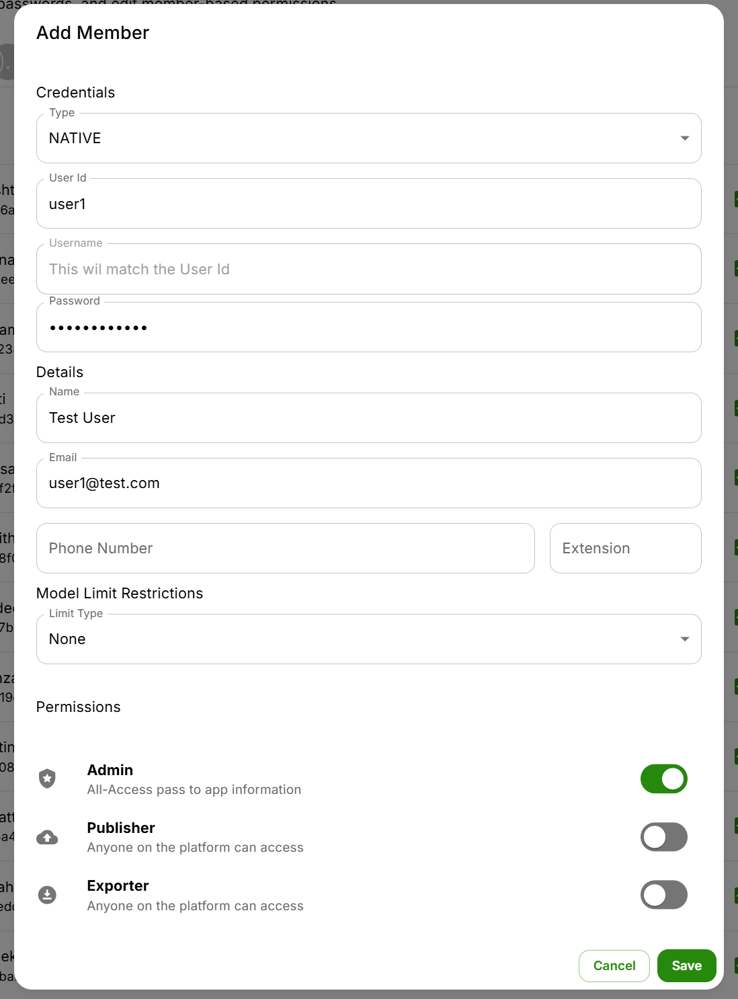
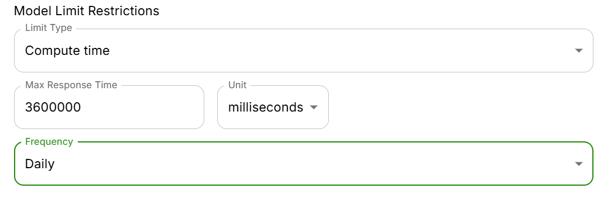

### Add Members
1. Click on Settings
2. Enable Admin Mode

3. Click on Member Settings
4. Click on Add Member
5. Fill in user details

In the Permissions Section you can grant Admin, Publisher, and Exporter access
6. You can also add Model Limit Restrictions for the new user

Admins can limit model limits by token or compute time
7. Click on Save

### Edit Members

This view displays a list of all existing members, along with their assigned roles (e.g., Publisher, Exporter, Admin).
    - Use the checkboxes or the pencil icon to edit member permissions.
    - Use the trashcan icon to remove members from the platform.

