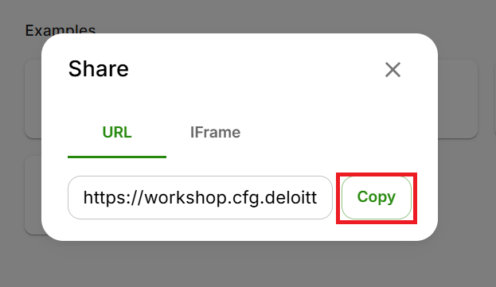
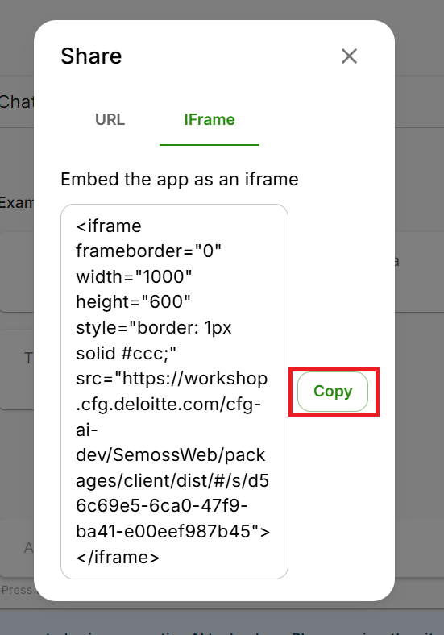
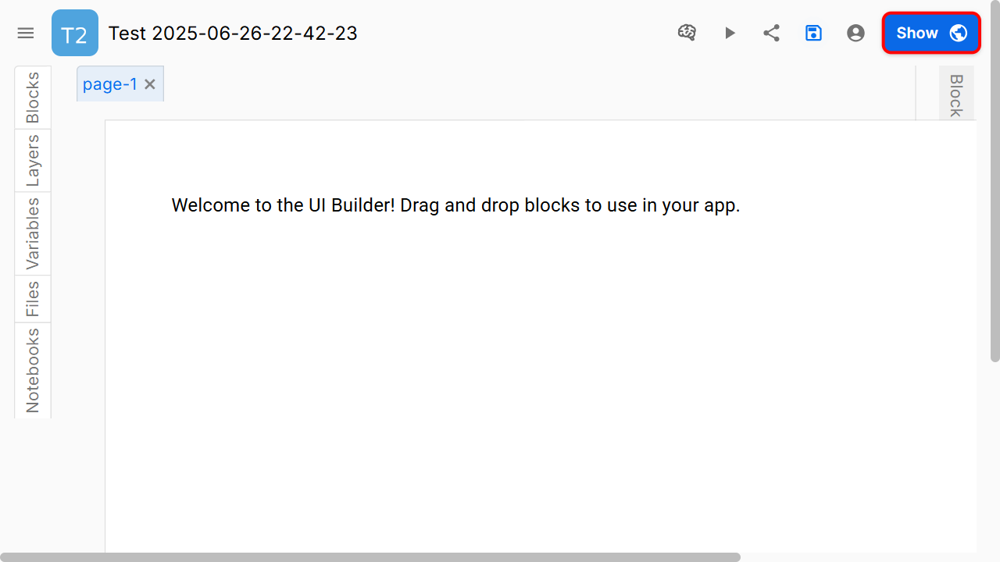
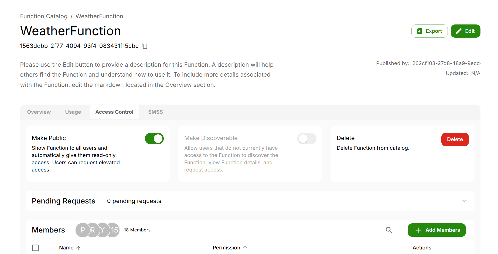
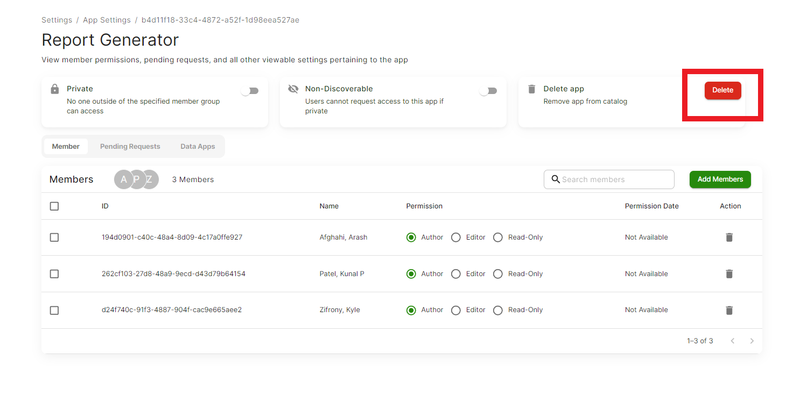

import ReactPlayer from "react-player"
import AppLibraryAndUserPermissions from "/Demos/AppLibraryAndUserPermissions.mp4"
import RemovingApp from "../../../static/Demos/RemovingApp.mp4";

# App Library

App Library is a section in AI Core which consists of list of Gen AI applications present on the platform that are created by users. Once you click on a particular app in the App Library, it will open the App which is ready to use.

## Creating a new App

To create a new App, click on the top right corner of the homepage on **Create New App**.


You can choose among the 4 different options of creating a new app. These are,

1. Code - You can build an app by coding using a framework or even from strach

    How to build a Code App has been covered in detail [here](../../How%20To/App%20Creation%20Guides/React%20App%20In-Depth%20Guide.md).

2. Drag and Drop - This is no-code option of creating a new app

    How to build a Drag and Drop App has been covered in detail [here](../../How%20To/App%20Creation%20Guides/By%20Drag%20&%20Drop.mdx).

3.  Agent Builder - This is also a no-code solution

    How to build an Agent Builder App has been covered in detail [here](../../How%20To/App%20Creation%20Guides/By%20Agent%20Builder.md).

4. Template App

    If you don't want to build your app from scratch, you can choose utilize a template from the list of templates.


After clicking the Create button in any of our tools, users are prompted to enter key app details like:
- name: The name of the app
- description: Description of the app
- app image: You can add a custom image for your app
- tags: When developing a new application, incorporating tags can significantly enhance both organization and navigation. Tags can be associated with various aspects of the app, such as its functionality or design. For example, if your app helps users plan trip itineraries, you might use tags like "travel planner" or "itinerary creator." These tags enable you to efficiently filter and locate the desired app within your entire library.


### Preview App

The Preview App button allows you to view and interact with your app as users would see it before it is published. This feature helps you test the user experience and overall layout without saving any changes made during the preview. If you notice anything that needs improvement, you can easily return to editing to make adjustments. Using the preview ensures your app meets your expectations before going live.


### Share App

The Share App button allows you to easily distribute your app to others.


We can share an App in two ways: 
#### URL

The is the most direct and quickest way of sharing an app with someone is using the URL option, one can copy the URL by clicking on the copy options right beside the URL, and share that link with others that you wanted to share. 




#### iFrame
Another way you can share the app is by sharing them the IFrame link of the app, to share an app using IFrame click on the IFrame tab  beside URL and you can copy the IFrame link and share it with others.


              
Using this way you can embed the app as an iframe. In the **HTML** code the website where you want to embed this app inside the body tag of that website paste this iframe tag contents that you copied by clicking the button in sharing menu. 

```html
<iframe frameborder="0"
            width="1000"
            height="600"
            style="border: 1px solid #ccc;" 
            src="https://workshop.cfg.deloitte.com/cfg-ai-dev/SemossWeb/packages/client/dist/#/s/d56c69e5-6ca0-47f9-ba41-e00eef987b45">
</iframe>
```

The attributes in the iframe tag can be changed accordingly to our use the default values such as frameborder, width, height, style etc. are defined such that the most suitable/optimised values, but feel free to change them to the required use.


### Save App

The Save App button ensures that all your changes and progress are securely stored as you work on your app. By clicking this button regularly, you can prevent accidental data loss and easily restore previous versions if needed. Some platforms may also offer an auto-save feature, so it’s a good idea to check your settings for additional protection. Consistently saving your work helps maintain the integrity of your app development process.


### Show App

The Show App button lets you preview your app exactly as end users will see it. This feature is useful for verifying that everything appears and functions correctly after publishing, and for spotting any issues or missing content. The view is read-only, so if you need to make changes, simply return to the editing mode. Using Show App helps ensure your app is ready for your audience.



## Uploading an App

If you have an existing app, you can upload it as a zip file. To upload an existing App, click on the top right corner of the Create New App page on **Upload App**.


On the modal, you can upload your zip file, name your app, give it tags, and manage initial access. Once you hit **Upload**, you will be redirected to the Code Editor for your app.


## Access Control
<ReactPlayer controls url={AppLibraryAndUserPermissions} />

You can control the level of access other users have to the apps you create. To manage the access of a particular app, open the app and click **edit** on the top right corner of the app page. Then click on the settings gear.

{/* TODO */}
{/*  */}
The Access Control tab allows authors of the App to change App permissions

### Add members
You can grant access to other users by clicking on Add Member. When adding a member you will have to select which [permission level](../../Getting%20Started//Platform%20Navigation/Settings/Permissions.mdx) to grant.

### Pending Requests
Users can request access to your app if it is  [Discoverable](#discoverable-apps), these requests will be visible in Pending Requests. 


### Public App
Making an app public allows all users to have READ-ONLY access to the app. Users would also be allowed to request access to the app.

### Discoverable App
Making a app discoverable allows all users to request access to the app.
[Request Access for Discoverable Apps](#discoverable-apps)

### Discoverable Apps
If an app is discoverable other users can request access to the app.


Click on **Request Access** near the top-right corner and a pop-up will provide you with 3 options to choose from - Author, Editor & Read-Only. You can choose the option based on your role and request.


## Edit App
This allows you to edit the App metadata displayed in the Overview tab for the App. It provides a convenient way to update details, correct errors, or enhance information as needed. By clicking this button, users can access editable fields and make changes before saving or submitting their updates. This functionality helps maintain accurate and up-to-date content.


  - Edit App Options
    - Edit/View Tabs: The "Edit" tab is for entering or modifying content, while the "View" tab allows users to see how the content will appear once formatted.
    - Description: A field for providing a detailed explanation of the app, helping others understand its purpose and usage.
    - Tag: Allows users to add tags for categorization or easy searching, enhancing the discoverability of the app.
    - Domain: Users can specify the domain or area of application for the app, aiding in contextual understanding.
    - Data Classification: A input field for specifying the classification of data, which can be important for compliance and security purposes.
    - Data Restrictions: This field is for noting any restrictions on the data, such as access limitations or usage guidelines.


## Export App
The **Export** button allows users to download the current content as a ZIP file, making it easy to save and share multiple files in a compressed format. This feature streamlines the process of exporting data for backup, collaboration, or offline use. By clicking the Export button, users can quickly package their work and transfer it efficiently. This zipped file can be uploaded in other AI Core enviornments.


## Delete App
Authors can permanently delete a app.


## Searching for Apps

Apps from the library can be accesed using the **search** option present at the top left corner of the page. This is highlighted in the picture below.


## Removing an App
<ReactPlayer controls url={RemovingApp} />

{/* <br/> */}

If you ever want to remove an App from your AI Core server, the first thing that you should do is navigate to your settings sections (the gear).


> _The settings tool_

Inside Settings, you should see a screen that has a settings sections for each of the resources you have in AI Core. Click on App Settings.


> _This will house all the Gen AI apps that you have in your App Catalog_

Here you will see each of your apps listed individually. Click on the app that you would like to delete.

> To be added

> _All of your Apps displayed_

Once inside an app, you can easily delete it by clicking the delete button.



> _Delete Button_

> **Warning**:
> This will **delete** the App for all users!

This process can be replicated for all other resource types (databases, models, storage catalogs, etc) in AI Core!

