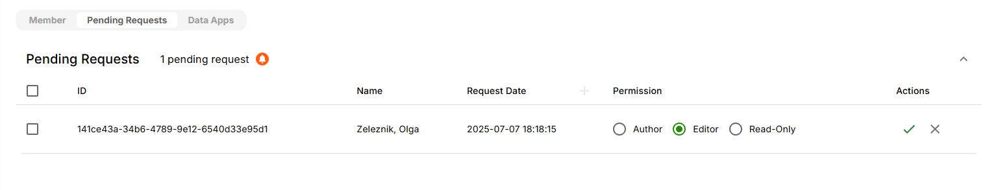
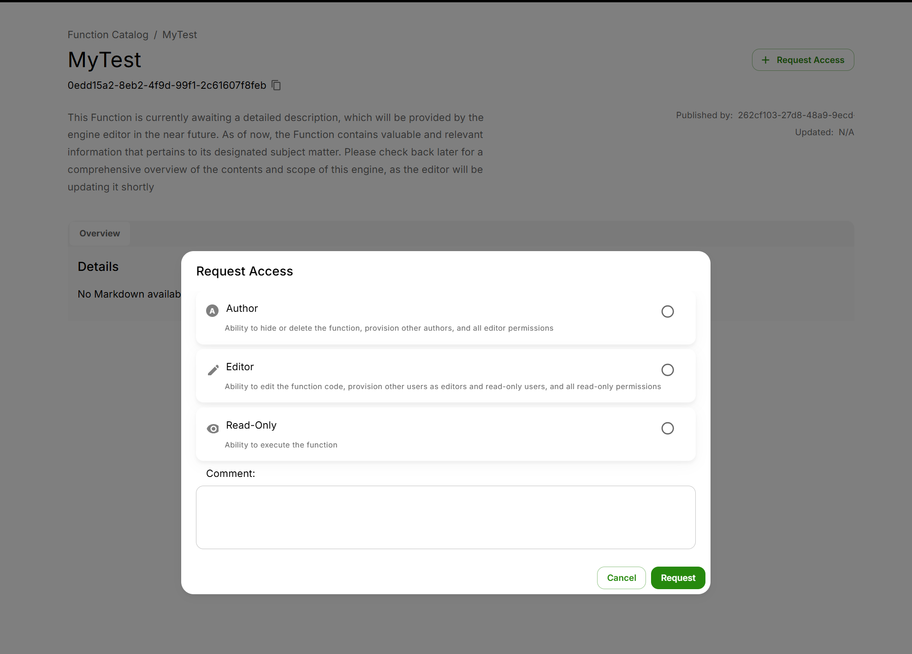
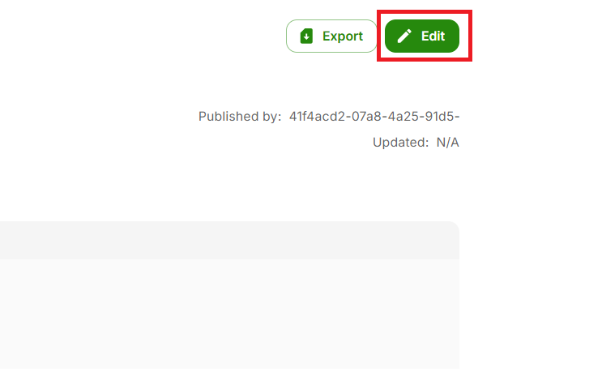
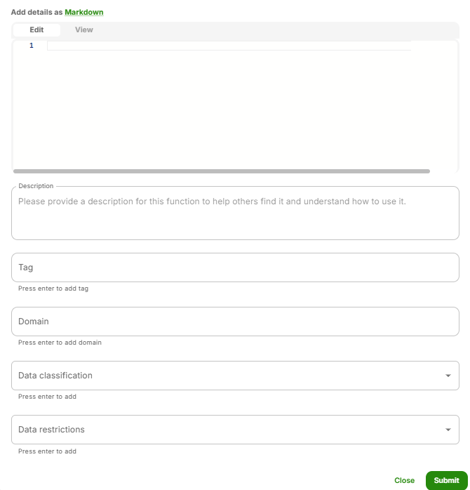
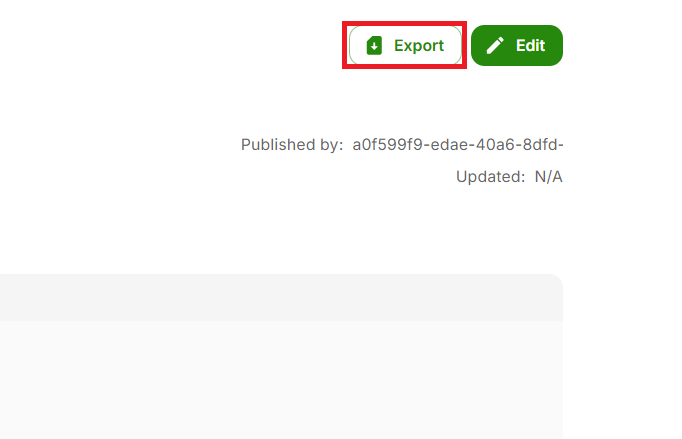

import ReactPlayer from "react-player";
import DatabaseCatalog from "../../../static/Demos/DatabaseCatalog.mp4";

# Database Catalog

Databases are organized data that is linked with Gen AI Apps on AI Core and can be used by those Apps to use data. Databases enable Apps to provide results as per requirement. You can create a new database or add locally available databases to AI Core which can be then connected to Apps.

To navigate to the Database Catalog, click on the **cylinderical** icon on the left side of AI Core portal which will take you to Data catalog.

{/* Add a picture of the database catalog main page */}

## Pre-requisites

- Before adding a Database to your AI Core instance, it must be detached from any existing instance otherwise it might return an error.
- When you attach a Database, all data files for the Database must be available

## Adding a Database
<ReactPlayer controls url={DatabaseCatalog} />

To connect to an existing Database or add a new Database, click on **Add Database**

{/* You will be directed to the **Add Source** page which will have various options within the Database section mentioned below.

 */}

Click on **Connect to Database** icon and it will take you to a page where you will have different Database file types to upload and Types of **Connections** to chose from (shown below).

### Postgres Example
Let us take the example of Postgres which is an open-source relational database management system that supports both SQL and JSON querying.

Click on **Postgres** to start the connection process.

As we can see in the above image, to connect to Postgres, we need to fill the required information. Let us understand them one by one.

#### Catalog Name
This is a user specific information. It refers to the Database name or the Connection name.

#### Database Description
Here we can write some information describing for what we are creating a database. We can write about the functionality of our database. For example, the database will store information of a chatbot of a company, we can mention that.

#### Tags
Just as Database Description, we can include Tags to describe about the functionality of our database. However, both Database Description and Tags are optional info to include.

#### Hostname
Hostname is the url address where our Database will be established. This is a credential the user optains from the admin of the database.

#### Port and Database
As you can see, both the Port number and the Database name are autofilled. Both are Database specific information.

#### Schema
Schema, which is autofilled, is another layer of nomenclature given to the database for the purpose of differentiation.

#### Username and Password

These are the credentials of the corresponsing database we want to connect our catalog with.

#### JBDC url
This is the same as the Hostname.

#### Final Steps
When all the parameters have been filled, click on Create Database button.

Here you will see all the tables housed inside the database we are trying to connect with. Select the tables we need to establish the connect with and confirm.

Congratulations, you have completed the connection process!

{/* <ReactPlayer controls url={DatabaseCatalog} /> */}

## Usage
The usage tab for a database tells you how to use the database in JavaScript, Python, Langchain API and Java.

## Access Control
The Access Control tab allows authors of the database to change database permissions

### Add members
You can grant access to other users by clicking on Add Member. When adding a member you will have to select which [permission level](../../Getting%20Started//Platform%20Navigation/Settings/Permissions.mdx) to grant.

### Pending Requests
Users can request access to your database if it is  [Discoverable](#discoverable-databases), these requests will be visible in Pending Requests. 

### Public Database
Making a database public allows all users to have READ-ONLY access to the database. Users would also be allowed to request access to the database.

### Discoverable Database
Making a database discoverable allows all users to request access to the database.
[Request Access for Discoverable Apps](#discoverable-databases)

### Discoverable Databases
If a database is discoverable other users can request access to the database.

Click on **Request Access** near the top-right corner and a pop-up will provide you with 3 options to choose from - Author, Editor & Read-Only. You can choose the option based on your role and request.

## Edit Database
This allows you to edit the database metadata displayed in the Overview tab for the database. It provides a convenient way to update details, correct errors, or enhance information as needed. By clicking this button, users can access editable fields and make changes before saving or submitting their updates. This functionality helps maintain accurate and up-to-date content.

  - Edit Database Options
    - Edit/View Tabs: The "Edit" tab is for entering or modifying content, while the "View" tab allows users to see how the content will appear once formatted.
    - Description: A field for providing a detailed explanation of the database, helping others understand its purpose and usage.
    - Tag: Allows users to add tags for categorization or easy searching, enhancing the discoverability of the database.
    - Domain: Users can specify the domain or area of application for the database, aiding in contextual understanding.
    - Data Classification: A input field for specifying the classification of data, which can be important for compliance and security purposes.
    - Data Restrictions: This field is for noting any restrictions on the data, such as access limitations or usage guidelines.

## Export Database
The **Export** button allows users to download the current content as a ZIP file, making it easy to save and share multiple files in a compressed format. This feature streamlines the process of exporting data for backup, collaboration, or offline use. By clicking the Export button, users can quickly package their work and transfer it efficiently. This zipped file can be uploaded in other AI Core environments.

## Delete Database
Authors can permanently delete a database.

