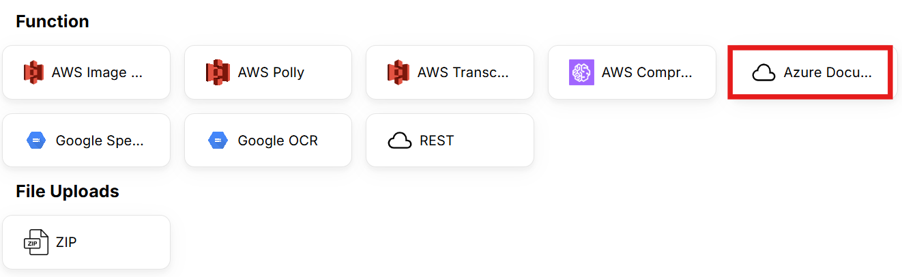
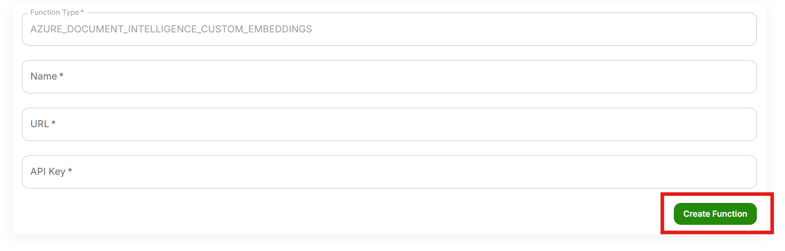
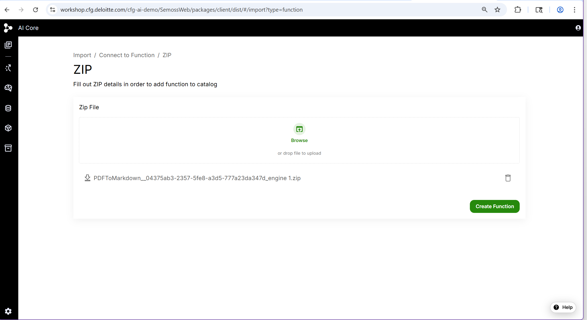
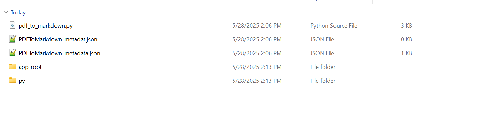
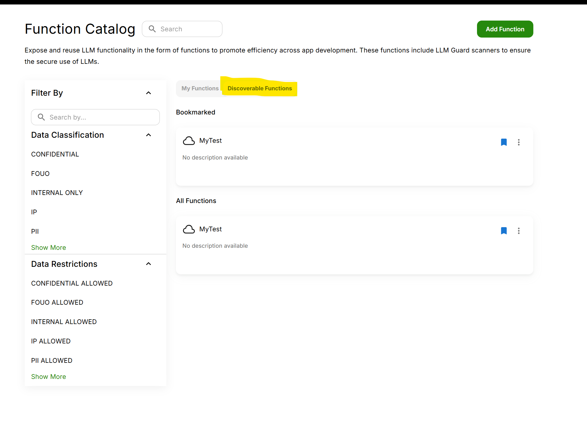

 Function Engines allow exposing and integrating custom functions to promote efficiency across app development. These functions include LLM Guard scanners, custom python functions and more to ensure the secure and appropriate use of LLMs. 


## Adding a New Function Engine


1. Access the Function Catalog

Open the side menu and click on **Function**


2. Click Add Function

From the Function Catalog homepage, click **Add Function**: This will start the process of adding a new function.


3. Select a Function

Select the desired function. Details for each can be entered manually via the UI or by uploading a ZIP file. For this example, we will be creating an "Azure Document Intelligence" function.





4. Configure the Function Properties

**Fill in the following properties**:

    - Name: Enter a descriptive name for the function.
    - URL: Provide the endpoint URL from Azure.
    - API Key: Input the API key from Azure.


5. Finalize the Creation of the Function
Click "Create Function": This will complete the process and add the new function to the catalog.



## Adding a zipped function engine
1. Go to function catalog page
2. Click on add function
3. Click on ZIP
4. Add your zipped function engine
5. Click on Create Function




## Usage
The usage tab in a specific function engine tells you how to use the function in JavaScript, Python and Java.


The default pixel to run it is 
```
ExecuteFunctionEngine(engine = "functionID", map=[{'param1':'value1', ... , 'paramN':'valueN'}] );
```
  - engine: the function id
  - map: a map with the specific parameters required to execute the function. You can find the information for the parameters in the SMSS tab.

## SMSS properties
Each function engine has an SMSS file that defines connection details for the function

These are the base properties of an Engine
- ENGINE: engine id of the function
- ENGINE_ALIAS: engine name displayed in AI Core
- ENGINE_TYPE: Java class that implements AI Core engine interface (IEngine)

These are the required properties specific to a function engine
- FUNCTION_DESCRIPTION: A description of what the function does
- FUNCITON_NAME: the function name inside the python file
- FUNCTION_REQUIRED_PARAMETERS: the required parameters in the function. 
- FUNCTION_PARAMETERS: list of key-value pairs explaining the parameters like parameterName, parameterType, and parameterDescription

Other properties might be in the SMSS specific to the function type
- PYTHON_FILE_NAME: the name of the python file which contains the function

## Function Assets
Function engines may contain python files and other assets.



### Python functions
In a python function engine the main python file must be located in the root directory folder of the function engine


## Access Control

The Access Control tab allows authors of the function to change function permissions

### Add members
You can grant access to other users by clicking on Add Member. When adding a member you will have to select which [permission level](../../Getting%20Started//Platform%20Navigation/Settings/Permissions.mdx) to grant.

### Pending Requests
Users can request access to your app if it is  [Discoverable](#discoverable-functions), these requests will be visible in Pending Requests. 


### Public Function
Making a function public allows all users to have READ-ONLY access to the function. Users would also be allowed to request access to the function.

### Discoverable Function
Making a function discoverable allows all users to request access to the function.
[Request Access for Discoverable Function](#discoverable-functions)


### Discoverable Functions
If a function is discoverable other users can request access to the function.



Click on **Request Access** near the top-right corner and a pop-up will provide you with 3 options to choose from - Author, Editor & Read-Only. You can choose the option based on your role and request.


## Edit Function
This allows you to edit the function metadata displayed in the Overview tab for the function. It provides a convenient way to update details, correct errors, or enhance information as needed. By clicking this button, users can access editable fields and make changes before saving or submitting their updates. This functionality helps maintain accurate and up-to-date content.


  - Edit Function Options
    - Edit/View Tabs: The "Edit" tab is for entering or modifying content, while the "View" tab allows users to see how the content will appear once formatted.
    - Description: A field for providing a detailed explanation of the function, helping others understand its purpose and usage.
    - Tag: Allows users to add tags for categorization or easy searching, enhancing the discoverability of the function.
    - Domain: Users can specify the domain or area of application for the function, aiding in contextual understanding.
    - Data Classification: A input field for specifying the classification of data, which can be important for compliance and security purposes.
    - Data Restrictions: This field is for noting any restrictions on the data, such as access limitations or usage guidelines.


## Export Function
The **Export** button allows users to download the current content as a ZIP file, making it easy to save and share multiple files in a compressed format. This feature streamlines the process of exporting data for backup, collaboration, or offline use. By clicking the Export button, users can quickly package their work and transfer it efficiently. This zipped file can be uploaded in other AI Core enviornments.


## Delete Function
Authors can permanently delete a function.


## Supported Functions
Below is a list of current supported functions with their required setup information:

- AWS Image Text Extraction
  {/* - Name
  - Access Key
  - Secret Key
  - Region
  - S3 Bucket Engine Id
  - Function Name (metadata)
  - Function Description (metadata)
  - Funcation Required Parameters, e.g., ["isFilePresentInS3","filePath"] */}

- AWS Polly
  {/* - Name
  - Access Key
  - Secret Key
  - Region
  - Function Name (metadata)
  - Function Description (metadata)
  - Function Required Parameters, e.g., ["extractedText","nameOfTheAudioFile"] */}

- AWS Transcribe
  {/* - Name
  - Access Key
  - Secret Key
  - Region
  - S3 Bucket Engine Id
  - Function Name (metadata)
  - Function Description (metadata)
  - Funcation Required Parameters, e.g., ["isFilePresentInS3","filePath"] */}

- AWS Comprehend
  {/* - Name
  - Access Key
  - Secret Key
  - Region
  - Funcation Required Parameters
  - Function Name (metadata)
  - Function Description (metadata) */}

- Azure Document Intelligence
  {/* - Name
  - URL
  - API Key */}

- Azure Speech To Text
  {/* - Name
  - Speech Key
  - Speech region
  - Function Required Parameters
  - Function Name (metadata)
  - Function Description (metadata) */}

- Google Speech To Text
  {/* - Name
  - Upload Service Account File
  - Google Bucket Engine Id
  - Function Name (metadata)
  - Function Description (metadata)
  - Funcation Required Parameters, e.g., ["isFilePresentInBucket","filePath"] */}

- Google OCR
  {/* - Name
  - Project Id
  - Processor Id
  - Region
  - Upload Service Account File
  - Google Bucket Engine Id
  - Function Name (metadata)
  - Function Description (metadata)
  - Funcation Required Parameters, e.g., ["isFilePresentInBucket","filePath"] */}

- REST
  {/* - Catalog Name
  - URL
  - Http Method: GET, POST, HOST, PUT
  - POST Message Body Type: json, x-www-form-urlencoded
  - Http Headers (optional)
  - Function Parameters
  - Function Required Parameters
  - Function Name (metadata)
  - Function Description (metadata) */}