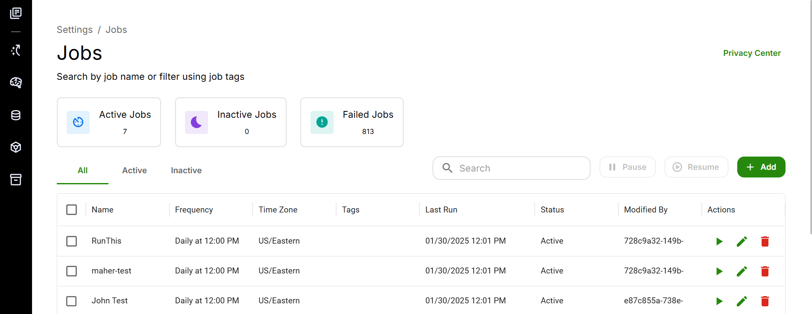

The Jobs section allows you to automate tasks that need to be executed at periodic intervals. To access this section, click on the Jobs button located on the Settings Home page.

In this section, you can view all the currently active jobs. Let's explore the functionalities of this section using these jobs as examples.

### Creating and Managing Jobs

1. **Name**: Give a unique name to the job.
2. **Frequency**: Set the frequency at which the job will be executed. For example, if the frequency is set to "Daily at 12 pm," the job will run every day at 12 noon.
3. **Timezone**: Specify the time zone for the scheduled frequency.
4. **Last Run**: Indicates the last time the job was executed.
5. **Status**: Shows whether the job is currently active.
6. **Modified By**: Displays the ID of the account that last edited the job.
7. **Actions**: This section includes three icons:
   - **Run Now (Arrow Icon)**: Manually execute the job immediately.
   - **Edit (Pencil Icon)**: Modify the job details.
   - **Delete (Wastebin Icon)**: Removes the job.

How to add a new job?

Click on Add button, you will see the below UI.

To add a new job, click on the Add button. You will see the following user interface:

To create a new job, follow these steps:

1. Describe your task in the pixel space.
2. Fill in the remaining details.
3. Click on "Add" to create the new job.

Once created, your new job will be visible on the jobs home page.

