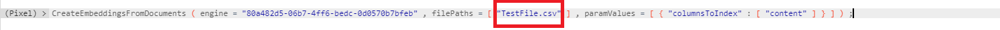

import Tabs from '@theme/Tabs';
import TabItem from '@theme/TabItem';
import ReactPlayer from "react-player";
import VectorCatalogDemoNew from "../../../static/Demos/VectorCatalogDemoNew.mp4";

# Vector Catalog

A vector database is a specialized solution designed for the storage, indexing, and retrieval of massive datasets containing unstructured data. These databases leverage machine learning models and their embeddings to facilitate searching across various forms of unstructured data, including images, video, text, audio, and more. This is done with the help of pixel calls, a domain specific language (DSL) specific to AI Core that is used as the payload for all the operations that can be performed on an insight.

<ReactPlayer controls url={VectorCatalogDemoNew} /><br />

### Adding a Vector Database

To connect to a vector database, go to **App Library > Vector Catalog**

Click on **Add Vector** on the top-right section and it will take to different type of connections for Vector.

Choose an appropriate **Connection** based on your requirements.


In this example, we will create a FAISS vector

Fill in the required FAISS (Facebook AI Similarity Search) details. Click on **Add Vector**.


Your vector database is now ready to use.

## Embed Documents

To embed documents in your vector database, open your vector in the vector catalog.

Go to **Files**.

Click on **+ Embed New Document** to upload your data file. It only accepts files with .txt, .csv, ,pdf, .doc, .ppt extensions.


Click on **upload files** to select and upload your data and click on **Embed**. You can also drag and drop your file to the same window.


You should now be able to see your file inside the vector database.


If you have questions regarding the policies or your datasets, go to **Q&A** tab and type in your query in the space provided.


Once the file is uploaded, run the following command.

`CreateEmbeddingsFromDocuments ( engine = "80a482d5-06b7-4ff6-bedc-0d0570b7bfeb" , filePaths = [ "TestFile.csv" ] , paramValues = [ { "columnsToIndex" : [ "content" ] } ] ) ;`



> Execute this command to embed your vector database with the .csv file

- This will take a while to run. Once completed, your vector database is ready to use.

> **Note**
> The engine ID above needs to match the engine ID of the vector database you just created.

- To do so, go back to App Library > Vector Catalog by clicking the vector icon on the left-side.

> To be Added 

> Look for the database you just created.

### Custom Chunking

Custom chunking refers to the process of breaking down large pieces of data, such as documents, audio, or images, into smaller, manageable chunks before loading them into a vector database. This process optimizes the storage, retrieval, and processing of data within the database.


#### Upload a .csv file 
To achieve this we will upload a .csv file to the vector database with the following columns:

- **Source**: Name of the source doucment
- **Modality**: The method by which this chunk was produced (e.g., text, audio, image, etc.)
- **Divider**: The page from which this content was extracted (this is a string and can be values like 1, 2, etc., for content parsed across multiple pages)
- **Part**: integer for the part in the page it is grabbed from. If a page has dense text relative to the max tokens this will increase from 0 to n for that page
- **Tokens**: Integer for the number of tokens for the content
- **Content**: The actual string of the content grabbed

**Example**
```csv
Source,Modality,Divider,Part,Tokens,Content
Executive,text,1,2,475,"your content"
Executive,text,2,3,511,"your content"
Executive,text,3,4,498,"your content"
Executive,text,3,4,500,"your content"
```

<Tabs groupId="custom-chuncking">
    <TabItem value="pixel" label="Pixel">
     ```pixel
     # CreateEmbeddingsFromVectorCSVFile: This function takes data from a CSV file and formats it for usage
     # engine: "Your engine ID"**: This specifies which engine or tool we are using to perform the transformation. Think of it as selecting the right software for the task.
     # filePaths: This tells the function where to find the CSV file that contains the data we want to process. In this case, the file is named "fileName1.csv".

     CreateEmbeddingsFromVectorCSVFile (engine = "Your engine ID", filePaths = ["fileName1.csv"]);
    ```
  </TabItem>
    <TabItem value="python" label="Python">
    ```python
    # vectorEngine: This is an object or instance of a class that is responsible for handling vector operations.
    # addVectorCSVFile: This is a method of the `vectorEngine` object. It is used to add a CSV file that contains vector data to the engine.
    # file_paths: This parameter specifies the path to the CSV file that contains the vector data. In this case, the file is named "fileName1.csv".

    vectorEngine.addVectorCSVFile(file_paths = ['fileName1.csv'])
    ```
  </TabItem>
  <TabItem value="java" label="Java">
    ```Java
    /*
    * Refer to AbstractVectorDatabaseEngine.java for full api use
    * 
    * vectorEngine: This is an object or instance of a class that is responsible for handling vector operations.
    * addEmbeddings: This is a method of the `vectorEngine` object. It is used to add embeddings from specified files 
    * 			and associate them with an insight and additional parameters.
    * filePaths This parameter is a list of strings, each representing the path to a file that contains the .csv data.
    * insight: This parameter represents an insight object that the embeddings will be associated with.
    * paramaters: This parameter is a map (or dictionary) where keys are strings and values are objects. 
    * 			It allows for additional parameters to be passed to the method, providing more context or configuration options for adding the embeddings.
    */

    vectorEngine.addEmbeddings(List<String> filePaths, Insight insight, Map<String, Object> parameters);
    ```
</TabItem>
</Tabs>

## Usage
The usage tab for a database tells you how to use the database in JavaScript, Python, Langchain API and Java.


## Access Control
The Access Control tab allows authors of the vector to change vector permissions

### Add members
You can grant access to other users by clicking on Add Member. When adding a member you will have to select which [permission level](../../Getting%20Started//Platform%20Navigation/Settings/Permissions.mdx) to grant.

### Pending Requests
Users can request access to your vector if it is  [Discoverable](#discoverable-vectors), these requests will be visible in Pending Requests. 


### Public vector
Making a vector public allows all users to have READ-ONLY access to the vector. Users would also be allowed to request access to the vector.

### Discoverable Vector
Making a vector discoverable allows all users to request access to the vector.
[Request Access for Discoverable Vectors](#discoverable-vectors)

### Discoverable Vectors
If an vector is discoverable other users can request access to the vector.


Click on **Request Access** near the top-right corner and a pop-up will provide you with 3 options to choose from - Author, Editor & Read-Only. You can choose the option based on your role and request.


## Edit Vector
This allows you to edit the vector metadata displayed in the Overview tab for the vector. It provides a convenient way to update details, correct errors, or enhance information as needed. By clicking this button, users can access editable fields and make changes before saving or submitting their updates. This functionality helps maintain accurate and up-to-date content.


  - Edit Vector Options
    - Edit/View Tabs: The "Edit" tab is for entering or modifying content, while the "View" tab allows users to see how the content will appear once formatted.
    - Description: A field for providing a detailed explanation of the vector, helping others understand its purpose and usage.
    - Tag: Allows users to add tags for categorization or easy searching, enhancing the discoverability of the vector.
    - Domain: Users can specify the domain or area of application for the vector, aiding in contextual understanding.
    - Data Classification: A input field for specifying the classification of data, which can be important for compliance and security purposes.
    - Data Restrictions: This field is for noting any restrictions on the data, such as access limitations or usage guidelines.


## Export Vector
The **Export** button allows users to download the current content as a ZIP file, making it easy to save and share multiple files in a compressed format. This feature streamlines the process of exporting data for backup, collaboration, or offline use. By clicking the Export button, users can quickly package their work and transfer it efficiently. This zipped file can be uploaded in other AI Core enviornments.


## Delete Vector
Authors can permanently delete a vector.
