# React App Quickstart Guide


## Overview 

The intent of this guide is to get a user up and running with a sample React app, allowing them to start developing a Gen AI app quickly and efficiently. 

This guide is perfect if you have an idea for a prompt and want access to your hosted data in AI Core. 

## Prerequisites

We will have the same basic prerequisities as the [Frontend Installation Guide](../../Advanced%20Installation/Frontend%20Installation.md)

Once you have VSCode and Node installed, come back to this page to continue the guide. 

For this guide, the frontend package manager that we will be using is pnpm, which you can install using the following command:

```
npm install -g pnpm
```

## Sample Project Code 

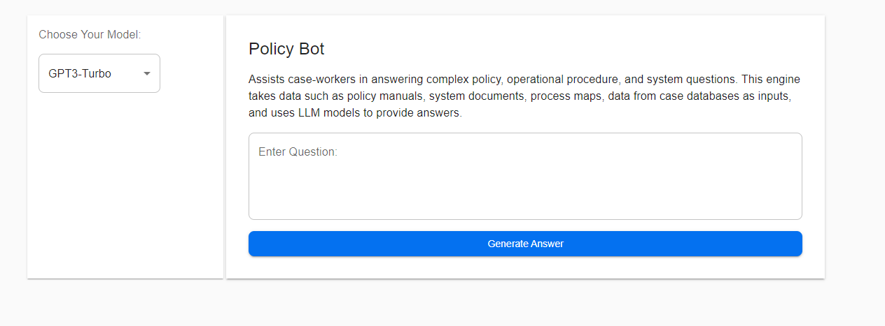
> _Policy App_

For this project we will be using our Policy App. To access this app, please navigate to:

[AI Core Apps GitHub](https://github.com/Deloitte-Default/cfgai-apps)
> **Note**
> This is a protected GitHub, make sure you have access and are signed in, you'll otherwise get a 404 Error.

If you do not have access to this GitHub, that's ok! Please contact a AI Core member and they will give you read/write privileges as soon as they can. 

As you can see there are a fair amount of apps to choose from here. 

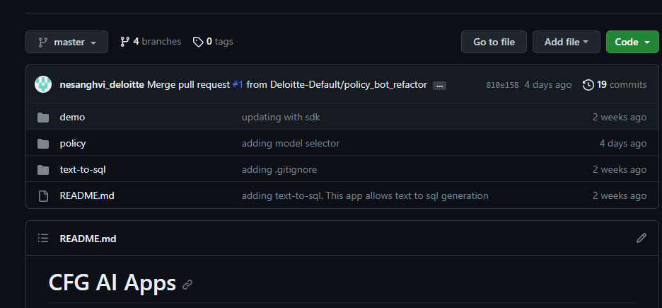
> _Apps List_

To access the policy app, we are going to quickly clone it into our local environment. 

### Step 1: Creating Local File

The first part of cloning the repository is to create a place to store the folders. Personally, I created a Gitlab folder where all of my Git related projects reside. 

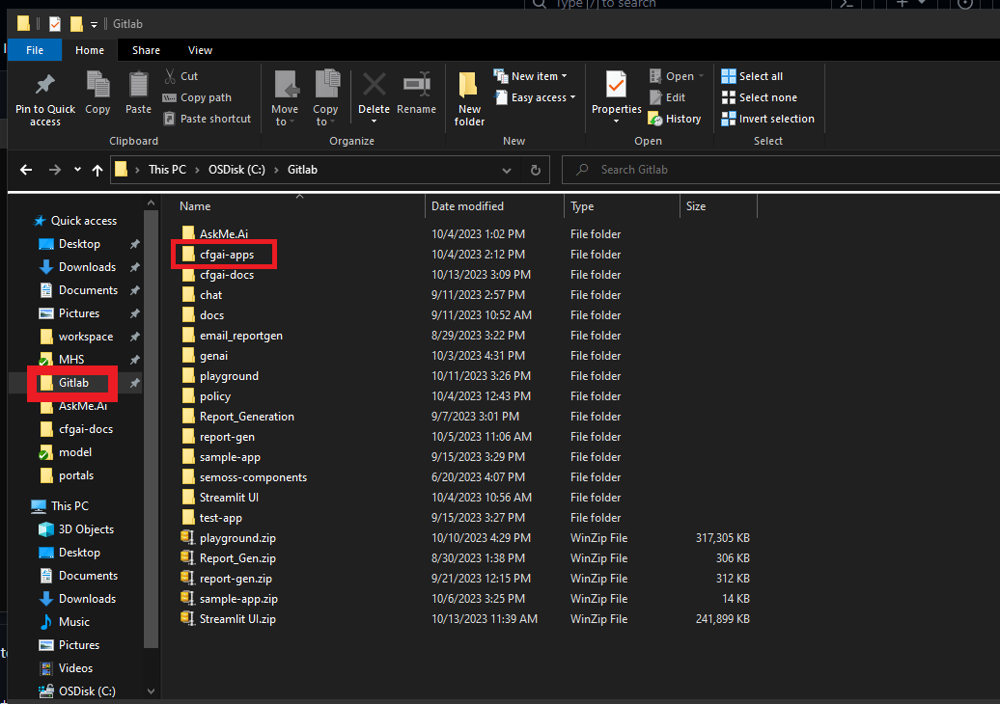
> _Local Folder for Git Projects_

After you create the folder, navigate to it in a local terminal. 

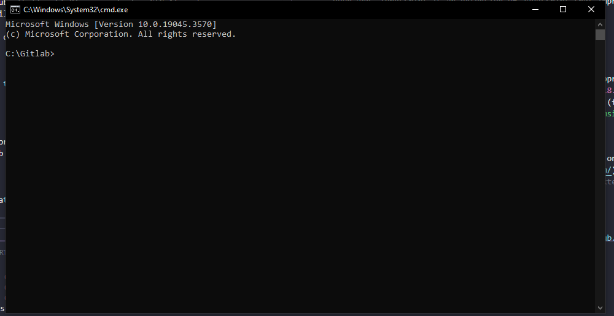
> _Navigating Local Folder in command prompt_

Here we will start the cloning process. Looking at the GitHub repository, click into the Code Section and copy the specific git link as indicated in the picture below. 

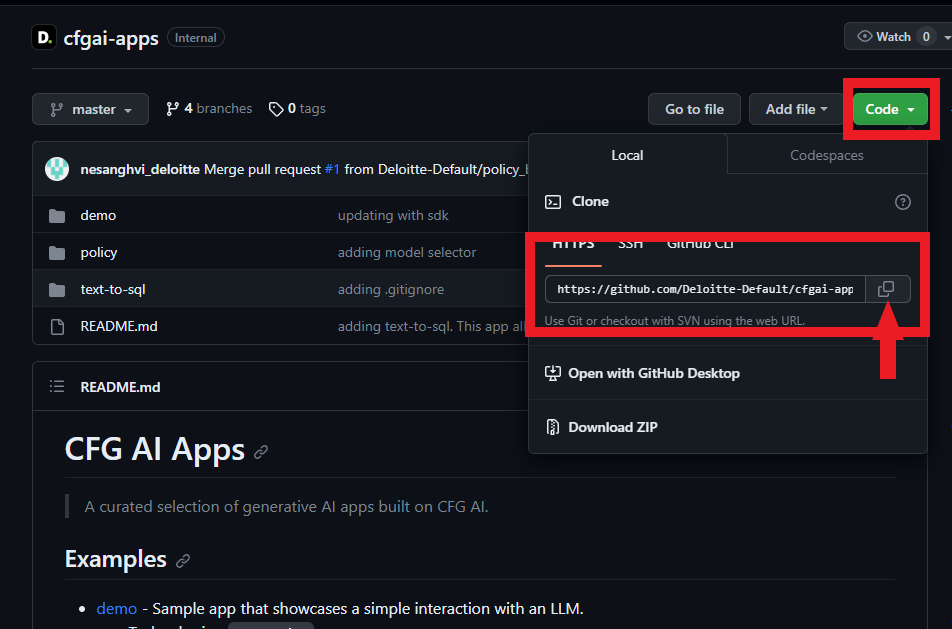
> _Code button in Github repository_

After this we can clone it to our local with a quick terminal command:

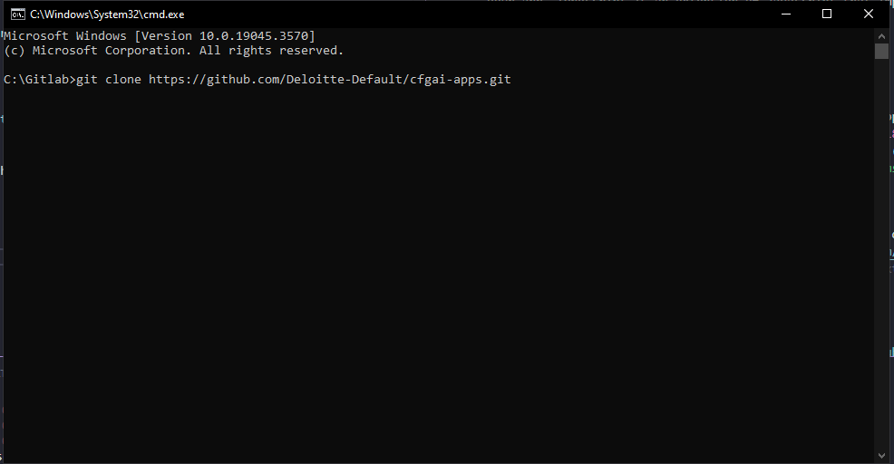
> _Cloning AI Core App locally_

As you can see in the picture above, the root folder is the new Gitlab folder that I created specifically to house my AI apps. 


### Step 2: Opening the Policy App 

Now that we have access to the Policy App locally, we can open it in VSCode and start our development journey. 

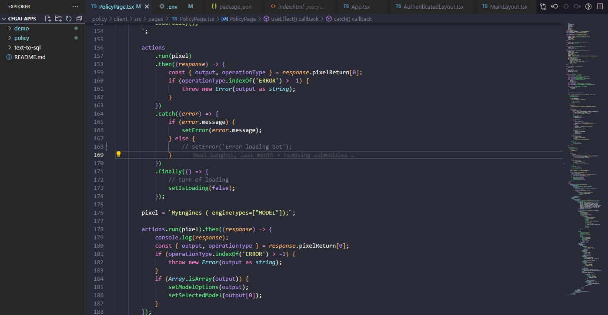
> _General VS code structure_

The general VS Code structure is shown above. To get to Policy App, open a new terminal in VSCode; inside of that terminal navigate to the client folder by typing in the following:

```
cd policy/client
```


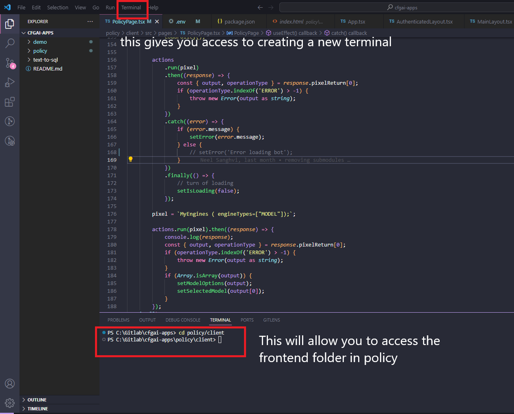
> _Access to Policy App client folder in VS_


The client folder will be where all of our Frontend code resides. To read a more comprehensive guide on the structure of a AI Core app, you can look at this guide: [React App Technical Guide](React%20App%20In-Depth%20Guide.md). For now we will focus on the client folder. 

### Step 3: Installing Dependencies

Once we are in the client folder, we can install all of the project dependencies by running: 

```
pnpm install
```

If you do not have access to pnpm or node, there are instructions for downloading those in the [Frontend Installation Guide](../../Advanced%20Installation/Frontend%20Installation.md)

Now we are ready to connect the Policy App to AI Core! 

## Connecting to AI Core

Now that we have access to sample code and have taken care of all dependencies, we want to connect our app to AI Core and get started developing. 

### Step 1: Creating a .env.local file

In order to connect to AI Core we first need to amend our .env files to point to the correct access and secret keys. 

First navigate to your .env file. It should look like this:

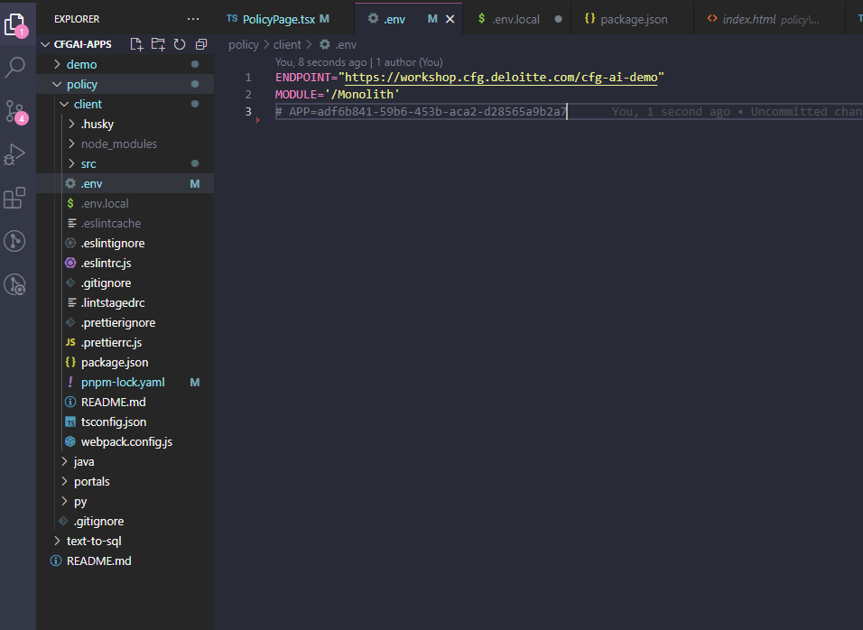
> _.env file in VS_

If you do not have these credentials, they are shown below for easy copy/pasting

```
ENDPOINT="https://workshop.cfg.deloitte.com/cfg-ai-demo"
MODULE='/Monolith'
```

We now want to add user specific information. In order to not expose this to the greater population, we will put these in a .env.local file. Create a file called `.env.local` and put the following into it:

```
ACCESS_KEY=
SECRET_KEY=
```

We will populate these fields in a second. But for now this is what your two files should look like:

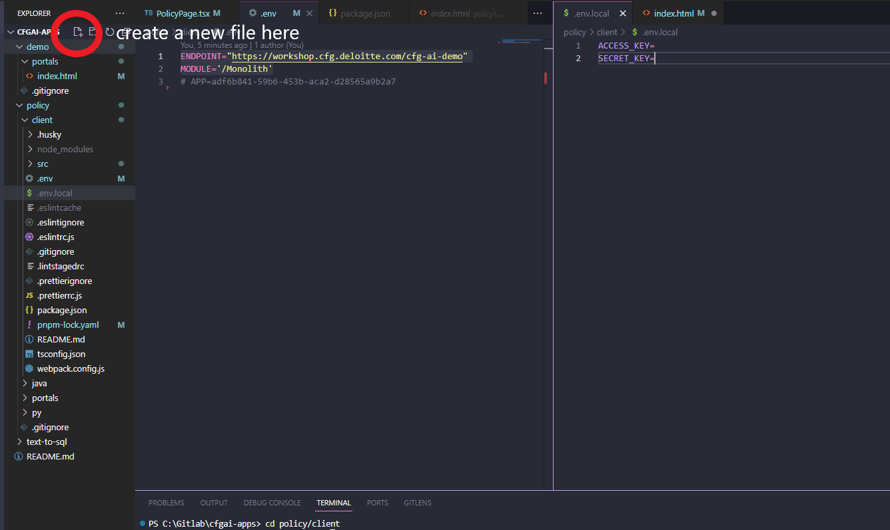
> _Click on highlighted to create new file_

### Step 2: Generating an ACCESS_KEY and a SECRET_KEY

The following link will show you how to [generate an Access Key and a Secret Key](../Establish%20Connection%20to%20CFG%20Portal/Connecting%20to%20CFG%20AI.md).

Once you have those, populate your `.env.local` file with the proper codes. 

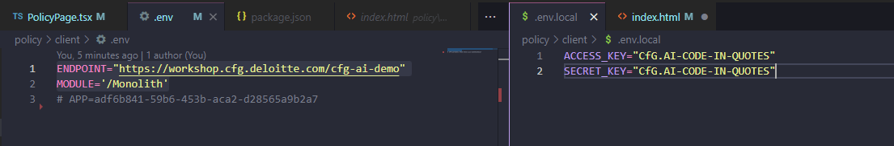
> _final .env & .env.local files on VS_

This is what your final `.env.local` and `.env` files should look like (though with your specific access and secret keys). 

Now we are ready to connect our App! 


### Step 3: Starting a Frontend Server

We are going to create a local frontend server that will connect to our AI Core server. 

Navigate back to your terminal. Make sure that you are still in `policy/client`. 

Once you are in the right directory run `pnpm run dev` in your terminal.

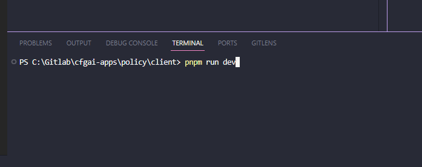
>_Create local server by running above command in command prompt_

In most instances this will create a local server in port 3000. 

Once it fully loads, you should be connected to AI Core and your frontend should look like this:

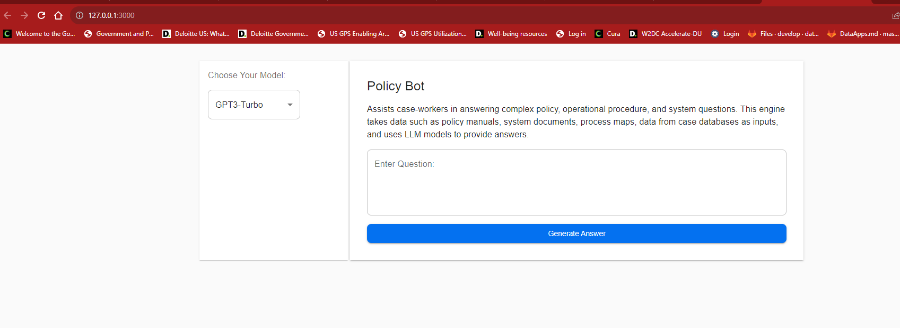
>_Policy App running on local server_

Congrats! You are now connected to AI Core. 

If this is your first time connecting to CFG, then you might need to populate your server with the resources you need to start analyzing data. Head over to [Navigating AI Core](../../Get%20Started/Navigation) to learn more. 

## Customizing the Policy Bot

Now that we have Policy Bot up and running, we are ready to start creating our own application on top of this skeleton. 

To do so, navigate to `PolicyPage.tsx`. It should be located in `policy/client/src/pages`

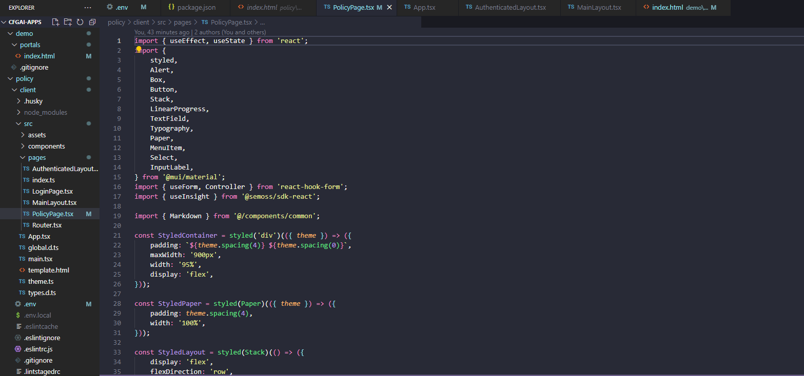
> _Homepage of Policy App in VS_

This page is the main Homepage of the Policy Bot. You can start playing with pixel calls and templating here. 

For a more detailed guide on building your own Gen AI app, you can continue learning [here](../../How%20To/App%20Creation%20Guides/React%20App%20In-Depth%20Guide.md). 

This is a more in-depth guide that goes into each portion of the development. 

## Adding Your App to the AI Core App Catalog

If you are happy with where your app is, and want to publish it to the AI Core App Catalog, the process is fairly simple. 

### Bundle Your App

In order to have your app reflect all of your recent changes, you need to make sure to bundle your app. To do this, ensure that you have the following script in your `client/package.json` file:
```
"scripts": {
    ...,
    "build": "webpack --mode=production --node-env=production",
    ...
  }
```

From the `client` directory, run the command `npm run build` in your terminal. Webpack will bundle your app and the bundled files will automatically be added to your `/portals` directory. If you don't see any files populate that folder, then you likely have an issue with your Webpack configuration.

## Adding Your App to the AI Core App Catalog

1. Compress all the directories in your project _except_ your `/client` folder. Ensure that you do this within the app directory. For example, if my app files are in a folder called `/MyApp`, I should not zip `/MyApp` itself. I should navigate into `/MyApp` and zip all the relevant directories inside of it. 

2. Navigate to [App Library](https://workshop.cfg.deloitte.com/cfg-ai-demo/SemossWeb/packages/client/dist/) and click "Create a New App" in the top right corner. This will bring you to the Create New App page.

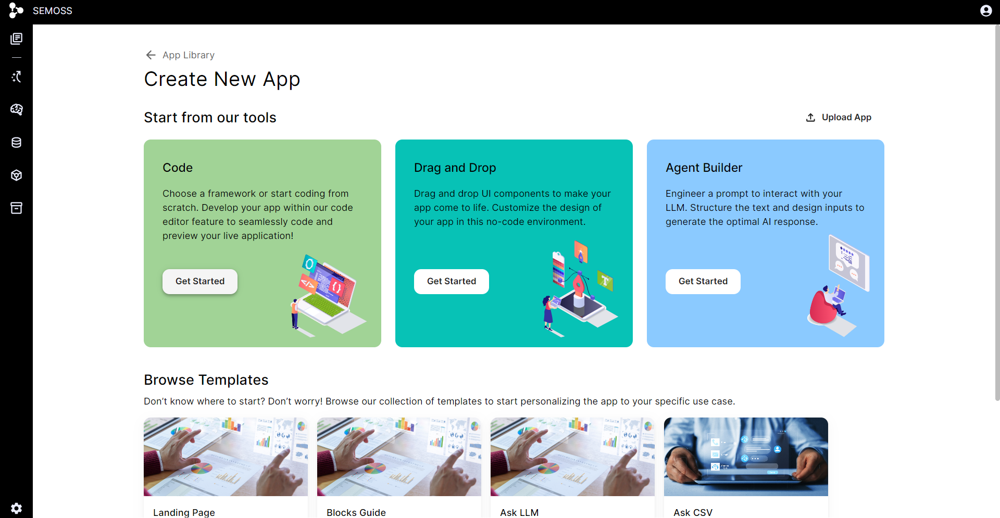

3. Click to "Get Started" under the Code option. Give your app a name and hit "Create." This will bring you to the Code Editor.

4. Click the Upload App Assets button at the top of the code file tree.

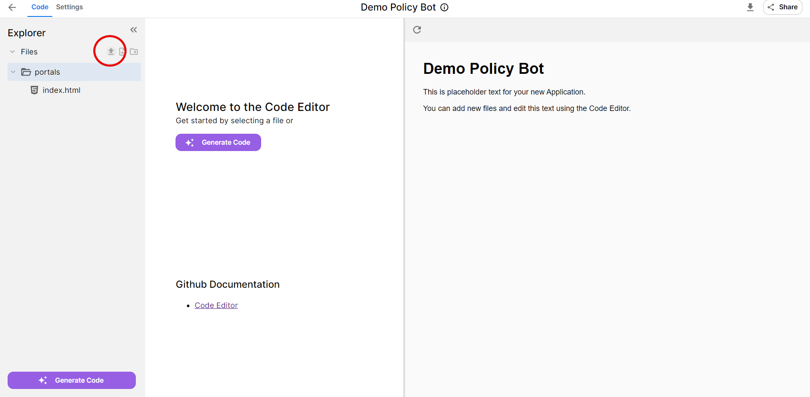

5. Attach your zip file in the modal that appears and hit "Upload."

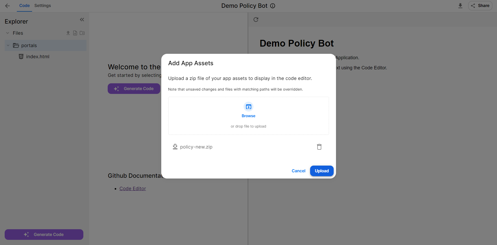

6. Ta-da! You have successfully uploaded your code app to the AI Core Server!

## Updating your App In CFG

Once you have finished making any updates to your app, these are the steps that you should follow to update your app in CFG. 

1. Use the previous section to bundle your app correctly. 
2. Compress all the directories in your project _except_ your `/client` folder. Ensure that you do this within the app directory. For example, if my app files are in a folder called `/MyApp`, I should not zip `/MyApp` itself. I should navigate into `/MyApp` and zip all the relevant directories inside of it. 
3. Navigate to your App in the App Library. Click the Edit App Icon in the top right. 
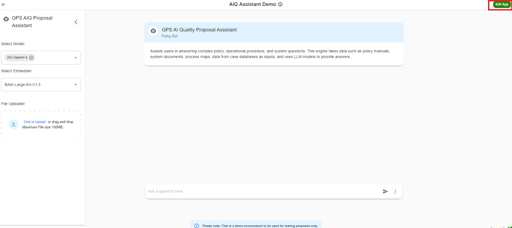
4. Once in the Edit App tab, navigate to the Settings Tab. 
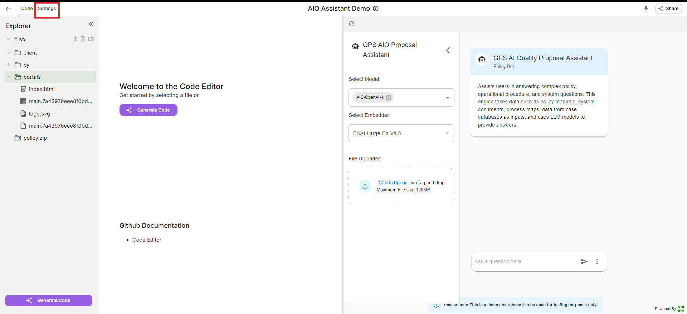
5. Once in the settings section, you want to go to the Data Apps Section. 
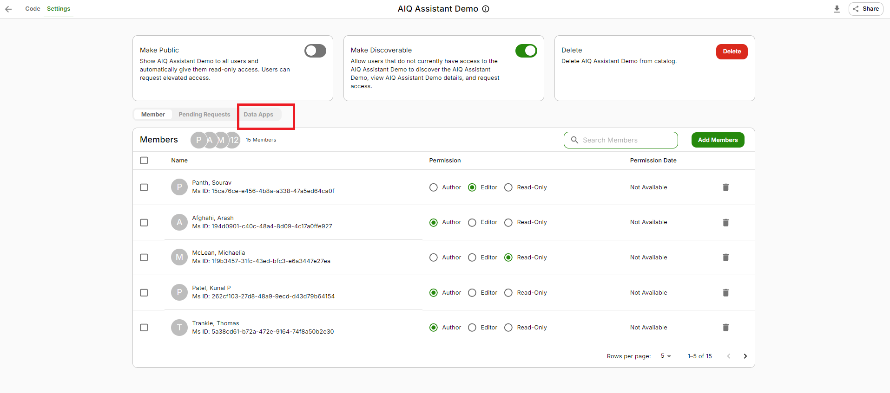
6. Once you are in Data Apps, you want to take the zip that you created in Step Two and upload it in the dropdown and press update! Once this is done your app will be fully updated. 

   

> **Hints or Additional Info:**
> Sometimes when you upload you will immediately get a 404 error, this is a known bug that is being worked on. If you refresh your page, everything will resume working normally. 


### What's Next?
Finished with this guide? 

Try out an App Use Case Quick Start guide for a different frontend framework linked below!
   - [Sample VanillaJS Use Case](VanillaJS%20App%20Quickstart%20Guide.md)
   - [Sample Streamlit Use Case](Streamlit%20App%20Quickstart%20Guide.md)
