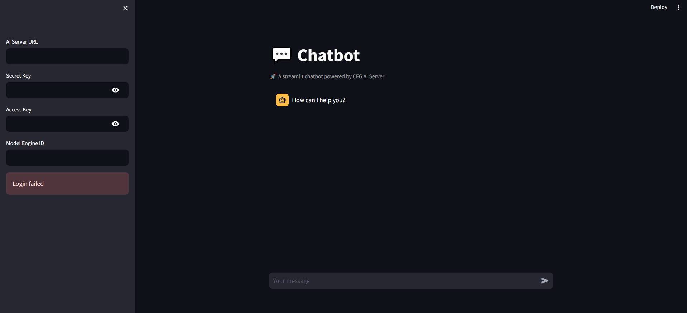
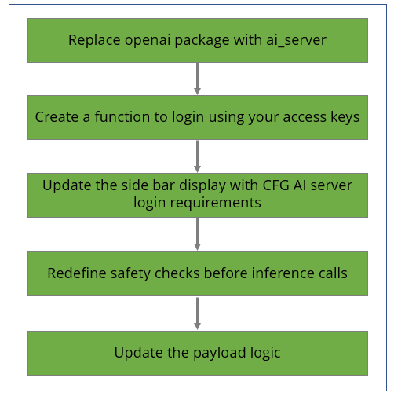

# Creating a GenAI app using Streamlit

## Overview

Streamlit is an open-source Python library that makes it easy to create custom web apps for machine learning and data science. Its a very useful tool for Data Scientists and Analysts to create analytical models and to query large databases. 

Streamlit has its own documentation that goes through its functionality and implementation. Its useful to go through and look through that here:

[Streamlit Documentation](https://docs.streamlit.io/)

Futhermore, Streamlit has a great gallery of apps that users have created. Its a useful repository of ideas and concepts that many find helpful:

[Apps Gallery](https://streamlit.io/gallery)

Please note that as of now there is no native integration of Streamlit as a hosted AI Core app. However, Streamlit is very useful for quick presentations and Proof-of-Concept creations. Converting them into a AI Core app would require using either the [VanillaJS Use Case](VanillaJS%20App%20Quickstart%20Guide.md) or the [React Use Case](React%20App%20Quickstart%20Guide.md). In the future there will be a Streamlit conversion guide that will be a more comprehensive guide for converting a streamlit app into a hosted AI Core app.  

You are, however, able to connect a Streamlit app to use the Models, Databases, and Storage Catalogs that are present in your AI Core server. This guide will go through and show how to run a local Streamlit app using your AI Core data.

It is important to keep in mind that Streamlit also requires a running backend server.

# Installation Guide 

## Generate Access Key from your AI server 

The first step to gaining access to the data stored in your AI Core server is to generate an access key and a secret key. To do this, click on the link below. After you have generated your keys, navigate back to this guide to complete your Streamlit integration. 

[Generate Access Key](../Establish%20Connection%20to%20CFG%20Portal/Connecting%20to%20CFG%20AI.md)

## Install the Streamlit and AI Server Packages
Open up a command prompt or terminal. 
Then, run the following commands to install Streamlit and AI Server:
```
pip install streamlit
pip install ai-server-sdk
```
> **Note**
> This guide assumes that you already have Python (3.9+) and pip installed. If you do not, please follow the [Back End Setup](../../Advanced%20Installation/Local%20BE%20Install%20Guide.md) section first.

## Integrate with Streamlit 

In this example we will take an existing streamlit app and modify it to be compatible with the AI Core server instead of Open AI.

### Step 1: **Clone the Chatbot.py code**

We are going to create a simple app that has a conversation with a given LLM or Model Engine. We cloned the code from [Chatbot.py](https://github.com/streamlit/llm-examples/blob/main/Chatbot.py).

The starting code is as follows:

```python
import openai
import streamlit as st

with st.sidebar:
    openai_api_key = st.text_input("OpenAI API Key", key="chatbot_api_key", type="password")
    "[Get an OpenAI API key](https://platform.openai.com/account/api-keys)"
    "[View the source code](https://github.com/streamlit/llm-examples/blob/main/Chatbot.py)"
    "[](https://codespaces.new/streamlit/llm-examples?quickstart=1)"

st.title("💬 Chatbot")
st.caption("🚀 A streamlit chatbot powered by OpenAI LLM")
if "messages" not in st.session_state:
    st.session_state["messages"] = [{"role": "assistant", "content": "How can I help you?"}]

for msg in st.session_state.messages:
    st.chat_message(msg["role"]).write(msg["content"])

if prompt := st.chat_input():
    if not openai_api_key:
        st.info("Please add your OpenAI API key to continue.")
        st.stop()

    openai.api_key = openai_api_key
    st.session_state.messages.append({"role": "user", "content": prompt})
    st.chat_message("user").write(prompt)
    response = openai.ChatCompletion.create(model="gpt-3.5-turbo", messages=st.session_state.messages)
    msg = response.choices[0].message
    st.session_state.messages.append(msg)
    st.chat_message("assistant").write(msg.content)
```

The original Streamlit App looked like this 




We are going to make it use the AI Server's Model Engine Catalog by implementing the changes mentioned below -



### Step 2: **Removing the openai import and replacing it with ai_server** 
```python
## Change 1 ##
# Replace openai package with ai_server
import ai_server
import streamlit as st
```

The ai_server function 

### Step 3: **Create a login function**

Every api call that is made usually requires some level of authentication. In order to avoid this, we are can create a caching function that stores our access and secret keys and stops streamlit from re-executing the login call. 

```python
## Change 2 ##
# Create a function to login into the server using your access keys
@st.cache_resource # Use st.cache to cache the server authentication logic
def login(secret_key, access_key, ai_server_url):
    try:
        # Attempt to create the server connection. If there is an error when connecting then an error will be raised
        conn = ai_server.RESTServer(
            access_key=access_key,
            secret_key=secret_key,
            base=ai_server_url
        )
        return conn
    except:
        # If login fails, display an error message
        st.error("Login failed")
``` 

### Step 4: **Updating the side bar**

Instead of providing a secret key for Open AI we will change the inputs to match the AI Server login requirements and indicate which model engine you would like to inference with. *Some of these fields can be hard coded depending on the use case*.

```python
## Change 3 ##
st.title("💬 Chatbot")
# Change the display reference from OpenAI LLM to AI Core Server
st.caption("🚀 A streamlit chatbot powered by AI Core Server")

# Remove OpenAI secret and add additional inputs in the side bar menu
with st.sidebar:
    ai_server_url = st.text_input("AI Server URL")                          # Your backend endpoint
    secret_key = st.text_input("Secret Key", type="password")               # Your AI Server Secret Key
    access_key = st.text_input("Access Key", type="password")               # Your AI Server Access Key
    engine_id = st.text_input("Model Engine ID", key="model_engine_id")     # The model engine ID
    server_connection = login(secret_key, access_key, ai_server_url)        # make the loging call
```
Currently Streamlit apps can only interact with AI Core when you are running an instance of AI Core locally. As such, you need point your server to your backend. In most instances this will be the Monolith server that you setup and run. 

If you were actively developing then you might want to consider hard coding your access credentials so that you don't have to enter them every time. That change would look as follow:

```python
# Harcoded Example of the above
# Remove OpenAI secret and add additional inputs in the side bar menu
with st.sidebar:
    ai_server_url = "<your monolith endpoint>"                              # Your Monolith endpoint
    secret_key = "<your secret key>"                                        # Your AI Server Secret Key
    access_key = "<your access key>"                                        # Your AI Server Access Key
    engine_id = st.text_input("Model Engine ID", key="model_engine_id")     # The model engine ID
    server_connection = login(secret_key, access_key, ai_server_url)        # make the loging call
```

### Step 5: **Redefine safety checks before inference calls**

Instead of requiring an OpenAI secret key, we will ensure that the user was able to connect to the server and provided a model engine ID.

```python
## Change 4 ##
# When the prompt is provided, make the connection was established and an engine ID was provided
if prompt := st.chat_input():
    if not server_connection:
        st.warning("Please login before trying to make an inference call.")
        st.stop()

    if not engine_id:
        st.info("Please add Model Engine ID.")
        st.stop()
```

### Step 6: **Update the payload logic**

Finally we just need to change the way we are accessing and recording the response from the model engine.
```python
    ## Change 5 ##
    ## Create a reference to the model engine ##
    model = ai_server.ModelEngine(engine_id = engine_id, insight_id = server_connection.cur_insight)

    # No changes here
    st.session_state.messages.append({"role": "user", "content": prompt})
    st.chat_message("user").write(prompt)

    # update the inference call to use ModelEngine
    response = model.ask(question = prompt)
    # Get the output string from the response
    msg = response[0]['response']
    # match the dictionary responses for OpenAI
    st.session_state.messages.append({"role": "assistant", "content": msg})
    st.chat_message("assistant").write(msg)
```

The final result is as follows:


Full code for implementing above changes can be found here

[Chatbot.py Full code](https://github.com/Deloitte-Default/cfgai-docs/blob/main/streamlit/CFG_Chatbot.py)
> **Note**
> This is a protected GitHub, if you do not have access to it, or are not currently signed in to your GitHub account you will get a 404 Error. Ask an admin for access. 


### What's Next?
Finished with this guide? 

Try out an App Use Case Quick Start guide for a different frontend framework linked below!
   - [React Quick Start Guide](React%20App%20Quickstart%20Guide.md)
   - [Sample VanillaJS Use Case](VanillaJS%20App%20Quickstart%20Guide.md)

 
