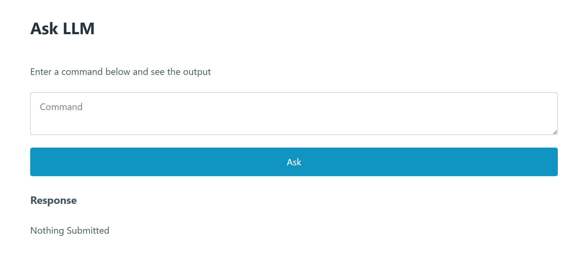
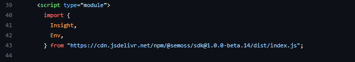
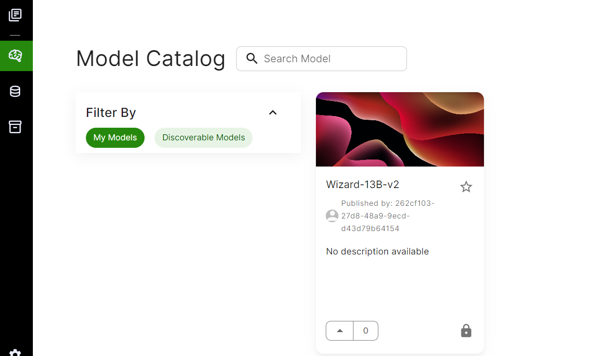
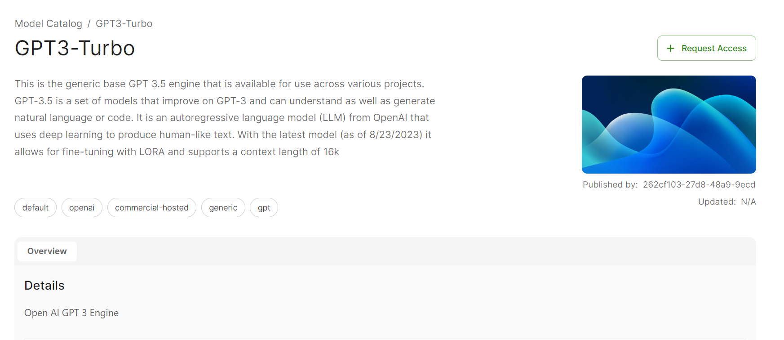
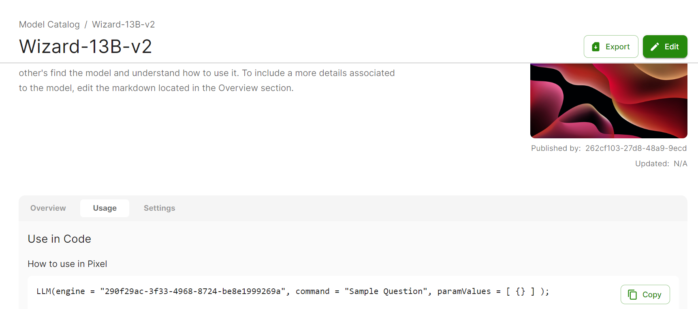
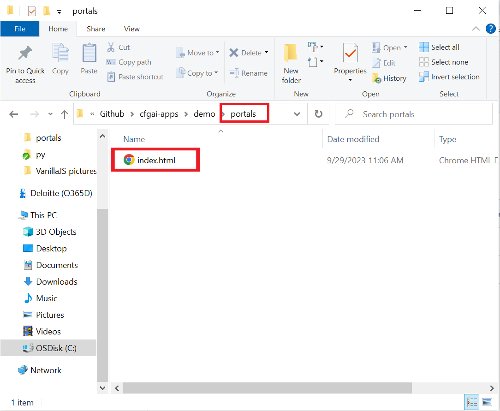
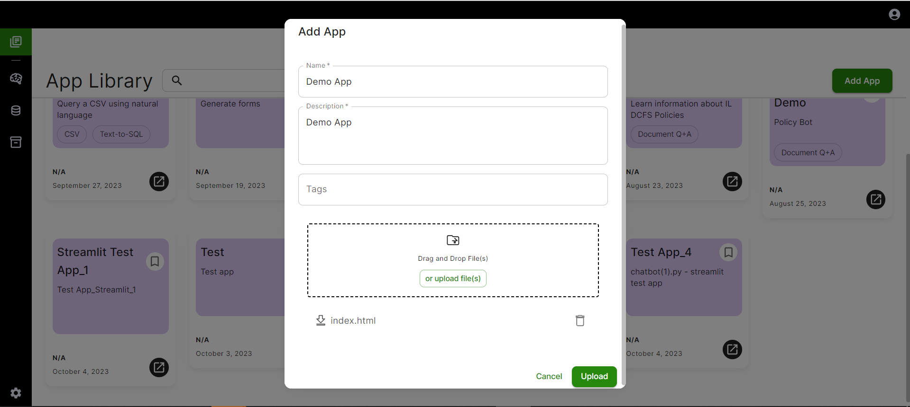
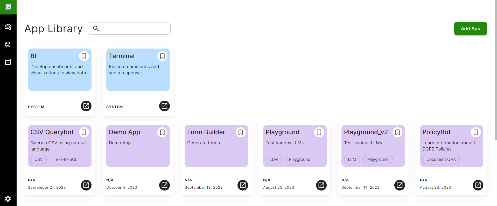

# Creating a GenAI app using VanillaJS


## Overview

Vanilla JavaScript, often referred to as 'VanillaJS,' is the core and foundational form of the JavaScript programming language. It serves as the fundamental building block of web development, enabling you to incorporate dynamic and interactive features into your web applications. 

Demo App to be created



## Connecting to AI Core

- [Generating Access and Secret Keys](../Establish%20Connection%20to%20CFG%20Portal/Connecting%20to%20CFG%20AI.md)

## Setup

For this guide we are going to be using a pre-existing 'demo' app, which has a good base of html in it already.  Navigate to the template below and download the demo app code into your local storage to get started. 

- [Template file for demo app](https://github.com/Deloitte-Default/cfgai-apps/blob/main/demo/portals/index.html)
> **Note**
> This is a protected GitHub, if you do not have access to it, or are not currently signed in to your GitHub account you will get a 404 Error. Ask an admin for access.

## Importing Insight and Env

Once you have access to the demo app's code you may notice that there is a portion near line 39 where we import Insight and Env into the application. We then use this code to create a new Insight. 



This is an integral portion to being able to access the models, storage catalogues, databases, etc that is stored in your AI Core instance. If you'd like to know more about what an Insight is, and why it is useful, you can read more about it here:

[What is an Insight](../../Get%20Started/Key%20Concepts.md#what-is-an-insight)

There is also some documentation on what actions having access to Insight allows you to do here:

[Usefulness of an Insight](../Establish%20Connection%20to%20CFG%20Portal/Using%20the%20SDK.md#using-insights)

For now, however, we just want to make note that we are importing an Insight, and later on creating an insight, allowing us the ability to access the information stored in our AI Core app, whether that be where our app is hosted or if we were to run the app locally. 

## Calling an LLM 

Now that we have imported an Insight into our app, we have access to the LLMs stored in the model catalogue of our AI Core instance. 



If you do not have any existing LLMs in your current model catalog, you can go to discoverable models, browse through our available models and when you find one, request access:



In order to use any LLM, you need to find its model ID. This is essential in order to call the LLM. In order to find what the model id is for any given LLM, you should navigate to the specific model in the model catalog. Go into the Usage tab, and the model id will be there:



Once you have access to a model, you can add its model ID into the portion of the VanillaJS Demo code. That can be found here: 


Once we have access to a model id, we then can make a call to the LLM model using the askModel insight action. 

```
if (insight.isReady) {
          const { output } = await insight.actions.askModel(ENGINE, command);
```

In the demo app, the command that we pass in is the simple prompt that the user puts into the command box. You can see that we grab that right above where we invoke the command:

```
        // set the variables
        const command = data.get("command");
```
This is the prompt that we are sending to the LLM. In the demo case, we are simply sending the text that the user inputs. However, in some more advanced cases we could change the user string, and add additional inputs to the prompt. We would mutate the string here, and then feed that into the LLM using the askModel command showcased above. 


## Adding Your App to App Catalog


**Creating Portals Folder**

Create the 'portals' folder inside your sample app folder (in this case 'demo'). Add the index.html file to the folder. Our sample app's portals folder looks like the following:



Next we need to compress the files so that the .zip file opens up to the directory containing our Portals folder which should look like this:


You are now ready to upload your app.

**Once you have added all your files into the structure:**

1. Navigate to https://workshop.cfg.deloitte.com/cfg-ai-demo/SemossWeb/packages/client/dist/#/

2. Click "Add App"


3. Fill in the required fields 


4. Upload your zip file 

5. Click "Upload" (Note: this may take a few minutes to spin up). 

6. Ta-da! You have successfully created an app in the AI Core Server! (Note:If you get an error, click to go back on your browser and you should be able to see you app in the catalogue)


7. Note the final portion of the url when you navigate to your app. This will be the App ID that is necessary for local development.

### What's Next?
Finished with this guide? 

Try out an App Use Case Quick Start guide for a different frontend framework linked below!
   - [React Quick Start Guide](React%20App%20Quickstart%20Guide.md)
   - [Sample Streamlit Use Case](Streamlit%20App%20Quickstart%20Guide.md)
