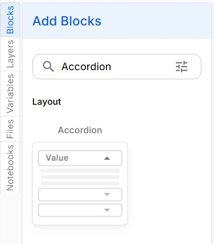
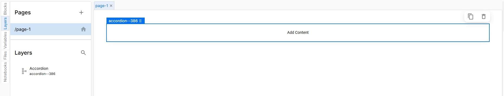
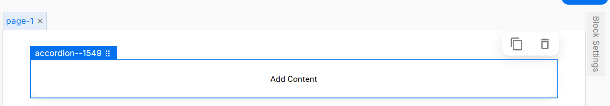
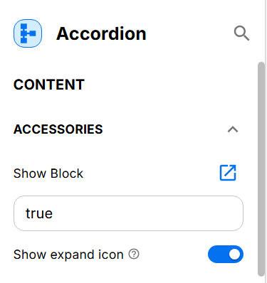
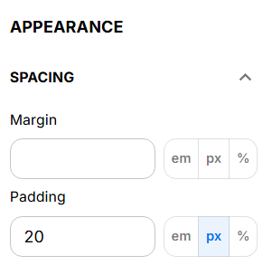
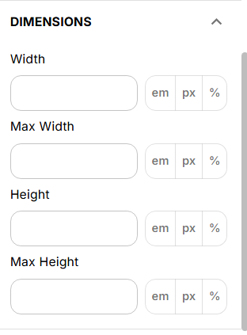
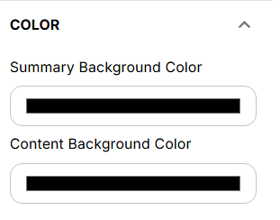
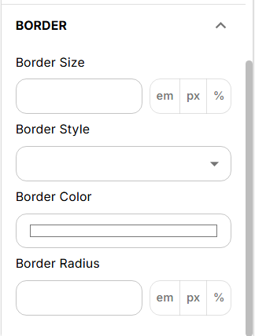

# Accordion Block

You can add an Accordion Block to organize and display content in a collapsible format. Follow the steps below to add an Accordion Block to your app UI.

To access the Accordion component, search for the Accordion Block in the Search Menu and Select the "Accordion" tab.

Once you have dragged the Accordion over you will be able to see it on the page.
Within the Layers panel, you will notice that the Accordion automatically has a number associated with it

Within the block settings you will be able to see many different setting options that you can choose

### Appearance
In this section, you can decide the Variant, Color, and Size of your Accordion.

### Show Expand Icon

If you want the Accordion to expand, select 'Show Expand Icon'.

#### Spacing

- **Margin:** Set the margin for the Accordion.
- **Padding:** Set the padding for the Accordion.

#### Dimensions

- **Width:** Specify the width of the Accordion.
- **Max Width:** Specify the maximum width of the Accordion.
- **Height:** Specify the height of the Accordion.

#### Color

- **Summary Background Color:** Set the background color for the summary section of the Accordion.
- **Content Background Color:** Set the background color for the content section of the Accordion.

#### Border

- **Border Size:** Set the size of the border.
- **Border Style:** Choose the style of the border.
- **Border Color:** Set the color of the border.
- **Border Radius:** Specify the radius of the border corners.

Congratulations, you have successfully added an Accordion Block to your UI.

