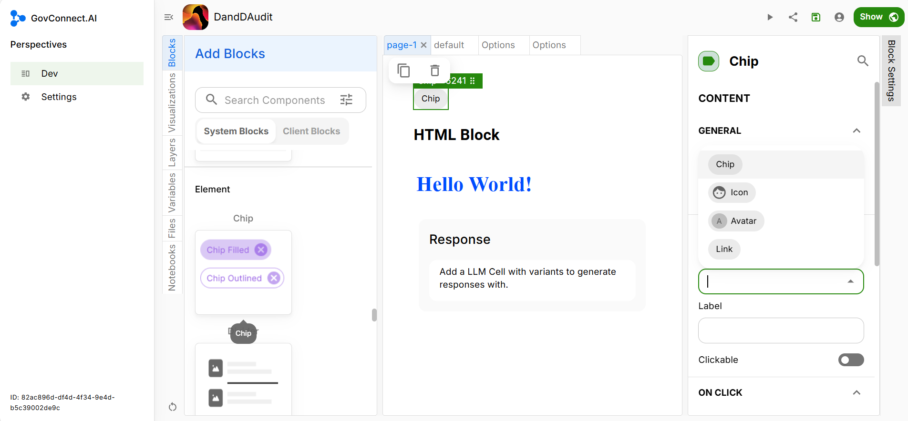
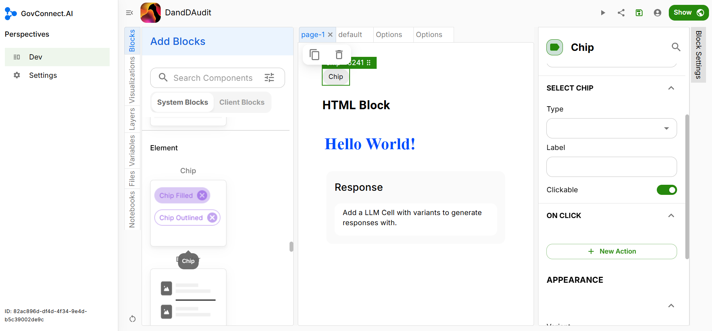
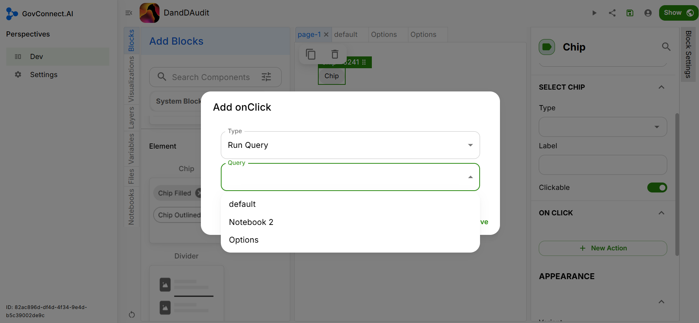

# Chip

You can decide the type of chip amongst the given 4 options (Chip, Icon, Avatar or a link).

Label is the Chip's name. It will appear as text inside the chip.

If you wan't to make the chip clickable, select 'Clickable'.

## Block Settings

### On Click

We want our options to be visible as soon as the user loads the corresponding page. Thus we will create a 'On Click' entry to enable this.

Click on '+ New Action' under On Click. Select 'Run Query' under Type and 'Options' under Query.

Click on 'Save' to finish.

### Appearance

In this section, you can decide the Variant, Color, and Size of your chip.

Congratulations, you have successfully added a Chip Block in your UI.