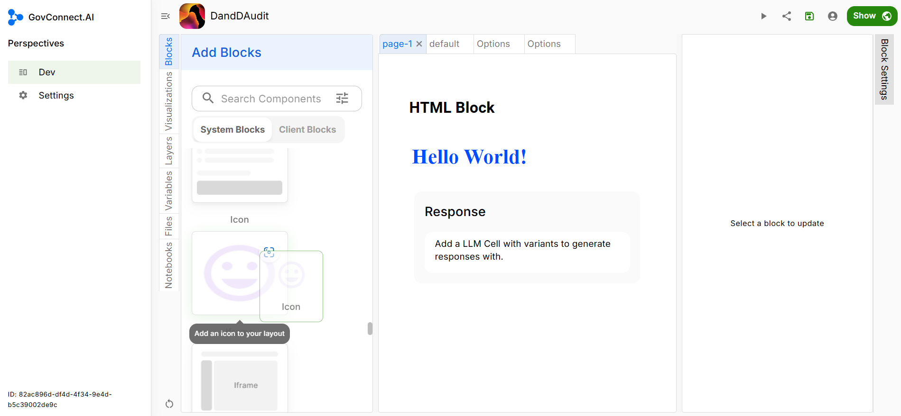
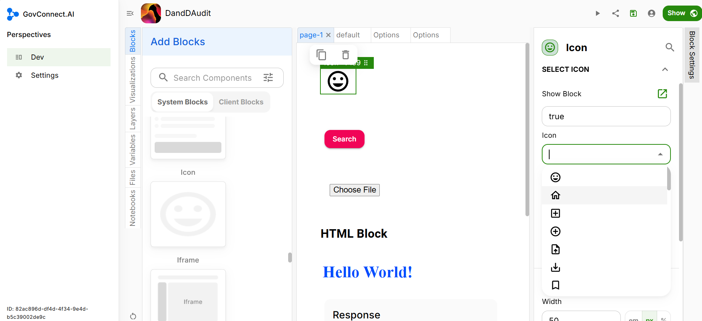
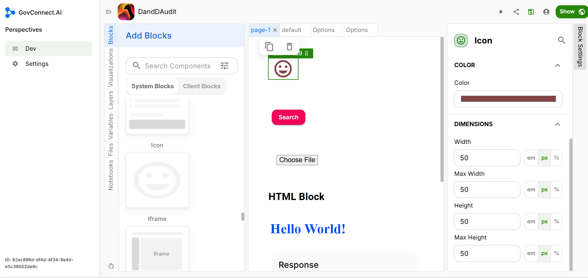

# Icon

You can even add an Icon to your App page. Drag and Drop the Icon block in your app UI, as highlighted below.

## Block Settings

### Content

There is a long list of Icons from which you can choose. Select the icon you would like to add.

### Appearance

After you have selected the icon of your choice, you need to choose its colour and its dimensions. Dimensions include the height and the width of your icon.

Congratulations you have successfully added an Icon block to your UI.