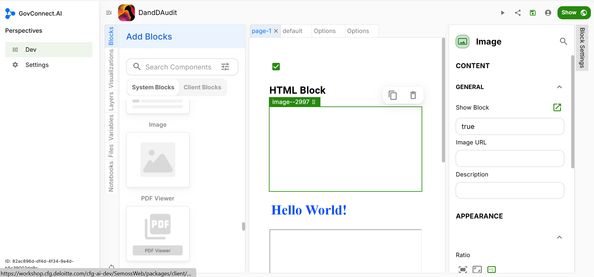

# Image

You can add images to your App interface using the Image block. Drag and drop the Image block into your app UI, as highlighted below.

## Block Settings

### Content

After adding the Image block, click on the Block Settings tab (on the left side of the page) and enter the URL of the image you want to insert.

### Appearance

Specify the position of the image within the block and set the dimension details, including height and width.

Congratulations, you have successfully added an Image block to your UI.
