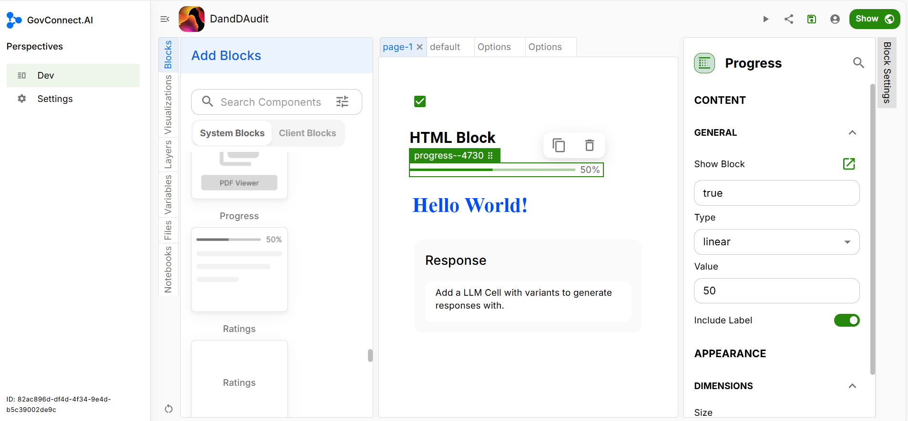

# Progress

You can add a progress bar to your App interface to highlight the percentage of task completion. Drag and drop the Progress block into your app UI, as highlighted below.

## Block Settings

### Content

In the Type section, select the type of progress bar you would like to display: **linear** (a horizontal line) or **circular** (a circle).

### Appearance

Specify the percentage of task completion under the 'Value' button. If you want the percentage to be displayed, click on 'Include Label'.

Select the size (length) of the progress bar under Dimensions to complete the process.

Congratulations, you have successfully added a Progress Bar to your UI.
