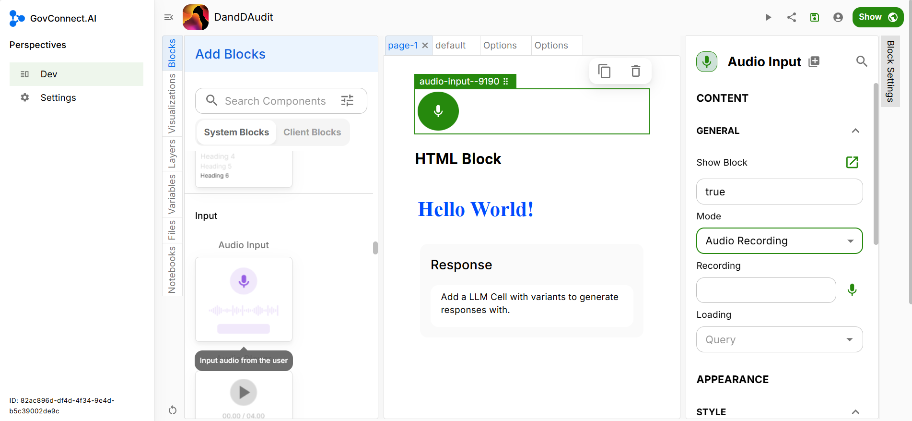

# Audio Input Block

First you need to select the mode -
Either you can go for **Speech to text** or you can select **Audio Recording**

If you select Speech to text-
You will need to write the transcript, the Audio Input feature will recite the textual content in an audio form.

If you select Recording-
You need to provide the mp3 (or any other audio extension) link of the recording.

## Block Settings

### Appearance

Now you need to select the Appearance of your recording. Choose between the various colours and styles.

### Dimensions

Finally decide on the dimensions of the audio recording icon and you have successfully added an audio input block to your UI.