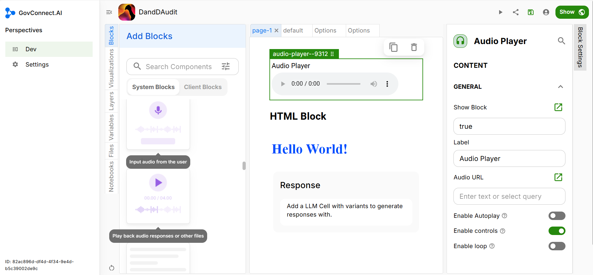

## Audio Player Block

You can give a name of your choice to the header of the Audio Player display. Mention the text that you want to see as the header in the **Label** tab.

Next you need to embed the audio URL. You can straightway provide the URL of the audio or even use Query to mention it as a code.

You can now select whether you want to enable **Autoplay** or not, Give the user usage **Controls** or not (like ability to hit pause etc.) and enable playing in **Loop** or not. Select the features that you would like the user to have.

Congratulations you have successfully added an Audio Player block to your UI.