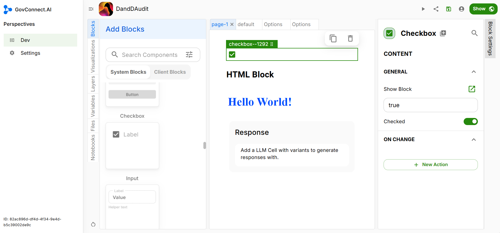

## Checkbox Block

You can add a checkbox to your UI. This can be useful in cases of terms and conditions. A checkbox can be provided to confirm whether the user has read and agrees to the terms of conditions.

If you want a tick mark to be visible when the user clicks on the Checkbox, select 'Checked'.

### On Change

We want our options to be visible as soon as the user loads the corresponding page. Thus we will create a 'On Change' entry to enable this.

> To be added

Click on 'Save' to finish.