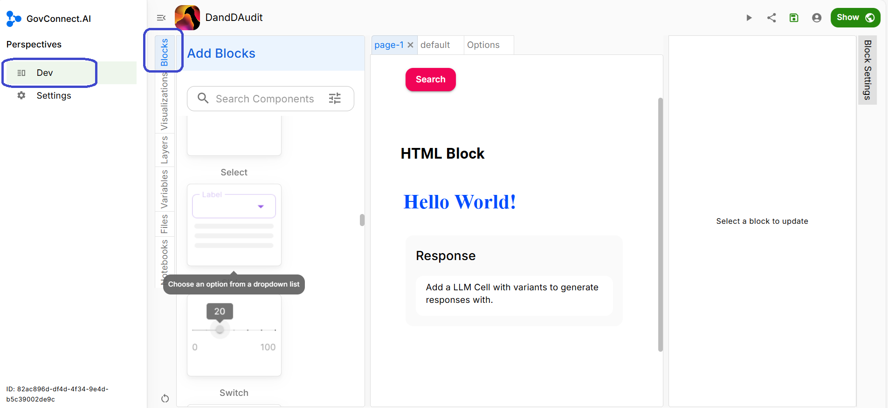
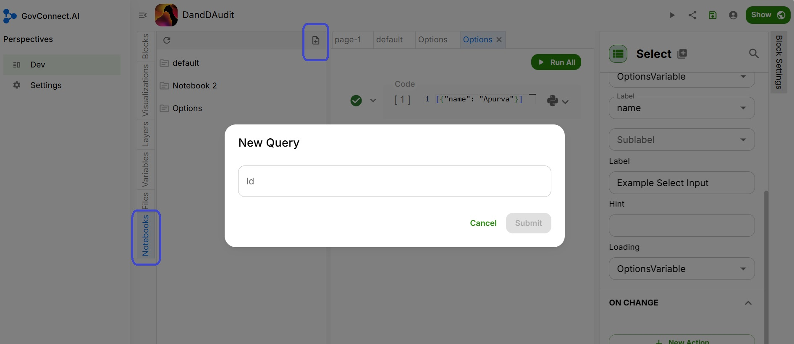
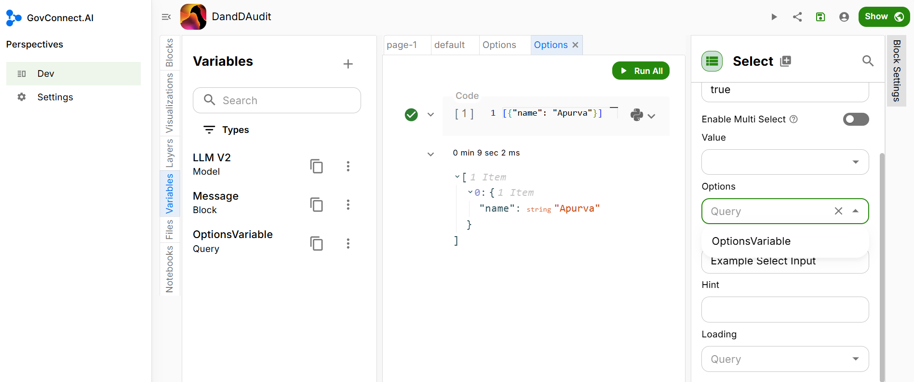
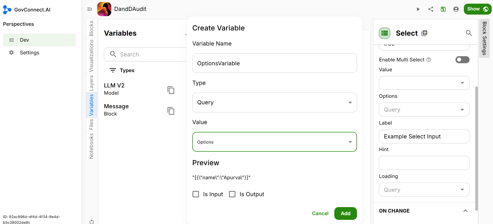

# Drop-Down Select Block

You can add a Drop-down Select Block for users to choose between multiple options for a given parameter. Follow the steps below to add a Drop-down Select Block to your app UI.

## Block Settings

### Content

Make sure you are in the 'Block' tab (inside the 'Dev' tab) on your page. The Dev section and the Block section are highlighted in the image below.



Scroll down the various block options until you reach 'Select' (under the heading of Input). The Select block is highlighted in the image below.


Drag and drop the **Select** Block into your App UI. Once you drop the block in your UI, you will see various parameters for which data needs to be populated on the right side of the screen. If you do not see this, click on **Block Settings**. The Block Settings tab is highlighted in the image below.


### Parameters

#### Enable Multi Select

By toggling this option on, you can enable selecting multiple options from the drop-down list, allowing users to select more than one option.

#### Options

To add options, first, add a Query. Click on the 'Notebooks' tab in the vertical tab on the left side of your screen. Then click on the '+' sign to add a new query. The '+' sign is highlighted in the image below.



Name this Query as Options. Now, write a code denoting the options you want to give to the user. An example of this is illustrated below:

```json
[{"name": "Hello world"}]
```

Once you have written this code, run the query.



After the query runs successfully, create a variable and attach this query to that variable.

Click on 'Variable' in the vertical tab on the left side of your screen. Click on '+' to add a new variable. Name this variable **OptionsVariable**. In type, select Query. In Value, select 'Options'. Click on 'Add' to attach this variable to the 'Options' query.



Now, when you go back to your UI, under Options, you will see the variable 'OptionsVariable'. Using this variable, you have connected your cell with the query 
```json
[{"name": "User"}].
```

Congratulations, you have successfully added a Drop-down Select Block to your UI.

