# Layers Panel
AI Core allows you to easily create an app using drag-and-drop features. 
When customizing an app's UI through the drag-and-drop editor, you can use the layers panel to visualize and adjust nested components.

#### Accessing the Layers Panel
To get started with the layers panel, navigate to the Apps page and select the "Create New App" button on the top right, then fill out the app name in the pop up screen.
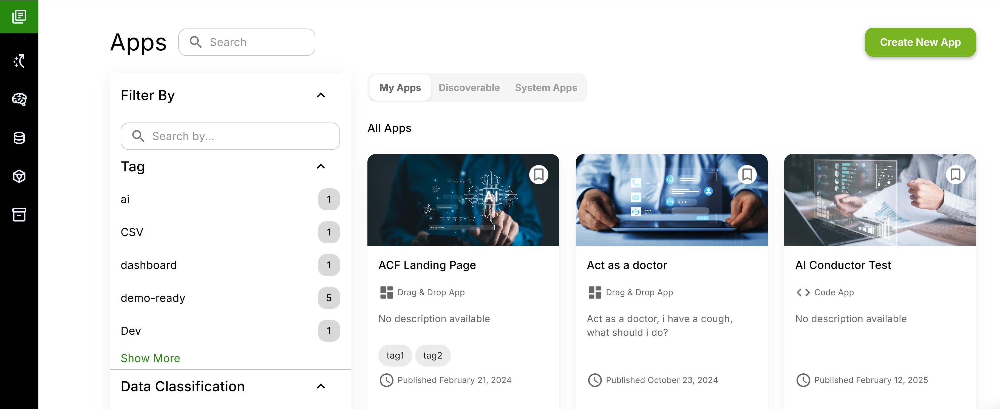

Choose the "Drag and Drop" editor option.
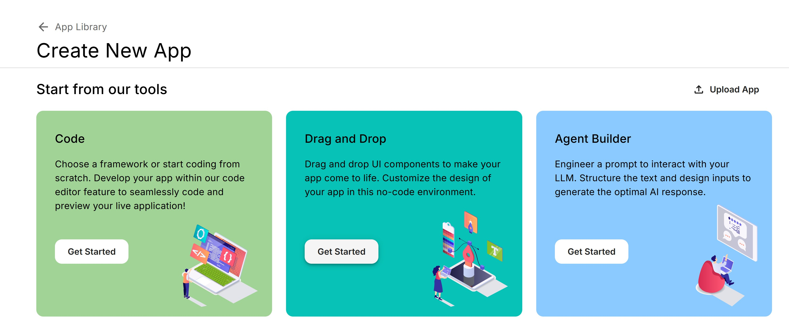

Once your app editor opens, select the "Layers" tab from the left hand menu.
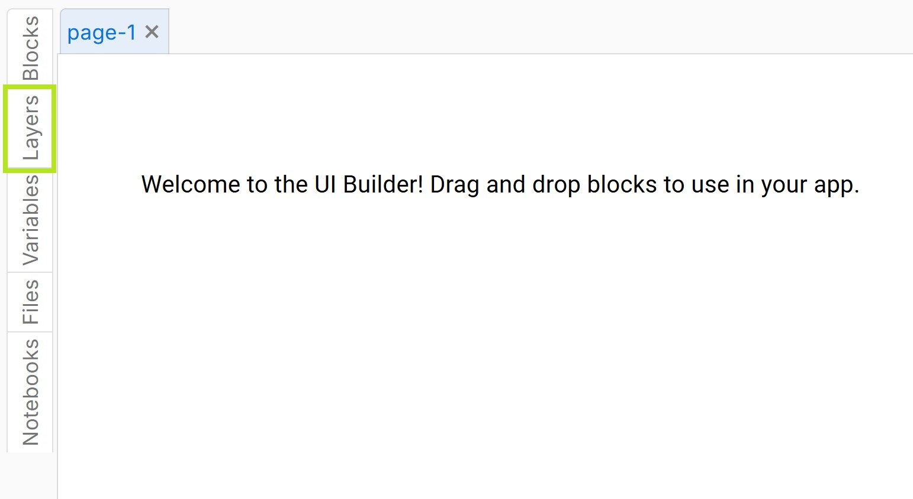

This will expand the Layers panel.
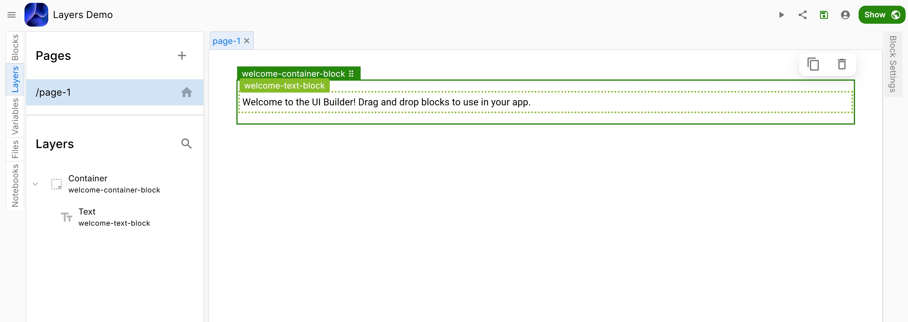

Within the Layers panel, you will notice that the app automatically created a template consisting of one page that has a container and a text box with a welcome message inside.

#### Blocks and Layers
When creating an app's UI through the drag-and-drop editor, you can add a variety of visual components to your app by inserting "blocks" from the blocks menu, which can be accessed by clicking the "Blocks" tab on the left hand side.
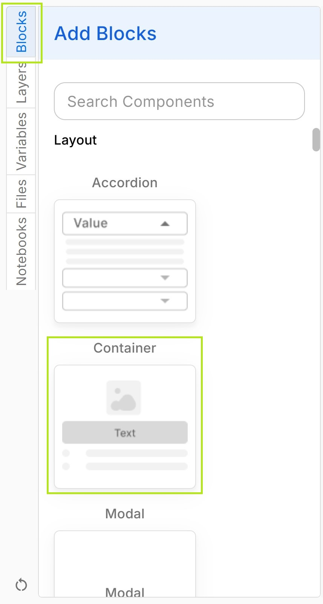

The blocks menu displays many types of blocks that are available for use. The "Layout" category of blocks helps organize the structure of the page by allowing other blocks to be nested inside of it. For example, one type of layout block is a "container," which allows other blocks to be placed inside of it. This helps organize components that are logically or visually connected into one unit.

The layers panel allows you to re-order blocks and nest blocks inside of containers. For example, here is an example with a container block that has two nested text blocks inside of it:
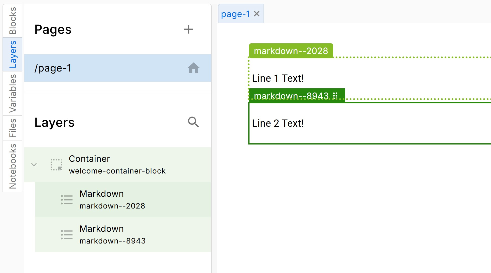

To nest a text box inside of a container, you can drag the text box block on top of the parent container within the layers panel.
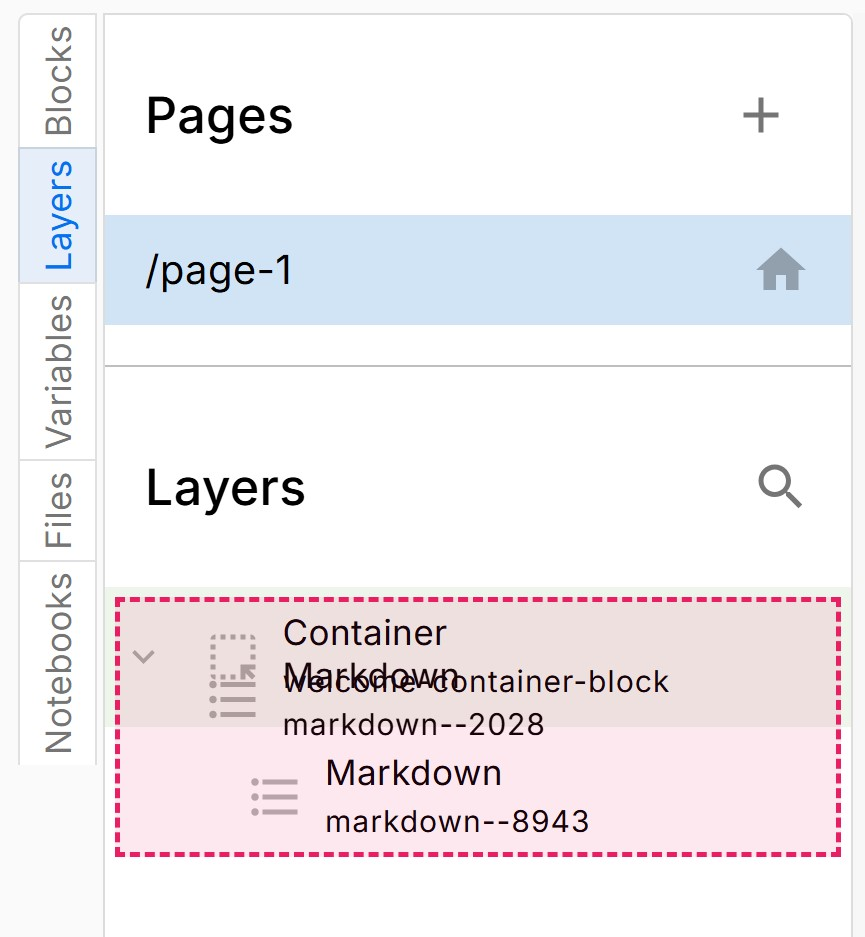

You can un-nest blocks in the same manner by dragging them out of the parent container in the layers panel:
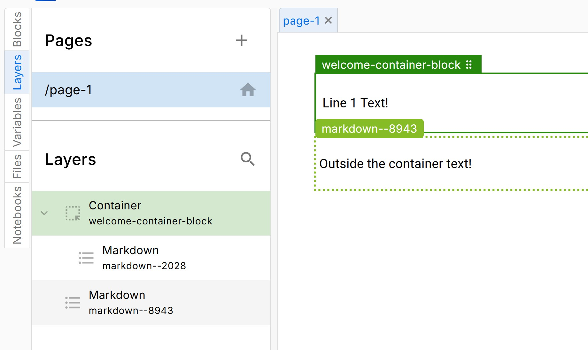

You can also use the drag and drop method to change the order of the containers themselves on the page, or the order of nested blocks within a container. 

The layers panel displays blocks in order from top to bottom, left to right.
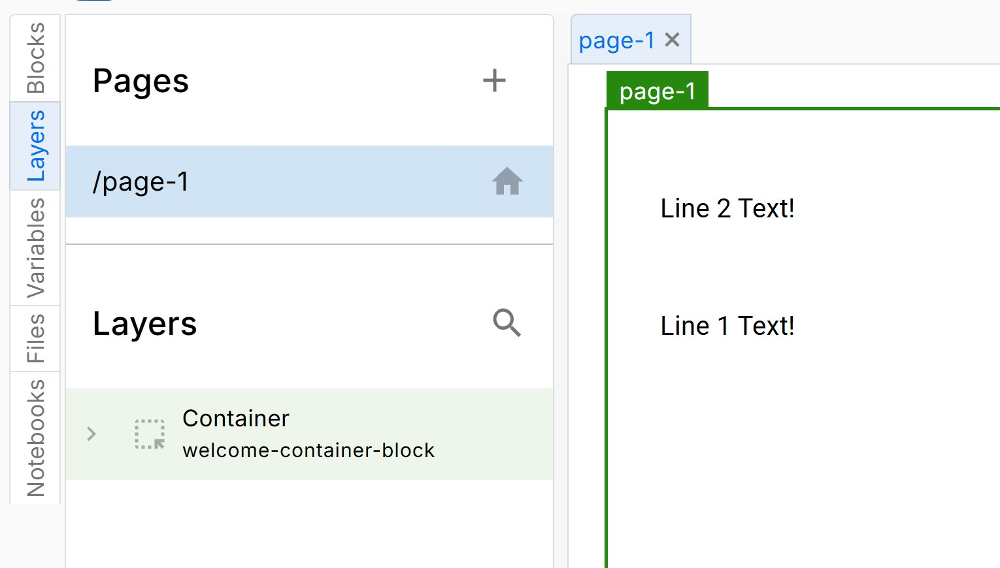

You can add multiple layout blocks and nest content inside of them, then adjust and view them from the layers panel as well.
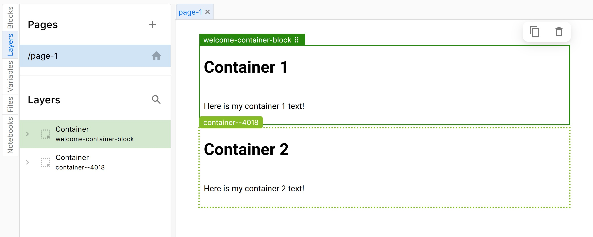

#### Adding a Page
Not only does the layers panel support editing components on a single page,  it also allows you to add pages and navigate between them in the drag-and-drop editor. This is helpful if your app will have multiple pages.

To add a page, click on the + button in the top right of the layers menu:
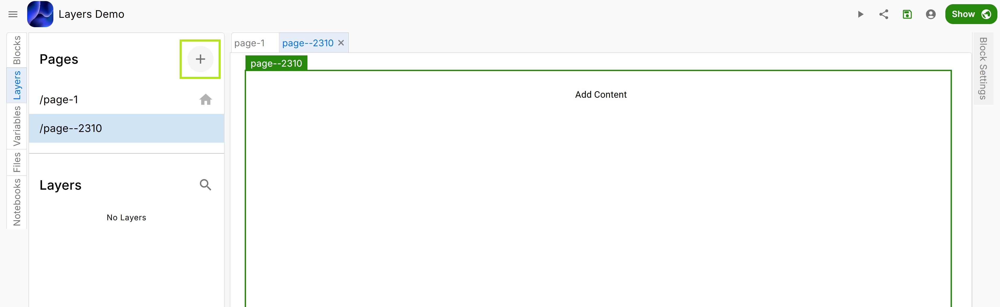

This will open your new page as a tab to the right of any existing pages. You will also see the new page appear under the list of pages in the layers menu. 

To navigate to a different page, you can click on its name in the pages list in the layers panel. If the page is already open in your editor, you can also click on the page tab along the top bar to navigate to that page.
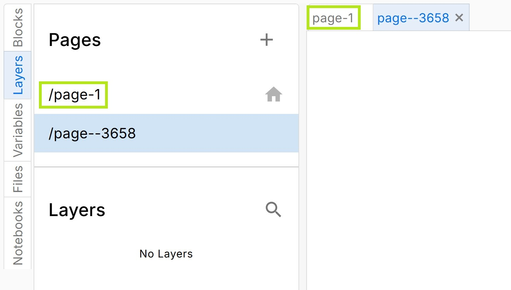
