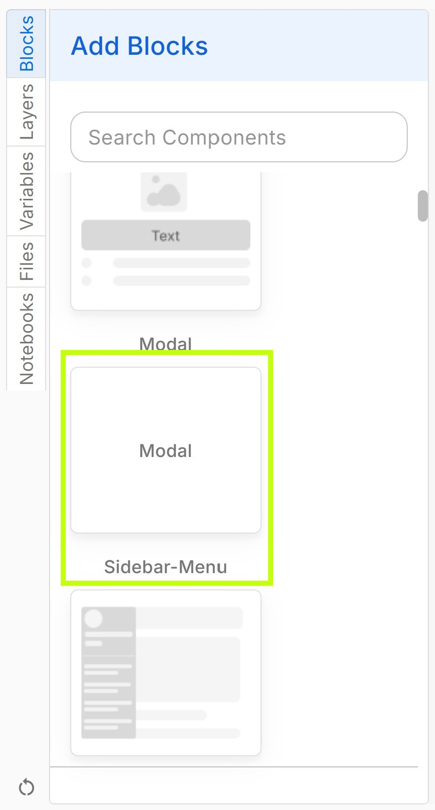
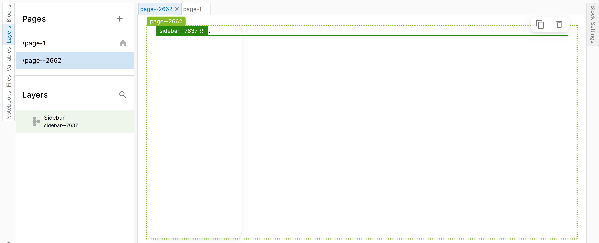
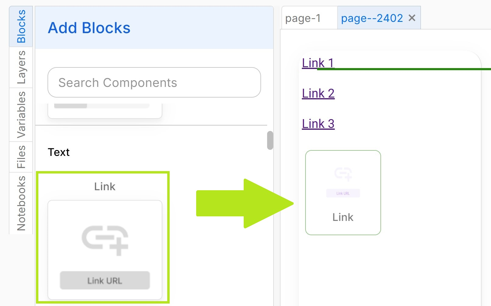
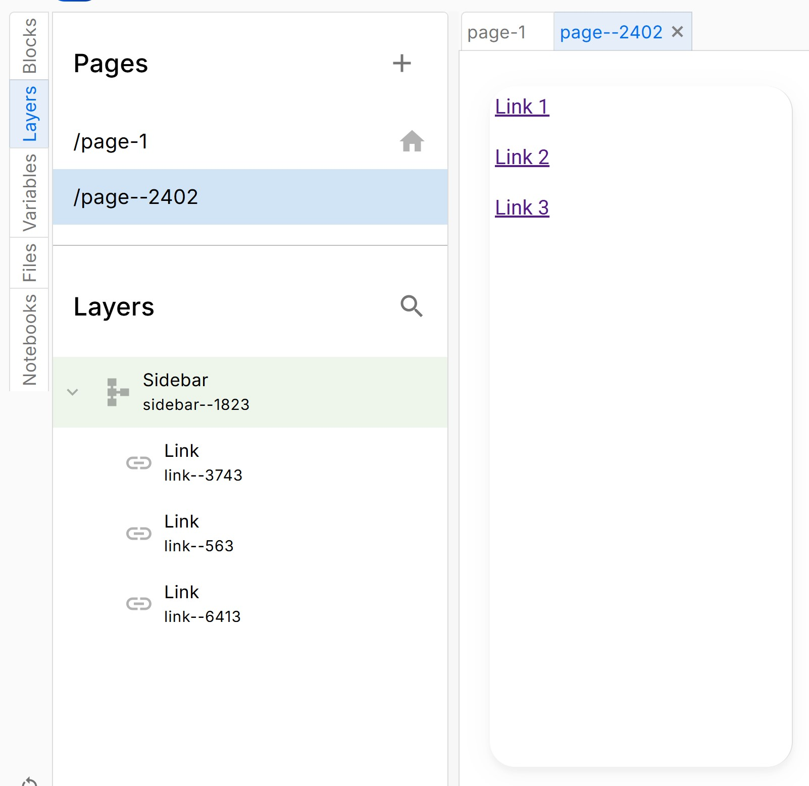
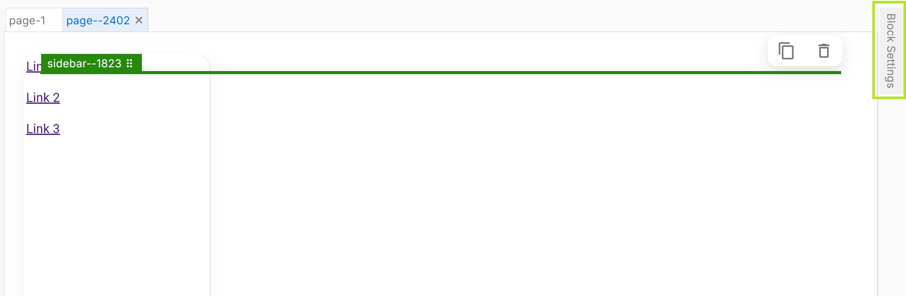
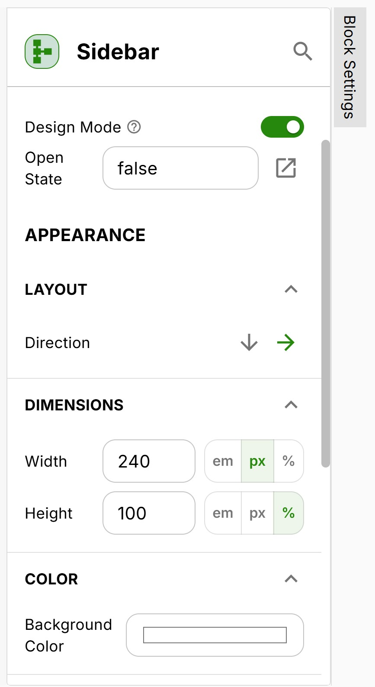
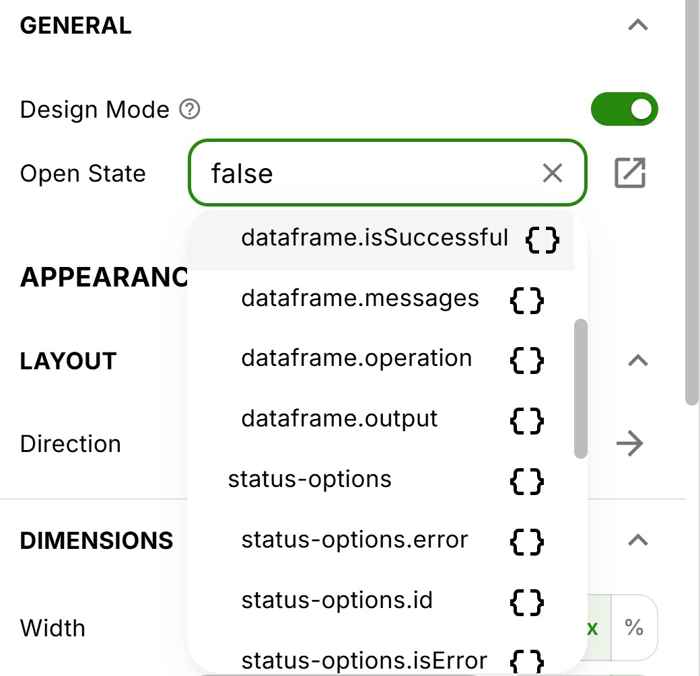
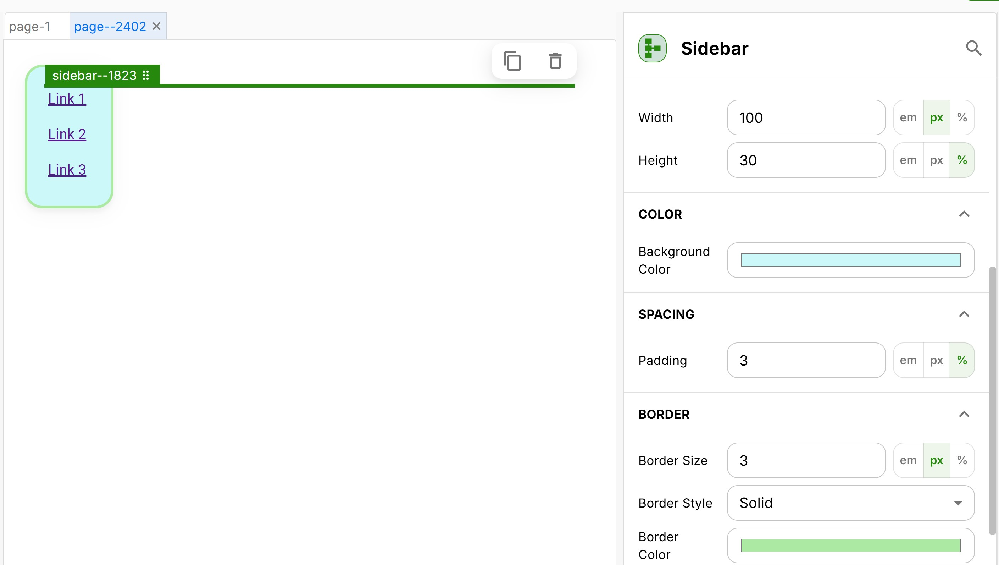

# Sidebar Menu Block
The sidebar menu is a layout component which organizes contents into a menu. It lends itself to apps that require a collapsible menu bar for navigating between pages or listing links.

Just like other layout components, you can nest other content blocks inside the sidebar block.

### How to Add a Sidebar Menu
In the drag and drop editor, open the Blocks menu to access all of the available layout components:

Drag the "Sidebar" block into your page.

Now that you have added a sidebar block, you can nest content like links and text boxes inside it. To add a link, return to the blocks menu and drag a "Link" component into  the sidebar on your page.

After your links appear, you can view them in the layers panel nested under the Sidebar block.

To customize your sidebar, first select the sidebar component either by clicking on the sidebar directly, or by selecting it from the list in the layers panel. Next, click the "Block Settings" tab on the right hand side of the editor to expand the the Block Settings panel.

This will open a menu with customization options for the sidebar menu.

One key option is the "Open State" which determines whether the sidebar menu should be expanded (true) or collapsed (false) by default. You can manually set the open state value, or link it to a variable or code block output from your app notebooks.

In addition, you can also customize the sidebar's visual traits like the color, alignment, border, padding, etc. 

