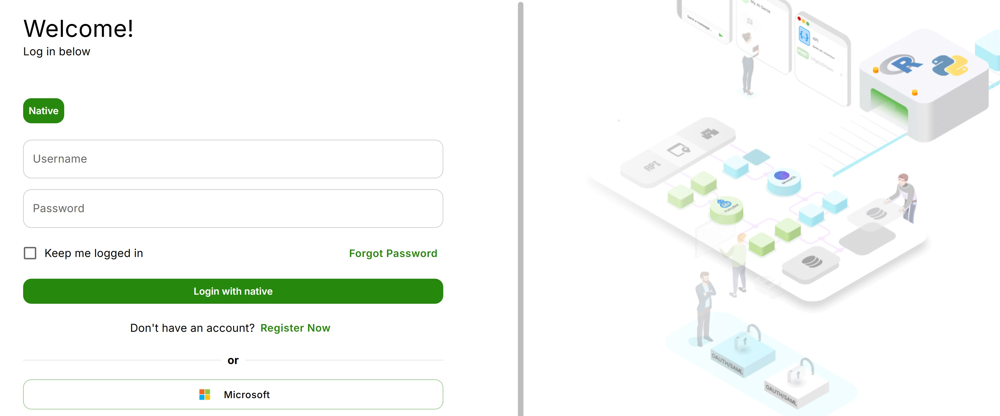
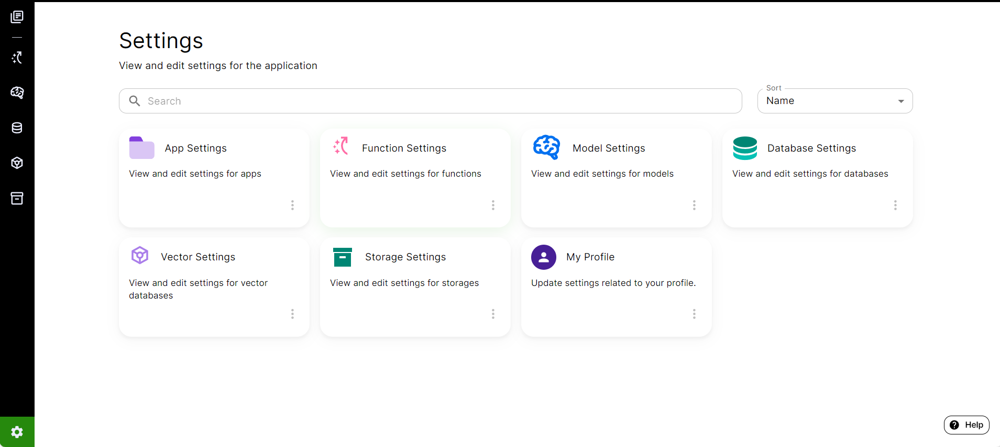
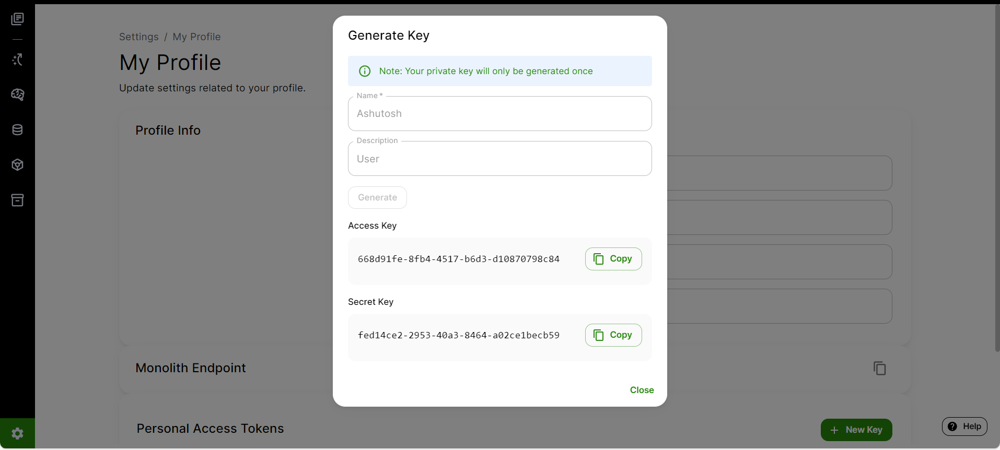

# Connecting To AI Core

## Create an Account and Log In
When you access the AI Core home page, you will see a login screen.

You have 2 options:
1. Login with an existing Microsoft SSO account, or
2. Create a new account for AI Core

To login with Microsoft, simply click the Microsoft button on the bottom left and the SSO portal will open in a pop-up window, where you may fill out your credentials.

To create a new AI Core account, click the "Register Now" link below the "Login with native" button. After you fill out the form and successfully register for a new AI Core account, you can enter your username and password and click the "Login with native" button.

## Generating Access and Secret Keys

To access the AI Core server, you need to create a user **Access Key** and **Secret Key** through the base application. The steps are as follows:

Navigate to the home screen of base application/App Library. Find the gear icon on the bottom-left side of the window. Click on it to go to Settings page.

Go to **'My Profile'** to access your user profile and click on **'Add New'** to create a new Access / Secret Key.

A **'Generate Access Key'** form will pop-up on your screen. Fill it out with the appropriate name and description and then click on **Generate**. Once you get the Access and Secret Keys, you MUST save/copy it locally.

> **Warning** > _This is the **ONLY TIME** that you will be able to see your Access Key and Secret Key. Once you close the out of pop-up, you will NOT be able to access them again. It is crucial that you record/copy the key values to a safe place, like a local .txt file or password manager, immediately after key creation._

> **Important** > _Please **do not share** your credentials with anyone_

These keys will be used to configure your AI Core SDK with access to the models, databases, and other resources associated with your account on the AI Core instance where your keys were generated.

### Next Steps

Now that you have explored the AI Core platform, you can start to develop your own apps. To do so, we recommend that you:

1. Set up your [front end development environment](./Packages%20and%20Pre-requisites.md#front-end-prerequisities)

2. Optionally, set up your [AI Core back end](./Packages%20and%20Pre-requisites.md#back-end-prerequisities) if you plan to create custom back end logic for your apps.
