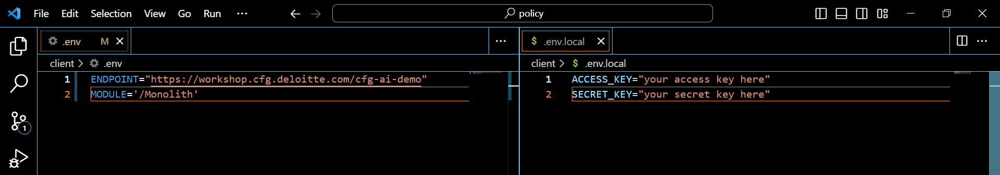

# Using the SEMOSS SDK

## Overview 

The SEMOSS SDK (Software Developer Kit) gives you access to the data that you have stored inside of your AI Core instance. It also allows you to make pixel calls, login, and query LLMs. 

- [Using the SEMOSS SDK](#using-the-semoss-sdk)
- [AI Core Environment Variables](#environment-variables)
- [Using Insights](#using-insights)
- [Using Pixels](#using-pixels)
    - [Retrieving Models](#retrieving-models)
    - [Calling a LLM](#querying-a-large-language-model)
    - [Running a Database Query](#running-a-database-query)
    - [Logging In](#logging-in)
    - [Logging Out](#logging-out)


### Using the SEMOSS SDK
In order to use the SEMOSS SDK, you will need to populate your AI Core instance with models, storage catalogs, and databases for use in your project. Learn how to do that in [Navigating AI Core](../../Get%20Started/Navigation).

### Environment Variables
The following environment variables are required at the root level of your client directory. They should be defined in `.env` and `.env.local` files. `.env.local` will not already exist in the project and will need to be created. Set the `ACCESS_KEY` and `SECRET_KEY` variables in `.env.local` to be the [access and secret keys](./Connecting%20to%20CFG%20AI.md#generating-access-and-secret-keys) you generated to connect to AI Core.



> **Note**
> _The `.env.local` file will appear greyed out. This is because it will be ignored by Git, so the file will not be pushed up with the rest of your work. It is important to avoid tracking this file in Git or pushing its changes to a repository since it was create to contain your access and secret keys._

The example `.env` above demonstrates how you would set your environment variables to connect to the AI Core server. To connect to a local instance instead, use the following variables:
```
    MODULE=/Monolith_Dev
    ENDPOINT=http://localhost:9090
    APP=<APP_ID>
```
You can access the `APP_ID` after you host the app in AI Core. Your `APP_ID` will be an alphanumerical string at the end of the app URL. 

For example, if the app URL is:
`http://localhost:9090/SEMOSS-ui/packages/client/dist/#/app/75277e50-456e-43f8-8ad7-d03224ebe4da`
then the `APP_ID` would be `75277e50-456e-43f8-8ad7-d03224ebe4da`

You can access the app URL by going to the App Library, navigating to the hosted app, and copying the link from the URL bar in your browser. 

#### Using Insights

`InsightProvider` is a wrapper component and provide an [Insight](../../Get%20Started/Key%20Concepts.md#what-is-an-insight) to all of its children. 
In your base app, use the insight provider like so:

```
import { InsightProvider } from '@SEMOSS/sdk-react';

const App = (props) => {
    const { children } = props;

    return <InsightProvider>{children}</InsightProvider>;
};
```

Once the application is wrapped, you can access insights through the useInsight hook.

```
import { useInsight } from '@SEMOSS/sdk-react';

const Child = (props) => {
    const { children } = props;

    const {
        /** Track if it is initialized **/
        isInitialized,
        /** Track if the user is authorized **/ isAuthorized,
        /** Any Insight Errors **/
        error,
        /** System information **/
        system,
        /** Actions to update **/
        actions,
    } = useInsight();

    return <InsightProvider>{children}</InsightProvider>;
};
```

#### Using Pixels
you can access it by using `pixel` API calls. Pixel is a domain-specific language used by AI Core to access and update data. Below are some examples of how to use a pixel call.

##### Retrieving Models
```
const { actions } = useInsight();

const pixel = `MyEngines( engineTypes=["MODEL"]);`
actions.run(pixel)
    .then((response) => {
        const { output, operationType } = response.pixelReturn[0];
        if (operationType.indexOf('ERROR') > -1) {
            throw new Error(output as string)
        }
        if (Array.isArray(output)) {
            console.log(output) // log the models returned
        }
    })
``` 

##### Querying a Large Language Model
```
const { actions } = useInsight();

const ask = (question) => {
    const { pixelReturn } = await actions.run(
        `LLM(engine=["${ENGINE}"], command=["<encode>${question}</encode>"]);`,
    );

    // get the message
    const message = pixelReturn[0].output.response;
    console.log(message);
};
```

##### Running a Database Query
AI Core Platform provides 2 main ways to query a database.
- Generic Pixel Query syntax: This is AI Core specific querying syntax which is database agnostic.
- Native Database Query: This is the way to query based on the native database querying language/dialect.

By using the Generic Pixel Query syntax, you can specify:
- Select(...)
- Filter(...)
- Sort(...)
- Limit(...)
- Offset(...)

For our movie database here is an example:
Database ( database = [ `"<ENGINE_ID>"` ] ) | Select ( MOVIES__Title ) .as ( [ Title ] ) | Filter ( ( ( MOVIES__Genre == [ "Action-Adventure" , "Comedy-Musical" , "Drama" ] )  AND  ( MOVIES__MovieBudget >= [ 10000 ] ) ) ) | Distinct ( false ) | CollectAll();

This query is selecting all the movie titles that have a MovieBudget greater than 10000 and specific genre.

> _**Note** When you want to specify a column in a table in the query, you must use the form TABLENAME__COLUMN. Pixel syntax is case sensitive!

To run a Native Database Pixel query, you can add your query to this pixel:
Database ( database = [ `"<ENGINE_ID>"` ] ) | Query ( "<encode>select * from MOVIES limit 10;</encode>" ) | CollectAll();
> _**Note** Your database query may be case sensitive!

```
const { actions } = useInsight();

const getMovies = () => {
    const { pixelReturn } = await actions.query(
        `Database(engine=["${ENGINE}"]) | Select(Movie__Title, Movie__Year) | Collect(-1)`,
    );

    // get the data
    const data = pixelReturn[0].output;

    console.log(data);
};
```
> _**Note** For more guidance on the syntax of LLM and database queries, please review the AI Core User Guide **[here](https://semoss.org/SemossDocumentation/#scripting-understanding-pixel)**._

##### Logging In
```
const { actions } = useInsight();

const login = (username, password) => {
    const success = await actions.login({
        type: 'native',
        username: username,
        password: password,
    });

    console.log(success);
};

const loginWithOauth = (provider: 'ms' ) => {
    const resp = await insight.actions.login({
        type: 'oauth',
        provider: provider
    })

    console.log(resp)
}
```

##### Logging Out
```
const { actions } = useInsight();

const logout = (username, password) => {
    const success = await actions.logout();

    console.log(success);
};
```

#### Ask LLM with stream  

```
import { partial, runPixel } from '@semoss/sdk';

const insight = new Insight();
await insight.initialize()
const insightId = insight._store.insightId

const askWithStream = async () => {
        let isCollecting = false;

        const collectMessage = async () => {
            // only continue if response hasn't come back from runPixel
            if (!isCollecting) {
                return;
            }
    
            // get the output of partial
            try {
                const output = await partial(insightId);

                // add the partial
                if (output.message && output.message.total) {
                    setAnswer(output.message.total);
                }

                // get the next partial of response
                setTimeout(() => collectMessage(), 1000);
            } catch (e) {
                // noop
            }
        }

        // start collecting
        isCollecting = true;
        
        // initial delay that collects partial of response
        setTimeout(() => collectMessage(), 500);

        const { errors, pixelReturn } = await runPixel(
            `LLM(engine=["001510f8-b86e-492e-a7f0-41299775e7d9"], command=["<encode>${question}</encode>"]);`,
            insightId,
        );

         // OR

        // const response = await  insight.actions.run(
        //     `LLM(engine=[MODEL_ID], command=["<encode>${question}</encode>"]);`,
        //     insightId,
        // )

        isCollecting = false
    }
```
