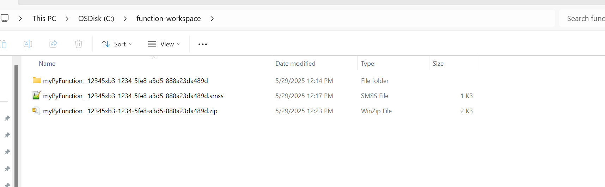
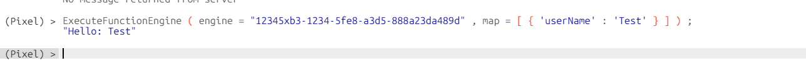

# Guide for Building a Python Function
To create a python function and expose in AI Core

1. Create a new directory in this example we will call it function-workspace
```
mkdir function-workspace
```
2. Go to function-workspace directory to create the new files
```
cd function-workspace
```
3. Create the function engine folder

Engine folders in AI Core are named as "ENGINENAME___ENGINEID"
```
mkdir myPyFunction__12345xb3-1234-5fe8-a3d5-888a23da489d
```
4. Create SMSS file and save as myPyFunction__12345xb3-1234-5fe8-a3d5-888a23da489d.smss
```
#Base Properties
ENGINE	12345xb3-1234-5fe8-a3d5-888a23da489d
ENGINE_ALIAS	myPyFunction
ENGINE_TYPE	prerna.engine.impl.function.LocalPythonFunctionEngine

FUNCTION_NAME generate_prompt
FUNCTION_DESCRIPTION This is a test python function.

FUNCTION_REQUIRED_PARAMETERS ["userName"]
FUNCTION_PARAMETERS [{"parameterName": "userName", "parameterType": "String", "parameterDescription": "user name"}]

PYTHON_FILE_NAME hello.py

```
5. Create python file

This is your custom file it must be located at the root directory of the engine folder. Note that the python file you create must be the same file name used in the SMSS. Your python file must also have the function name you specified in the SMSS.
```
cd myPyFunction__12345xb3-1234-5fe8-a3d5-888a23da489d
echo. > hello.py
```

For this example you can copy this simple python function into hello.py
```
def generate_prompt(userName: str):
    prompt = f"Hello: {userName}"
    return prompt
```

6. Zip up your function-workspace folder containing the engine folder and engine SMSS

7. Upload to AI Core! [Add Zip File](../../documentation/platform-navigation/function-catalog#adding-a-zipped-function-engine)
8. Once uploaded you should be able to see it in the UI
9. To test the function, look at the usage tab. Modify according to your function. 

For this example we can run the following pixel in the terminal
```
ExecuteFunctionEngine(engine = "12345xb3-1234-5fe8-a3d5-888a23da489d", map=[{'userName':'Test'}] );
```
10. Success!!!!


