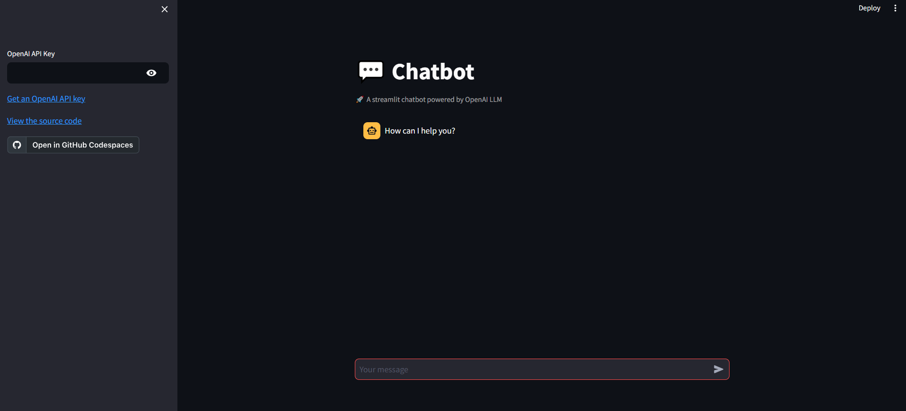

# How to build a Streamlit App using Server API
Let's build a Streamlit App using the Python client SDK called *ai-server*. 

## **Install Python Client**

    pip install git+ssh://git@github.com/Deloitte-Default/cfgai-py-ai-server.git

## **Generate Access Key from your AI Server**
To generate access keys for the AI Sever pleasese refernce this guide.


## **Integrate with Streamlit**

In this example we will take an existing streamlit app and modify it to be compatible with the AI server instead of Open AI

**Clone the Chatbot.py code**  
We are going to create a simple app to conversate with a given LLM or ModelEnige. We cloned the code from [Streamlit's Example page](https://github.com/streamlit/llm-examples/blob/main/Chatbot.py).

The starting code is as follows:
```python
import openai
import streamlit as st

with st.sidebar:
    openai_api_key = st.text_input("OpenAI API Key", key="chatbot_api_key", type="password")
    "[Get an OpenAI API key](https://platform.openai.com/account/api-keys)"
    "[View the source code](https://github.com/streamlit/llm-examples/blob/main/Chatbot.py)"
    "[](https://codespaces.new/streamlit/llm-examples?quickstart=1)"

st.title("💬 Chatbot")
st.caption("🚀 A streamlit chatbot powered by OpenAI LLM")
if "messages" not in st.session_state:
    st.session_state["messages"] = [{"role": "assistant", "content": "How can I help you?"}]

for msg in st.session_state.messages:
    st.chat_message(msg["role"]).write(msg["content"])

if prompt := st.chat_input():
    if not openai_api_key:
        st.info("Please add your OpenAI API key to continue.")
        st.stop()

    openai.api_key = openai_api_key
    st.session_state.messages.append({"role": "user", "content": prompt})
    st.chat_message("user").write(prompt)
    response = openai.ChatCompletion.create(model="gpt-3.5-turbo", messages=st.session_state.messages)
    msg = response.choices[0].message
    st.session_state.messages.append(msg)
    st.chat_message("assistant").write(msg.content)
```

The original app looked like this:



We are going to make it use the AI Server's Model Engine Catalog instead.

**Remove the openai import and replace it with ai_server** 
```python
## Change 1 ##
# Replace openai package with ai_server
import ai_server
import streamlit as st
```

**Create a login function so that we dont relogin everytime**

Rather than authenticating the access keys with every call, we can authenticate once and store the cookies. To do this we will simply create a login function that stops streamlit from calling re-executing the login call.
```python
## Change 2 ##
# Create a function to login into the server using your access keys
@st.cache_resource # Use st.cache to cache the server authentication logic
def login(secret_key, access_key, ai_server_url):
    try:
        # Attempt to create the server connection. If there is an error when connecting then an error will be raised
        conn = ai_server.RESTServer(
            access_key=access_key,
            secret_key=secret_key,
            base=ai_server_url
        )
        return conn
    except:
        # If login fails, display an error message
        st.error("Login failed")
``` 

**Update the side bar**

Instead of providing a secret key for Open AI we will change the inputs to match the AI Server login requiremnets and indicate which model engine you would like to inference with. *Some of these fields can be hard coded depending on the use case*.
```python
## Change 3 ##
st.title("💬 Chatbot")
# Change the display reference from OpenAI LLM to SEMOSS Server
st.caption("🚀 A streamlit chatbot powered by SEMOSS Server")

# Remove OpenAI secret and add additional inputs in the side bar menu
with st.sidebar:
    ai_server_url = st.text_input("AI Server URL")                          # Your Monolith endpoint
    secret_key = st.text_input("Secret Key", type="password")               # Your AI Server Secret Key
    access_key = st.text_input("Access Key", type="password")               # Your AI Server Access Key
    engine_id = st.text_input("Model Engine ID", key="model_engine_id")     # The model engine ID
    server_connection = login(secret_key, access_key, ai_server_url)        # make the loging call
```

If you were actively developing then you might want to consider hard coding your access credentials so that you don't have to enter them every time. That change would look as follow:

```python
# Harcoded Example of the above
# Remove OpenAI secret and add additional inputs in the side bar menu
with st.sidebar:
    ai_server_url = "<your monolith endpoint>"                              # Your Monolith endpoint
    secret_key = "<your secret key>"                                        # Your AI Server Secret Key
    access_key = "<your access key>"                                        # Your AI Server Access Key
    engine_id = st.text_input("Model Engine ID", key="model_engine_id")     # The model engine ID
    server_connection = login(secret_key, access_key, ai_server_url)        # make the loging call
```

**Redefine safety checks before inference calls**

Instead of requiring an OpenAI secret key, we will ensure that the user was able to connect to the server and provided a model engine ID.

```python
## Change 4 ##
# When the prompt is provided, make the connection was established and an engine ID was provided
if prompt := st.chat_input():
    if not server_connection:
        st.warning("Please login before trying to make an inference call.")
        st.stop()

    if not engine_id:
        st.info("Please add Model Engine ID.")
        st.stop()
```

**Update the payload logic**

Finally we just need to change the way we are accessing and recording the response from the model engine.
```python
    ## Change 5 ##
    ## Create a reference to the model engine ##
    model = ai_server.ModelEngine(engine_id = engine_id, insight_id = server_connection.cur_insight)

    # No changes here
    st.session_state.messages.append({"role": "user", "content": prompt})
    st.chat_message("user").write(prompt)

    # update the inference call to use ModelEngine
    response = model.ask(question = prompt)
    # Get the output string from the response
    msg = response[0]['response']
    # match the dictionary responses for OpenAI
    st.session_state.messages.append({"role": "assistant", "content": msg})
    st.chat_message("assistant").write(msg)
```
The final result is as follows:


### **Full Code Below**
```python
## Change 1 ##
# Replace openai package with ai_server
import ai_server
import streamlit as st

## Change 2 ##
# Create a function to login into the server using your access keys
@st.cache_resource # Use st.cache to cache the server authentication logic
def login(secret_key, access_key, ai_server_url):
    try:
        # Attempt to create the server connection. If there is an error when connecting then an error will be raised
        conn = ai_server.RESTServer(
            access_key=access_key,
            secret_key=secret_key,
            base=ai_server_url
        )
        return conn
    except:
        # If login fails, display an error message
        st.error("Login failed")

## Change 3 ##
st.title("💬 Chatbot")
# Change the display reference from OpenAI LLM to SEMOSS Server
st.caption("🚀 A streamlit chatbot powered by SEMOSS Server")

# Remove OpenAI secret and add additional inputs in the side bar menu
with st.sidebar:
    ai_server_url = st.text_input("AI Server URL")                          # Your Monolith endpoint
    secret_key = st.text_input("Secret Key", type="password")               # Your AI Server Secret Key
    access_key = st.text_input("Access Key", type="password")               # Your AI Server Access Key
    engine_id = st.text_input("Model Engine ID", key="model_engine_id")     # The model engine ID
    server_connection = login(secret_key, access_key, ai_server_url)        # make the loging call


if "messages" not in st.session_state:
    st.session_state["messages"] = [{"role": "assistant", "content": "How can I help you?"}]

for msg in st.session_state.messages:
    st.chat_message(msg["role"]).write(msg["content"])

## Change 4 ##
# When the prompt is provided, make the connection was established and an engine ID was provided
if prompt := st.chat_input():
    if not server_connection:
        st.warning("Please login before trying to make an inference call.")
        st.stop()

    if not engine_id:
        st.info("Please add Model Engine ID.")
        st.stop()

    ## Change 5 ##
    ## Create a reference to the model engine ##
    model = ai_server.ModelEngine(engine_id = engine_id, insight_id = server_connection.cur_insight)

    # No changes here
    st.session_state.messages.append({"role": "user", "content": prompt})
    st.chat_message("user").write(prompt)

    # update the inference call to use ModelEngine
    response = model.ask(question = prompt)
    # Get the output string from the response
    msg = response[0]['response']
    # match the dictionary responses for OpenAI
    st.session_state.messages.append({"role": "assistant", "content": msg})
    st.chat_message("assistant").write(msg)
```